# National MCP Standard for Physical AI Oncology Clinical Trials

**Version 1.1.0** | **Proposed Reference Standard** | **United States**

[](LICENSE)
[](https://doi.org/10.5281/zenodo.18894758)
[](https://doi.org/10.5281/zenodo.18916731)
[](releases.md)
[](.github/workflows/ci.yml)
[](schemas/)
[](https://www.python.org/)
[](reference/typescript/)
[](https://modelcontextprotocol.io/)
[](deploy/docker-compose.yml)
[](interop-testbed/)
[](servers/)
[](integrations/)
[](safety/)
[](profiles/)
[](schemas/)
[](spec/tool-contracts.md)
[](conformance/)
[](tests/)
[](changelog.md)
[](releases.md)

The **National MCP-PAI Oncology Trials Standard** is a proposed reference standard for deploying Model Context Protocol (MCP) servers across federated Physical AI oncology clinical trial systems in the United States. This standard defines protocol contracts, actor models, security baselines, regulatory overlays, machine-readable JSON schemas, and governance processes intended to enable industry-wide interoperability of autonomous robotic systems in regulated clinical environments.

> **Scope**: This specification targets U.S. clinical sites, sponsors, CROs, and technology vendors operating Physical AI systems — surgical robots, therapeutic positioning systems, diagnostic needle-placement platforms, and rehabilitative exoskeletons — within FDA-regulated oncology trials.

---

## Table of Contents

- [Motivation](#motivation)
- [National Architecture Overview](#national-architecture-overview)
- [MCP Server Implementations](#mcp-server-implementations)
- [Integration Adapters](#integration-adapters)
- [Robot Safety and Execution Boundaries](#robot-safety-and-execution-boundaries)
- [MCP Process Diagrams](#mcp-process)
- [Deployment Infrastructure](#deployment-infrastructure)
- [Quickstart Demo](#quickstart-demo)
- [Reference Implementations](#reference-implementations)
- [Unit Test Suite](#unit-test-suite)
- [CI/CD Pipeline](#cicd-pipeline)
- [Black-Box Conformance Harness](#black-box-conformance-harness)
- [Conformance Test Suite](#conformance-test-suite)
- [National Interoperability Testbed](#national-interoperability-testbed)
- [Certification and Evidence Generation](#certification-and-evidence-generation)
- [Benchmarks](#benchmarks)
- [Profiles and Conformance Level Definitions](#profiles-and-conformance-level-definitions)
- [Machine-Readable JSON Schemas](#machine-readable-json-schemas)
- [Conformance Levels](#conformance-levels)
- [Actor Model](#actor-model)
- [Tool Contract Registry](#tool-contract-registry)
- [Security and Privacy](#security-and-privacy)
- [Regulatory Compliance](#regulatory-compliance)
- [Advantages Over Existing Approaches](#advantages-over-existing-approaches)
- [Repository Structure](#repository-structure)
- [Getting Started](#getting-started)
- [Paper](#paper)
- [Governance](#governance)
- [References](#references)

---

## Paper

**National MCP Servers for Physical AI Oncology Clinical Trial Systems**

Kawchak K. National MCP Servers for Physical AI Oncology Clinical Trial Systems. Zenodo. 2026; [10.5281/zenodo.18916731](https://doi.org/10.5281/zenodo.18916731).


- **PDF**: [National MCP Servers for Physical AI Oncology Clinical Trial Systems.pdf](https://github.com/kevinkawchak/national-mcp-pai-oncology-trials/blob/main/paper/National%20MCP%20Servers%20for%20Physical%20AI%20Oncology%20Clinical%20Trial%20Systems.pdf)
- **LaTeX Source**: [Latex Source Files.zip](https://github.com/kevinkawchak/national-mcp-pai-oncology-trials/blob/main/paper/Latex%20Source%20Files.zip)
- **Template**: [kourgeorge/arxiv-style](https://github.com/kourgeorge/arxiv-style)

The 20-page paper covers the five-server MCP architecture, safety modules, conformance levels, federated learning integration, AI-assisted development methodology, and the path from prior fragmented trial infrastructure to the proposed national standard.

---

## Motivation

Physical AI systems are entering oncology clinical trials at an accelerating pace — from surgical robots performing tumor resections to companion robots assisting with patient monitoring. Today, each site, sponsor, and vendor implements bespoke integrations between robotic agents and clinical systems, resulting in fragmented security models, inconsistent audit trails, and duplicated regulatory compliance effort across thousands of trial sites.

This national standard eliminates that fragmentation by defining a single MCP-based protocol layer that every conforming implementation must satisfy, enabling:

- **Plug-and-play interoperability** across any conforming clinical site
- **Unified regulatory posture** (FDA, HIPAA, 21 CFR Part 11) built into the protocol
- **Federated data governance** that keeps patient data on-site while enabling multi-site collaboration
- **Vendor-neutral tool contracts** that decouple robot platforms from clinical infrastructure
- **Machine-readable schemas** for automated validation of all MCP server inputs and outputs

---

## National Architecture Overview

The national standard defines a three-tier architecture connecting Physical AI platforms to clinical trial infrastructure through standardized MCP servers deployed at each participating site.

### System Architecture Diagram

```
┌─────────────────────────────────────────────────────────────────────────┐
│                    NATIONAL MCP-PAI ONCOLOGY NETWORK                    │
├─────────────────────────────────────────────────────────────────────────┤
│                                                                         │
│    ┌─────────────┐  ┌─────────────┐  ┌─────────────┐  ┌─────────────┐   │
│    │  SITE A     │  │  SITE B     │  │  SITE C     │  │  SITE N     │   │
│    │  (Hospital) │  │ (Cancer Ctr)│  │  (Research) │  │  (Any Site) │   │
│    │             │  │             │  │             │  │             │   │
│    │ ┌─────────┐ │  │ ┌─────────┐ │  │ ┌─────────┐ │  │ ┌─────────┐ │   │
│    │ │  Robot  │ │  │ │  Robot  │ │  │ │  Robot  │ │  │ │  Robot  │ │   │
│    │ │  Agent  │ │  │ │  Agent  │ │  │ │  Agent  │ │  │ │  Agent  │ │   │
│    │ └────┬────┘ │  │ └────┬────┘ │  │ └────┬────┘ │  │ └────┬────┘ │   │
│    │      │      │  │      │      │  │      │      │  │      │      │   │
│    │ ┌────▼────┐ │  │ ┌────▼────┐ │  │ ┌────▼────┐ │  │ ┌────▼────┐ │   │
│    │ │   MCP   │ │  │ │   MCP   │ │  │ │   MCP   │ │  │ │   MCP   │ │   │
│    │ │ Servers │ │  │ │ Servers │ │  │ │ Servers │ │  │ │ Servers │ │   │
│    │ │ (5 Svcs)│ │  │ │ (5 Svcs)│ │  │ │ (5 Svcs)│ │  │ │ (5 Svcs)│ │   │
│    │ └────┬────┘ │  │ └────┬────┘ │  │ └────┬────┘ │  │ └────┬────┘ │   │
│    │      │      │  │      │      │  │      │      │  │      │      │   │
│    │ ┌────▼────┐ │  │ ┌────▼────┐ │  │ ┌────▼────┐ │  │ ┌────▼────┐ │   │
│    │ │Clinical │ │  │ │Clinical │ │  │ │Clinical │ │  │ │Clinical │ │   │
│    │ │Systems  │ │  │ │Systems  │ │  │ │Systems  │ │  │ │Systems  │ │   │
│    │ │EHR/PACS │ │  │ │EHR/PACS │ │  │ │EHR/PACS │ │  │ │EHR/PACS │ │   │
│    │ └─────────┘ │  │ └─────────┘ │  │ └─────────┘ │  │ └─────────┘ │   │
│    └─────────────┘  └─────────────┘  └─────────────┘  └─────────────┘   │
│                                                                         │
│  ┌───────────────────────────────────────────────────────────────────┐  │
│  │                   FEDERATED COORDINATION LAYER                    │  │
│  │  Aggregation (FedAvg/FedProx/SCAFFOLD) · Differential Privacy     │  │
│  │  Cross-Site Audit Verification · Regulatory Reporting             │  │
│  └───────────────────────────────────────────────────────────────────┘  │
└─────────────────────────────────────────────────────────────────────────┘
```
─
### Protocol Flow Diagram

```
 ROBOT AGENT               MCP SERVER LAYER              CLINICAL SYSTEMS
 ─────────────             ────────────────              ────────────────

  ┌─────────┐    1. Auth     ┌──────────┐
  │  Robot  │───────────────>│  AuthZ   │   Token Issued
  │  Agent  │<───────────────│  Server  │
  │         │                └──────────┘
  │         │    2. Query    ┌──────────┐    FHIR R4       ┌──────────┐
  │         │───────────────>│  FHIR    │─────────────────>│   EHR    │
  │         │<───────────────│  Server  │<─────────────────│  System  │
  │         │  De-ID Data    └──────────┘                  └──────────┘
  │         │                ┌──────────┐    DICOM         ┌──────────┐
  │         │───────────────>│  DICOM   │─────────────────>│   PACS   │
  │         │<───────────────│  Server  │<─────────────────│  System  │
  │         │  Image Ptr     └──────────┘                  └──────────┘
  │         │
  │         │  3. Execute Procedure (Robot Performs Clinical Task)
  │         │
  │         │    4. Audit    ┌──────────┐
  │         │───────────────>│  Ledger  │   Hash-Chained Record
  │         │<───────────────│  Server  │
  │         │                └──────────┘
  │         │   5. Lineage   ┌──────────┐
  │         │───────────────>│Provenance│   DAG Record
  │         │<───────────────│  Server  │
  └─────────┘                └──────────┘
```

### Schema Validation Flow

```
┌───────────────────────────────────────────────────────────────┐
│                  SCHEMA VALIDATION LAYER                      │
│                                                               │
│  Incoming Request         JSON Schema              Output     │
│  ┌────────────┐    ┌──────────────────┐     ┌──────────────┐  │
│  │ MCP Tool   │───>│  Validate Input  │────>│  Execute     │  │
│  │ Invocation │    │  Against Schema  │     │  Tool Logic  │  │
│  └────────────┘    └──────────────────┘     └──────┬───────┘  │
│                                                    │          │
│                    ┌──────────────────┐     ┌──────▼───────┐  │
│                    │ Validate Output  │<────│  Raw Result  │  │
│                    │  Against Schema  │     └──────────────┘  │
│                    └────────┬─────────┘                       │
│                             │                                 │
│                    ┌────────▼─────────┐                       │
│                    │  Schema-Valid    │                       │
│                    │  MCP Response    │                       │
│                    └──────────────────┘                       │
│                                                               │
│  13 Schemas: capability-descriptor, robot-capability,         │
│  site-capability, task-order, audit-record, provenance,       │
│  consent-status, authz-decision, dicom-query, fhir-read,      │
│  fhir-search, error-response, health-status                   │
└───────────────────────────────────────────────────────────────┘
```

### National Deployment Topology

```
┌────────────────────────────────────────────────────┐
│           NATIONAL GOVERNANCE LAYER                │
│  Standards Body · Conformance Registry             │
│  Extension Namespace · Version Compatibility       │
│  Schema Registry · Validation Services             │
└────────────────────────┬───────────────────────────┘
                         │
            ┌────────────┼──────────────┐
            ▼            ▼              ▼
      ┌───────────┐ ┌───────────┐ ┌───────────┐
      │ REGION 1  │ │ REGION 2  │ │ REGION N  │
      │ (East)    │ │ (Central) │ │ (West)    │
      │           │ │           │ │           │
      │ 200+ Sites│ │ 300+ Sites│ │ 250+ Sites│
      │ 5 Servers │ │ 5 Servers │ │ 5 Servers │
      │ per Site  │ │ per Site  │ │ per Site  │
      └─────┬─────┘ └─────┬─────┘ └─────┬─────┘
            │             │             │
            └─────────────┼─────────────┘
                          ▼
                ┌────────────────────┐
                │  FEDERATED LAYER   │
                │  Model Aggregation │
                │  Audit Merge       │
                │  Privacy Budgets   │
                └────────────────────┘
```

---

## MCP Server Implementations

v0.7.0 introduces production-shaped MCP server packages for all five domains, backed by persistence abstractions and deployable via Docker.

### Five Domain Servers

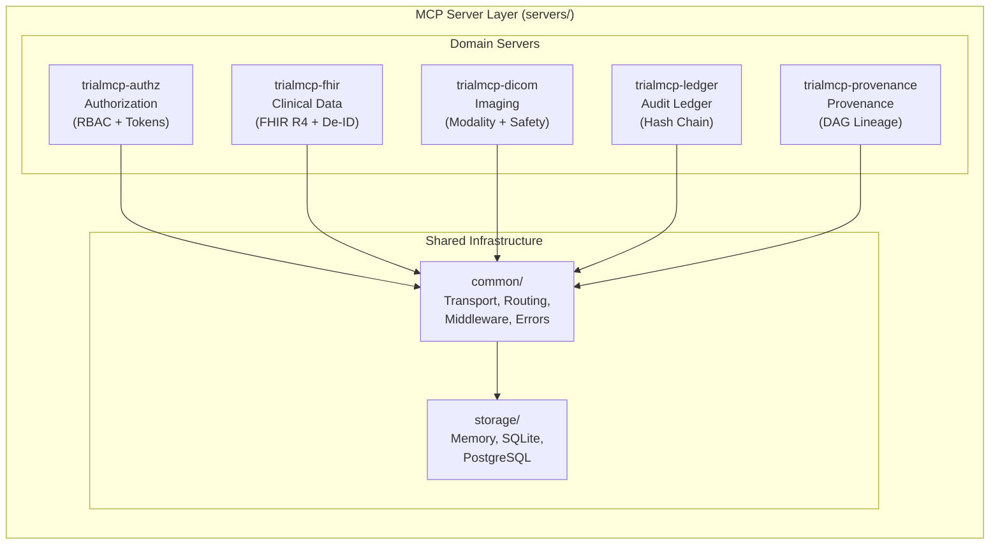

| Server | Package | Tools | Key Features |
|--------|---------|-------|-------------|
| **trialmcp-authz** | `servers/trialmcp_authz/` | `authz_evaluate`, `authz_issue_token`, `authz_validate_token`, `authz_revoke_token` | Deny-by-default RBAC, 6-actor policy matrix, SHA-256 token lifecycle |
| **trialmcp-fhir** | `servers/trialmcp_fhir/` | `fhir_read`, `fhir_search`, `fhir_patient_lookup`, `fhir_study_status` | HIPAA Safe Harbor de-identification, HMAC-SHA256 pseudonymization |
| **trialmcp-dicom** | `servers/trialmcp_dicom/` | `dicom_query`, `dicom_retrieve` | Role-based modality restrictions (CT, MR, PT), patient name hashing |
| **trialmcp-ledger** | `servers/trialmcp_ledger/` | `ledger_append`, `ledger_verify`, `ledger_query`, `ledger_export` | Hash-chained immutable ledger, SHA-256 canonical JSON |
| **trialmcp-provenance** | `servers/trialmcp_provenance/` | `provenance_record`, `provenance_query_forward`, `provenance_query_backward`, `provenance_verify` | DAG-based lineage, SHA-256 fingerprinting, W3C PROV alignment |

### Shared Infrastructure

| Component | Path | Purpose |
|-----------|------|---------|
| Transport | `servers/common/transport.py` | stdin/stdout MCP protocol (JSON-RPC 2.0) |
| Routing | `servers/common/routing.py` | Tool-call request dispatching |
| Middleware | `servers/common/middleware.py` | Auth and audit middleware |
| Errors | `servers/common/errors.py` | 9-code error taxonomy |
| Config | `servers/common/config.py` | Env vars, YAML/JSON config files |
| Logging | `servers/common/logging.py` | Structured JSON logging |
| Health | `servers/common/health.py` | Health/readiness endpoints |
| Validation | `servers/common/validation.py` | Schema validation utilities |

### Persistence Layer

| Adapter | Path | Use Case |
|---------|------|----------|
| In-Memory | `servers/storage/memory.py` | Testing, local development |
| SQLite | `servers/storage/sqlite_adapter.py` | Single-site deployment |
| PostgreSQL | `servers/storage/postgres_adapter.py` | Production deployment |

---

## Integration Adapters

v0.9.0 introduces production-grade integration adapters that connect MCP servers to real hospital infrastructure.

### Integration Architecture

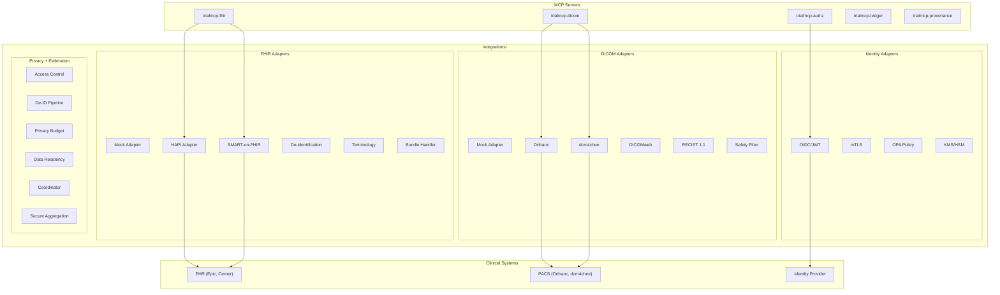

### FHIR Integration (`integrations/fhir/`)

| Module                | Purpose |
|-----------------------|-------------------------------------------|
| `base_adapter.py`     | Abstract FHIR adapter interface |
| `mock_adapter.py`     | Mock adapter with synthetic oncology data |
| `hapi_adapter.py`     | HAPI FHIR server REST adapter |
| `smart_adapter.py     | SMART-on-FHIR / OAuth2 adapter |
| `deidentification.py` | HIPAA Safe Harbor 18-identifier removal |
| `capability.py`       | CapabilityStatement R4 generation |
| `terminology.py`      | ICD-10, SNOMED CT, LOINC, RxNorm hooks |
| `bundle_handler.py`   | Transaction, batch, search bundles |
| `patient_filter.py`   | Consent-based resource access filters |

### DICOM Integration (`integrations/dicom/`)

| Module | Purpose |
|--------|---------|
| `base_adapter.py` | Abstract DICOM adapter interface |
| `mock_adapter.py` | Mock adapter with 4 synthetic studies |
| `orthanc_adapter.py` | Orthanc DICOM server adapter |
| `dcm4chee_adapter.py` | dcm4chee archive adapter |
| `dicomweb.py` | DICOMweb (QIDO-RS, WADO-RS, STOW-RS) |
| `metadata_normalizer.py` | Tag harmonization, encoding normalization |
| `modality_filter.py` | Role-based modality restrictions |
| `recist.py` | RECIST 1.1 measurement validators |
| `safety.py` | Metadata-only safety enforcement |

### Identity, Privacy, and Federation

| Package | Module | Purpose |
|---------|--------|---------|
| `identity/` | `oidc_adapter.py` | OIDC/JWT token validation |
| `identity/` | `mtls.py` | mTLS certificate validation |
| `identity/` | `policy_engine.py` | OPA-compatible policy engine |
| `identity/` | `kms.py` | KMS/HSM signing key hooks |
| `clinical/` | `econsent_adapter.py` | eConsent/IRB metadata |
| `clinical/` | `scheduling_adapter.py` | Procedure scheduling |
| `clinical/` | `provenance_export.py` | W3C PROV-N export |
| `privacy/` | `access_control.py` | RBAC + ABAC access control |
| `privacy/` | `deidentification_pipeline.py` | Unified de-ID pipeline |
| `privacy/` | `privacy_budget.py` | Differential privacy budgets |
| `privacy/` | `data_residency.py` | Data residency enforcement |
| `federation/` | `coordinator.py` | Federated coordination |
| `federation/` | `secure_aggregation.py` | Secure aggregation |
| `federation/` | `site_harmonization.py` | Cross-site data harmonization |
| `federation/` | `policy_enforcement.py` | Federation policy enforcement |

---

## Robot Safety and Execution Boundaries

v0.9.0 implements a comprehensive safety framework for Physical AI robot-assisted procedures.

### Safety Architecture

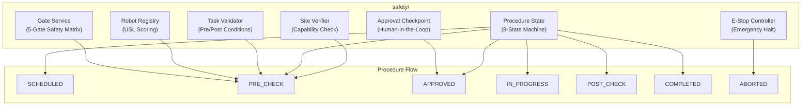

### Safety Modules (`safety/`)

| Module | Purpose |
|--------|---------|
| `gate_service.py` | Pre-procedure 5-gate safety matrix (consent, site, robot, protocol, human approval) |
| `robot_registry.py` | Robot capability registry with USL scoring and certification tracking |
| `task_validator.py` | Task-order validation with precondition/postcondition contracts |
| `approval_checkpoint.py` | Human-in-the-loop approval gates with timeout (300s) and escalation |
| `estop.py` | Emergency stop with signal propagation, state preservation, recovery |
| `procedure_state.py` | 8-state machine: SCHEDULED → PRE_CHECK → APPROVED → IN_PROGRESS → POST_CHECK → COMPLETED / ABORTED / FAILED |
| `site_verifier.py` | Site capability verification against site-capability-profile schema |

### Procedure State Machine

```
SCHEDULED ──> PRE_CHECK ──> APPROVED ──> IN_PROGRESS ──> POST_CHECK ──> COMPLETED
    |             |                          |
    v             v                          v
 ABORTED       FAILED                     ABORTED
```

---

## MCP Process Diagrams

Comprehensive process diagrams documenting all MCP communication patterns are in [`docs/mcp-process/`](docs/mcp-process/).

| Diagram | Description |
|---------|-------------|
| [01 - Robot Procedure Lifecycle](docs/mcp-process/01-robot-procedure-lifecycle.md) | End-to-end state machine with MCP server interactions per state |
| [02 - Cross-Site MCP Communication](docs/mcp-process/02-cross-site-mcp-communication.md) | Multi-site topology, audit chain sync, token exchange protocol |
| [03 - Clinical System Integration](docs/mcp-process/03-clinical-system-integration.md) | FHIR/DICOM/identity adapter architecture and data flows |
| [04 - Safety Gate Evaluation](docs/mcp-process/04-safety-gate-evaluation.md) | Safety gate matrix, evaluation flow, e-stop propagation |
| [05 - Federated Learning Coordination](docs/mcp-process/05-federated-learning-coordination.md) | Federated round lifecycle, secure aggregation, privacy budgets |
| [06 - Audit and Provenance Chain](docs/mcp-process/06-audit-provenance-chain.md) | Hash-chained ledger construction and DAG provenance tracking |
| [07 - Privacy and De-identification](docs/mcp-process/07-privacy-deidentification.md) | HIPAA Safe Harbor pipeline and data residency enforcement |

---

## Deployment Infrastructure

### Docker

Individual Dockerfiles for each server and an all-in-one image are provided in `deploy/docker/`.

```bash
# Single-site deployment with all 5 servers:
cd deploy && docker-compose up

# Multi-site deployment (Site A + Site B + shared ledger):
cd deploy && docker-compose -f docker-compose.multi-site.yml up
```

### Kubernetes

Reference Kubernetes manifests for production deployment:

```
deploy/kubernetes/
├── namespace.yaml          # trialmcp namespace
├── configmap.yaml          # ConfigMap + Secrets template
├── deployment-authz.yaml   # AuthZ Deployment + Service
├── deployment-fhir.yaml    # FHIR Deployment + Service
├── deployment-dicom.yaml   # DICOM Deployment + Service
├── deployment-ledger.yaml  # Ledger Deployment + Service
└── deployment-provenance.yaml  # Provenance Deployment + Service
```

### Helm Chart

Configurable Helm chart for deployment:

```bash
helm install trialmcp deploy/helm/trialmcp \
  --set global.storageBackend=sqlite \
  --set global.logLevel=INFO
```

---

## Quickstart Demo

Run the complete workflow across all 5 MCP servers in under 5 minutes:

```bash
pip install -e .
python examples/quickstart/run_demo.py
```

The demo executes: token issuance → authorization → FHIR read (de-identified) → DICOM query → ledger append → provenance record → chain verification → DAG verification.

---

## Reference Implementations

> **INFORMATIVE** — The reference implementations below are NON-NORMATIVE Level 1 illustrative implementations. They demonstrate schema-compliant payload shapes and are not suitable for production deployment. The normative requirements are defined in `/spec/`, `/schemas/`, and `/profiles/`.

### Reference Implementation Architecture

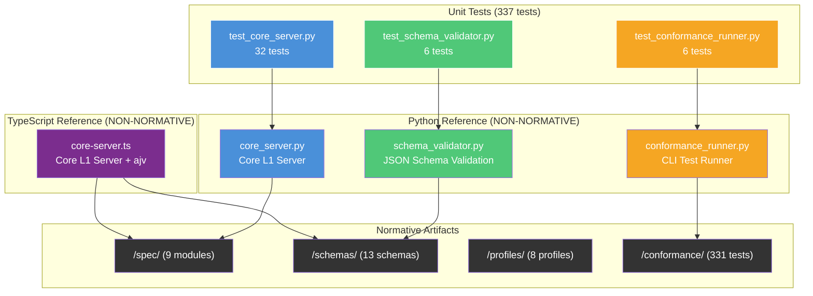

### Reference Implementation Summary

| Language | Directory | Files | Purpose |
|----------|-----------|-------|---------|
| **Python** | [`reference/python/`](reference/python/) | `core_server.py`, `schema_validator.py`, `conformance_runner.py` | Minimal Core server, schema validator, conformance runner |
| **TypeScript** | [`reference/typescript/`](reference/typescript/) | `core-server.ts`, `package.json`, `tsconfig.json` | Minimal Core server stub with ajv validation |

Both reference implementations demonstrate:
- **Deny-by-default RBAC** — 6-actor policy matrix per [spec/actor-model.md](spec/actor-model.md)
- **Hash-chained audit** — SHA-256 chain with canonical JSON per [spec/audit.md](spec/audit.md)
- **Schema validation** — All outputs validated against [schemas/](schemas/)
- **Token lifecycle** — Issuance, validation, and revocation per [spec/security.md](spec/security.md)

---

## Unit Test Suite

The `/tests/` directory contains 337 unit tests that validate the reference Python implementation's public API, integration adapters, and safety modules. These tests complement the 331 conformance tests by verifying the correctness of server implementations, adapter modules, and safety infrastructure.

### Unit Test Architecture

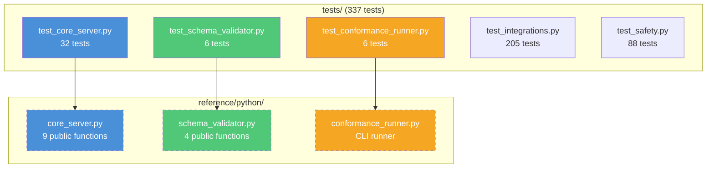

### Unit Test Summary

| Test File | Tests | Coverage |
|-----------|-------|----------|
| `test_core_server.py` | 32 | AuthZ evaluate, token lifecycle, ledger operations, health/error helpers, policy matrix, genesis hash |
| `test_schema_validator.py` | 6 | Schema loading, schema listing, validation |
| `test_conformance_runner.py` | 6 | Pytest argument building, level directory mapping |
| `test_integrations.py` | 205 | All 34 integration adapters (FHIR, DICOM, clinical, federation, identity, privacy) |
| `test_safety.py` | 88 | All 8 safety modules (e-stop, procedure state, robot registry, task validator, gates, approvals, site verifier) |

### Running Unit Tests

```bash
# Run all unit tests
pytest tests/ -v

# Run all tests (unit + conformance)
pytest -v
```

---

## CI/CD Pipeline

The CI/CD pipeline (`.github/workflows/ci.yml`) runs on every push and pull request. The pipeline includes fourteen jobs:

| Job | Matrix | Checks |
|-----|--------|--------|
| **lint-and-format** | Python 3.10, 3.11, 3.12 | Ruff lint, Ruff format, pytest unit tests (337), pytest conformance suite (331) |
| **integration-tests** | Python 3.12 | Integration tests against in-process server packages |
| **adversarial-tests** | Python 3.12 | Adversarial test packs (authz bypass, PHI leakage, replay, tampering, rate limiting) |
| **schema-compatibility** | Python 3.12 | Schema compatibility diffing (breaking/non-breaking change detection) |
| **benchmark-smoke** | Python 3.12 | Benchmark smoke tests (latency, throughput, chain, concurrent) |
| **schema-validation** | Python 3.12 | All 13 schemas validated (structure + example self-validation) |
| **contract-consistency** | Python 3.12 | Generated models match committed models, core_server outputs validate against schemas |
| **sdk-python** | Python 3.12 | Python SDK install and import verification |
| **sdk-typescript** | Node.js 20 | TypeScript SDK compile check |
| **cli-smoke** | Python 3.12 | CLI tool subcommand smoke tests |
| **codegen-consistency** | Python 3.12 | Code generation consistency check |
| **security-scan** | Python 3.12 | Dependency audit and secret scanning |
| **typescript-build** | Node.js 20 | TypeScript reference compile check |
| **docs-lint** | — | Required documentation files exist, internal markdown links checked (fails on errors) |

```
┌──────────────────────────────────────────────────────────────────────────────┐
│                             CI/CD PIPELINE                                   │
├──────────────────────────────────────────────────────────────────────────────┤
│                                                                              │
│  Push / PR to main                                                           │
│       │                                                                      │
│       ├──> lint-and-format (3.10) ─> ruff + 337 unit + 331 conformance       │
│       ├──> lint-and-format (3.11) ─> ruff + 337 unit + 331 conformance       │
│       ├──> lint-and-format (3.12) ─> ruff + 337 unit + 331 conformance       │
│       ├──> integration-tests ──────> in-process server integration tests     │
│       ├──> adversarial-tests ──────> authz bypass + PHI + replay + tamper    │
│       ├──> schema-compatibility ───> schema diff + breaking change detect    │
│       ├──> benchmark-smoke ────────> latency + throughput + chain + concur   │
│       ├──> schema-validation ──────> 13 schemas + examples                   │
│       ├──> contract-consistency ───> model gen + runtime schema validation   │
│       ├──> sdk-python ─────────────> SDK install + import verification       │
│       ├──> sdk-typescript ─────────> tsc --noEmit (SDK)                      │
│       ├──> cli-smoke ──────────────> CLI subcommand smoke tests              │
│       ├──> codegen-consistency ────> code generation check                   │
│       ├──> security-scan ──────────> dependency audit + secret scan          │
│       ├──> typescript-build ───────> tsc --noEmit (reference)                │
│       └──> docs-lint ──────────────> file check + link check (fail errors)   │
│                                                                              │
│  All jobs run in parallel · 668 total tests per Python version               │
└──────────────────────────────────────────────────────────────────────────────┘
```

---

## Black-Box Conformance Harness

v0.8.0 introduces a black-box conformance harness under `conformance/harness/` that can target real server deployments via pluggable transport adapters (stdin, HTTP, Docker). The harness enables any vendor or site to validate their MCP server implementation against the national standard without relying on internal fixture validation alone.

### Harness Architecture

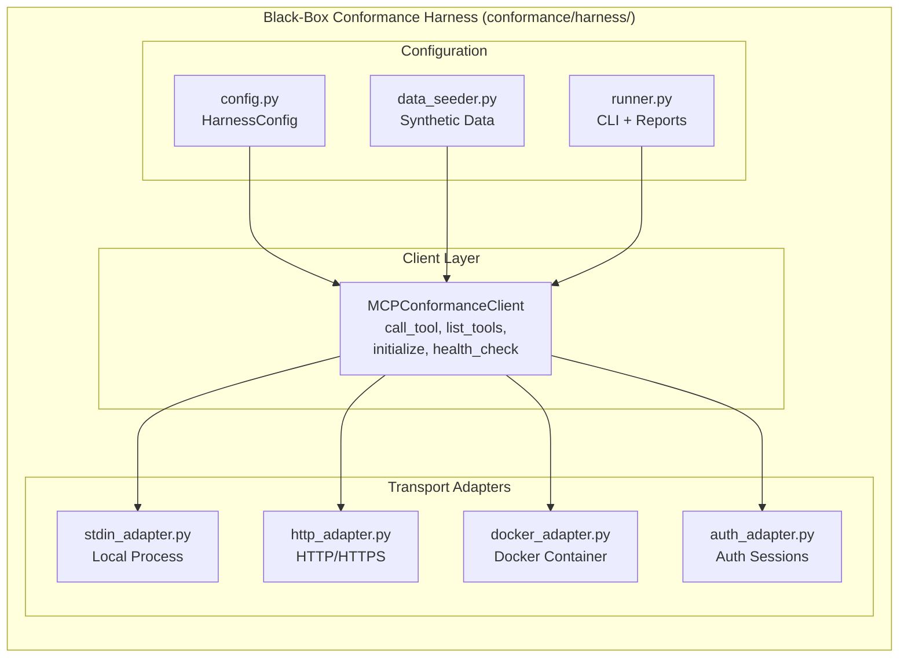

| Component | Path | Purpose |
|-----------|------|---------|
| Client | `conformance/harness/client.py` | MCP client with `call_tool()`, `list_tools()`, `initialize()`, `health_check()` |
| Config | `conformance/harness/config.py` | Target server URLs, credentials, profile/level selection, output format |
| Stdin Adapter | `conformance/harness/adapters/stdin_adapter.py` | stdin/stdout JSON-RPC subprocess transport |
| HTTP Adapter | `conformance/harness/adapters/http_adapter.py` | HTTP POST transport for remote servers |
| Docker Adapter | `conformance/harness/adapters/docker_adapter.py` | Docker exec transport for containerized servers |
| Auth Adapter | `conformance/harness/adapters/auth_adapter.py` | Multi-role authenticated session management |
| Data Seeder | `conformance/harness/data_seeder.py` | Synthetic FHIR Patient, ResearchStudy, DICOM metadata |
| Runner | `conformance/harness/runner.py` | CLI with JSON, JUnit XML, HTML, Markdown report output |

### Running the Harness

```bash
# Run against local stdin server
trialmcp-conformance --target stdin --profile base --level 1

# Run against HTTP deployment
trialmcp-conformance --target http --address http://localhost:8080 --profile clinical-read --level 2

# Run against Docker container
trialmcp-conformance --target docker --address trialmcp-authz --profile base --level 1 --output-format junit
```

---

## Conformance Test Suite

The conformance test suite under `/conformance/` contains 331 automated tests across eight tiers — unit, positive, negative, security, interoperability, blackbox, adversarial, and integration — covering all five conformance levels and thirteen schemas.

### Conformance Test Architecture

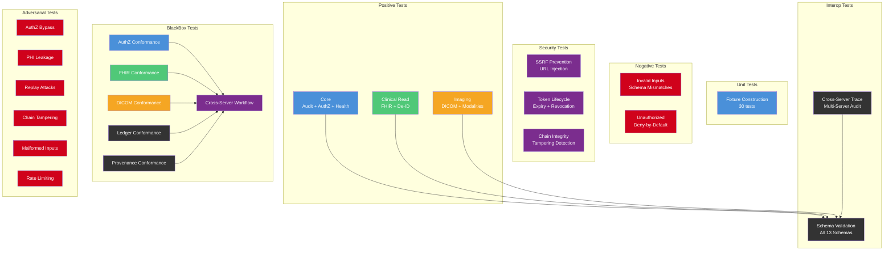

### Conformance Test Summary

| Tier | Test File | Coverage |
|------|-----------|----------|
| **Unit** | `unit/test_fixture_construction.py` | 30 tests: fixture construction for all 4 fixture modules |
| **Positive** | `positive/test_core_conformance.py` | Audit, error envelope, health, authz (Level 1 Core) |
| **Positive** | `positive/test_clinical_read_conformance.py` | FHIR + HIPAA de-identification (Level 2) |
| **Positive** | `positive/test_imaging_conformance.py` | DICOM + role-based modalities (Level 3) |
| **Negative** | `negative/test_invalid_inputs.py` | Malformed requests, schema mismatches |
| **Negative** | `negative/test_unauthorized_access.py` | Deny-by-default, permission escalation |
| **Security** | `security/test_ssrf_prevention.py` | URL injection, internal IP detection |
| **Security** | `security/test_token_lifecycle.py` | Issuance, expiry, revocation |
| **Security** | `security/test_chain_integrity.py` | Hash chain tampering, genesis verify |
| **Interop** | `interoperability/test_cross_server_trace.py` | Multi-server audit linkage (Level 4) |
| **Interop** | `interoperability/test_schema_validation.py` | All outputs against 13 schemas |
| **BlackBox** | `blackbox/test_authz_conformance.py` | Token lifecycle, RBAC, deny-by-default |
| **BlackBox** | `blackbox/test_fhir_conformance.py` | FHIR read, search, de-identification |
| **BlackBox** | `blackbox/test_dicom_conformance.py` | DICOM query, modality restrictions |
| **BlackBox** | `blackbox/test_ledger_conformance.py` | Ledger append, verify, chain integrity |
| **BlackBox** | `blackbox/test_provenance_conformance.py` | Provenance record, DAG integrity |
| **BlackBox** | `blackbox/test_cross_server_workflow.py` | End-to-end 5-server workflow |
| **Adversarial** | `adversarial/test_authz_bypass.py` | Role escalation, token reuse, forged tokens |
| **Adversarial** | `adversarial/test_phi_leakage.py` | De-ID completeness, error message exposure |
| **Adversarial** | `adversarial/test_replay_attacks.py` | Duplicate audit/provenance, replayed authz |
| **Adversarial** | `adversarial/test_chain_tampering.py` | Modified, inserted, deleted, reordered records |
| **Adversarial** | `adversarial/test_malformed_inputs.py` | SSRF, XSS, SQL injection, command injection |
| **Adversarial** | `adversarial/test_rate_limiting.py` | Rapid tokens, bulk queries, write contention |

### National Conformance Validation Flow
 
```
┌──────────────────────────────────────────────────────────────────┐
│                  NATIONAL CONFORMANCE VALIDATION                 │
├──────────────────────────────────────────────────────────────────┤
│                                                                  │
│         IMPLEMENTER                  CONFORMANCE SUITE           │
│      ┌──────────────┐             ┌──────────────────────┐       │
│      │ MCP Server   │────────────>│ 1. Unit Tests        │       │
│      │ Deployment   │             │    Fixture Validation│       │
│      │ (5 Servers)  │             ├──────────────────────┤       │
│      └──────────────┘             │ 2. Positive Tests    │       │
│                                   │    Core + Clinical   │       │
│          ┌──────────┐             │    + Imaging         │       │
│          │ BlackBox │             ├──────────────────────┤       │
│          │ Harness  │────────────>│ 3. BlackBox Tests    │       │
│          │ (stdin/  │             │    All 5 Servers +   │       │
│          │  HTTP/   │             │    Cross-Server      │       │
│          │  Docker) │             ├──────────────────────┤       │
│          └──────────┘             │ 4. Adversarial Tests │       │
│                                   │    Bypass + Tamper + │       │
│                                   │    Replay + Inject   │       │
│                                   ├──────────────────────┤       │
│                                   │ 5. Security Tests    │       │
│                                   │    SSRF + Token +    │       │
│                                   │    Chain Integrity   │       │
│                                   ├──────────────────────┤       │
│                                   │ 6. Interop Tests     │       │
│                                   │    Cross-Server +    │       │
│                                   │    Schema Validation │       │
│                                   └──────────┬───────────┘       │
│                                              │                   │
│                                   ┌──────────▼───────────┐       │
│                                   │  Conformance Report  │       │
│                                   │  Level 1–5 Certified │       │
│                                   │  668 Tests Validated │       │
│                                   │  (337 unit + 331 conf│       │
│                                   └──────────────────────┘       │
└──────────────────────────────────────────────────────────────────┘
```

See [conformance/README.md](conformance/README.md) for the full test harness documentation.

---

## National Interoperability Testbed

v0.8.0 introduces a national interoperability testbed under `interop-testbed/` that proves cross-site behavior, deployment consistency, and failure modes across a multi-site cluster.

### Testbed Architecture

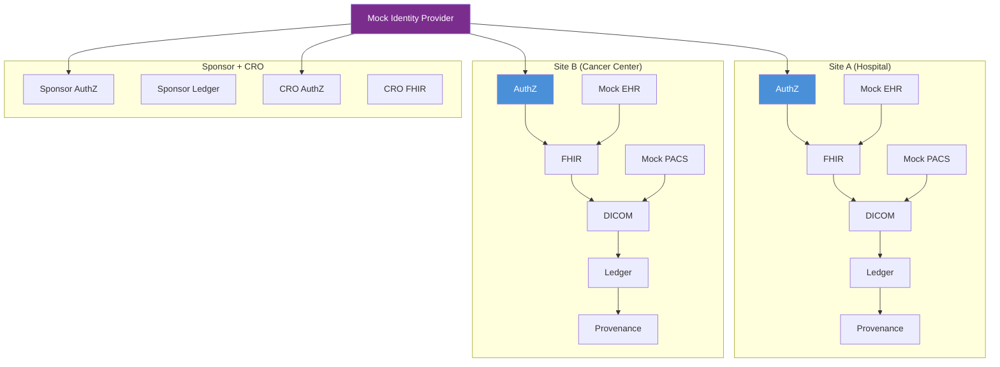

### Testbed Components

| Component | Path | Purpose |
|-----------|------|---------|
| Docker Compose | `interop-testbed/docker-compose.yml` | Multi-site cluster (Site A, Site B, Sponsor, CRO, Identity) |
| Personas | `interop-testbed/personas/` | 6 actor persona configs (robot, coordinator, monitor, auditor, sponsor, CRO) |
| Mock EHR | `interop-testbed/mock_services/mock_ehr.py` | FHIR R4 synthetic patient data |
| Mock PACS | `interop-testbed/mock_services/mock_pacs.py` | Synthetic DICOM imaging metadata |
| Mock Identity | `interop-testbed/mock_services/mock_identity.py` | OIDC/JWT token provider |

### Interoperability Scenarios

| Scenario | File | Validates |
|----------|------|-----------|
| Cross-Site Provenance | `scenarios/cross_site_provenance.py` | DAG integrity across site boundaries |
| Audit Replay | `scenarios/audit_replay.py` | Hash chain replay with per-record verification |
| Token Exchange | `scenarios/token_exchange.py` | Cross-site token issuance, validation, revocation |
| Partial Outage | `scenarios/partial_outage.py` | Graceful degradation when services fail |
| Schema Drift | `scenarios/schema_drift.py` | Major/minor/patch drift detection between versions |
| State Overlay | `scenarios/state_overlay.py` | CA CCPA, NY PHL/SHIELD, FDA 21 CFR Part 11 overlays |
| Robot Workflow | `scenarios/robot_workflow.py` | 8-step robot-assisted procedure workflow |
| Site Onboarding | `scenarios/site_onboarding.py` | 10-check site certification checklist |

---

## Certification and Evidence Generation

v0.8.0 adds certification tools under `tools/certification/` for generating conformance reports, evidence packs, site certification, and schema compatibility analysis.

| Tool | File | Purpose |
|------|------|---------|
| Report Generator | `tools/certification/report_generator.py` | JSON, JUnit XML, HTML, Markdown conformance reports |
| Evidence Pack | `tools/certification/evidence_pack.py` | SHA-256 hashed evidence bundles with manifest |
| Site Certification | `tools/certification/site_certification.py` | Profile-based conformance level validation |
| Schema Diff | `tools/certification/schema_diff.py` | Breaking/non-breaking schema change detection |

---

## Benchmarks

v0.8.0 adds performance benchmarks under `benchmarks/` for measuring latency, throughput, chain verification, and concurrent access performance.

| Benchmark | File | Measures |
|-----------|------|----------|
| Latency | `benchmarks/latency_benchmark.py` | Audit hash computation, chain construction timing |
| Throughput | `benchmarks/throughput_benchmark.py` | AuthZ, audit, provenance operations per second |
| Chain | `benchmarks/chain_benchmark.py` | Chain construction at 10/50/100/500 records |
| Concurrent | `benchmarks/concurrent_benchmark.py` | ThreadPool performance at 1/2/4/8 threads |
| Report | `benchmarks/report.py` | Report generation with baseline regression detection |

---

## Profiles and Conformance Level Definitions

Version 0.3.0 introduces 8 conformance profiles under `/profiles/` that formalize the requirements for each deployment tier and regulatory jurisdiction. Each profile defines mandatory tools, optional tools, forbidden operations, required schemas, regulatory overlays, and a conformance test subset.

### Profile Architecture

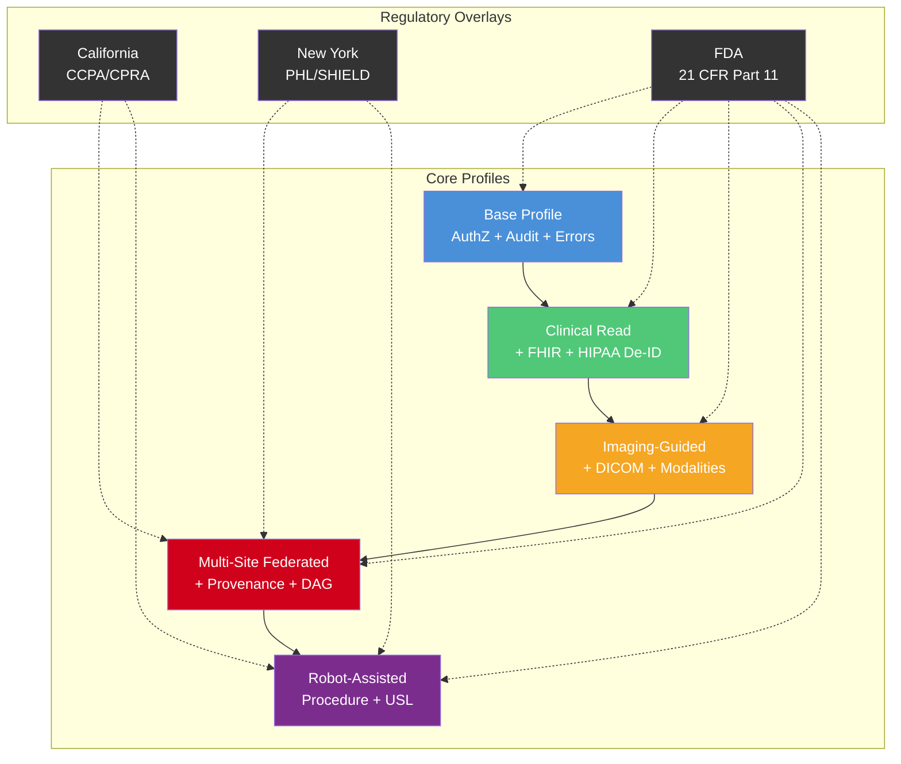

### Profile Summary

| Profile | File | Mandatory Tools | Required Schemas | Test Count |
|---------|------|----------------|-----------------|------------|
| **Base Profile** | [`profiles/base-profile.md`](profiles/base-profile.md) | `authz_*` (5), `ledger_*` (5) | authz-decision, audit-record, error-response, health-status, capability-descriptor | 19 |
| **Clinical Read** | [`profiles/clinical-read.md`](profiles/clinical-read.md) | + `fhir_*` (4) | + fhir-read, fhir-search, consent-status | 29 |
| **Imaging-Guided Oncology** | [`profiles/imaging-guided-oncology.md`](profiles/imaging-guided-oncology.md) | + `dicom_*` (4) | + dicom-query, robot-capability-profile | 39 |
| **Multi-Site Federated** | [`profiles/multi-site-federated.md`](profiles/multi-site-federated.md) | + `provenance_*` (5) | + provenance-record, site-capability-profile | 48 |
| **Robot-Assisted Procedure** | [`profiles/robot-assisted-procedure.md`](profiles/robot-assisted-procedure.md) | All 23 tools | + robot-capability-profile, task-order | 58 |

### Regulatory Overlay Profiles

| Overlay | File | Jurisdiction | Key Requirements |
|---------|------|-------------|-----------------|
| **California CCPA** | [`profiles/state-us-ca.md`](profiles/state-us-ca.md) | US-CA | CCPA/CPRA consumer rights, sensitive PI protections, data minimization |
| **New York Health Info** | [`profiles/state-us-ny.md`](profiles/state-us-ny.md) | US-NY | PHL Article 27-F (HIV), SHIELD Act, MHL Article 33, DOH 10 NYCRR |
| **FDA 21 CFR Part 11** | [`profiles/country-us-fda.md`](profiles/country-us-fda.md) | US (Federal) | Electronic records, electronic signatures, audit trails, system validation |

### National Profile Deployment Map

```
┌─────────────────────────────────────────────────────────────────────┐
│                  NATIONAL PROFILE DEPLOYMENT                        │
├─────────────────────────────────────────────────────────────────────┤
│                                                                     │
│  ┌───────────────────┐  ┌──────────────────┐  ┌──────────────────┐  │
│  │  CALIFORNIA SITE  │  │  NEW YORK SITE   │  │  OTHER US SITES  │  │
│  │                   │  │                  │  │                  │  │
│  │  Profile: L5      │  │  Profile: L4     │  │  Profile: L1–L5  │  │
│  │  + CCPA Overlay   │  │  + NY Overlay    │  │  + FDA Overlay   │  │
│  │  + FDA Overlay    │  │  + FDA Overlay   │  │                  │  │
│  │                   │  │                  │  │                  │  │
│  │  Extra: CPRA      │  │  Extra: PHL 27-F │  │  State overlays  │  │
│  │  sensitive PI,    │  │  HIV protections,│  │  applied per     │  │
│  │  data minimization│  │  SHIELD Act,     │  │  jurisdiction    │  │
│  │                   │  │  MHL Article 33  │  │                  │  │
│  └───────────────────┘  └──────────────────┘  └──────────────────┘  │
│                                                                     │
│  ┌───────────────────────────────────────────────────────────────┐  │
│  │              FDA 21 CFR PART 11 — ALL SITES                   │  │
│  │  Audit trails · Electronic signatures · System validation     │  │
│  │  Record integrity · Authority checks · Change control         │  │
│  └───────────────────────────────────────────────────────────────┘  │
└─────────────────────────────────────────────────────────────────────┘
```

---

## Machine-Readable JSON Schemas

Version 0.2.0 introduces 13 machine-readable JSON Schema files (JSON Schema draft 2020-12) that formalize the data contracts for all MCP server interactions across the national network. These schemas enable automated input/output validation, conformance testing, and code generation for every conforming implementation.

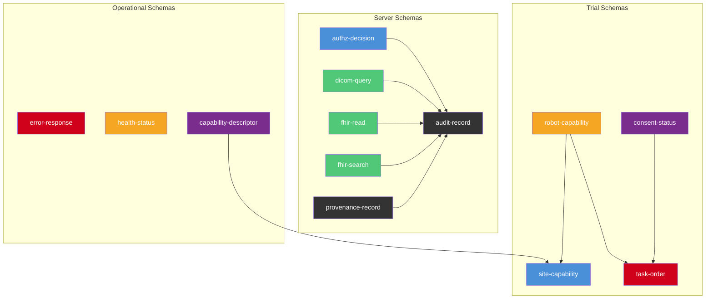

### Schema Summary

| Schema | Source | Purpose |
|--------|--------|---------|
| [`capability-descriptor`](schemas/capability-descriptor.schema.json) | Server capability advertisement | Server name, version, tools, conformance level |
| [`robot-capability-profile`](schemas/robot-capability-profile.schema.json) | `trial_robot_agent.py` + `trial_schedule.json` | Platform, robot type, USL score, safety prerequisites |
| [`site-capability-profile`](schemas/site-capability-profile.schema.json) | Site descriptor | Jurisdiction, servers, data residency, IRB approval |
| [`task-order`](schemas/task-order.schema.json) | `trial_schedule.json` structure | Procedure type, robot assignment, scheduling, safety checks |
| [`audit-record`](schemas/audit-record.schema.json) | `ledger_server.py` AuditRecord | Hash-chained audit record for 21 CFR Part 11 |
| [`provenance-record`](schemas/provenance-record.schema.json) | `provenance_server.py` ProvenanceRecord | DAG lineage with SHA-256 fingerprinting |
| [`consent-status`](schemas/consent-status.schema.json) | Consent state machine | Patient consent with 6 granular categories |
| [`authz-decision`](schemas/authz-decision.schema.json) | `authz_server.py` evaluate | RBAC decision with matching rules |
| [`dicom-query`](schemas/dicom-query.schema.json) | `dicom_server.py` dicom_query | DICOM query with role-based permissions |
| [`fhir-read`](schemas/fhir-read.schema.json) | `fhir_server.py` fhir_read | FHIR R4 read with HIPAA de-identification |
| [`fhir-search`](schemas/fhir-search.schema.json) | `fhir_server.py` fhir_search | FHIR R4 search with result capping |
| [`error-response`](schemas/error-response.schema.json) | `servers/common/__init__.py` | Standardized error with 9-code taxonomy |
| [`health-status`](schemas/health-status.schema.json) | `servers/common/__init__.py` | Server health with dependency and metrics |

---

## Conformance Levels

The standard defines five conformance levels. Each level builds on the previous, adding MUST/SHOULD/MAY requirements per [RFC 2119](https://www.rfc-editor.org/rfc/rfc2119).

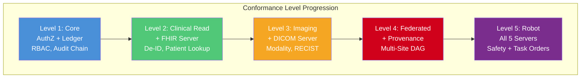

| Level | Name | Required Servers | Key Capabilities |
|-------|------|-----------------|------------------|
| **1 — Core** | Core | AuthZ, Ledger | Authentication, authorization, audit chain |
| **2 — Clinical Read** | Clinical Read | + FHIR | FHIR R4 queries, de-identification, patient lookup |
| **3 — Imaging** | Imaging | + DICOM | DICOM query/retrieve, RECIST measurements |
| **4 — Federated Site** | Federated Site | + Provenance | Multi-site data lineage, federated aggregation |
| **5 — Robot Procedure** | Robot Procedure | All 5 | End-to-end autonomous robot clinical workflows |

See [spec/conformance.md](spec/conformance.md) for the full MUST/SHOULD/MAY matrix per level.

---

## Actor Model

Six actors interact with the national MCP infrastructure. Roles are enforced through deny-by-default RBAC policies.

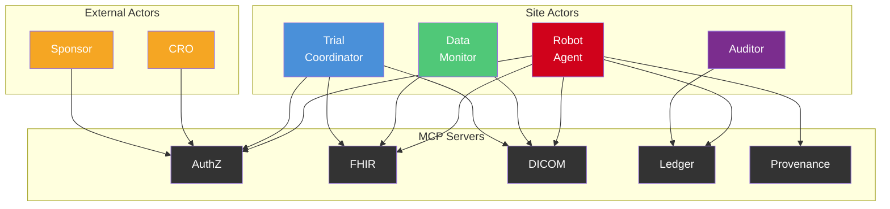

| Actor | Description | Default Access |
|-------|-------------|----------------|
| **Robot Agent** | Autonomous physical AI system executing clinical procedures | Scoped FHIR read, DICOM query/retrieve, ledger append, provenance record |
| **Trial Coordinator** | Clinical site staff managing trial operations | Full FHIR and DICOM access, policy management |
| **Data Monitor** | CRO or sponsor representative reviewing trial data | Read-only FHIR and DICOM, no retrieve, no provenance write |
| **Auditor** | Compliance officer verifying regulatory adherence | Ledger query/verify/replay, chain status |
| **Sponsor** | Pharmaceutical or device company funding the trial | Policy configuration, aggregate reporting |
| **CRO** | Contract Research Organization managing multi-site operations | Cross-site coordination, aggregate data access |

See [spec/actor-model.md](spec/actor-model.md) for the full permission matrix.

---

## Tool Contract Registry

The standard defines **23 tool contracts** across five MCP servers. Every tool MUST satisfy input validation, output schema, error code, and audit requirements defined in [spec/tool-contracts.md](spec/tool-contracts.md).

### Server Summary

| Server | Tools | Purpose |
|--------|-------|---------|
| **trialmcp-authz** | `authz_evaluate`, `authz_issue_token`, `authz_validate_token`, `authz_list_policies`, `authz_revoke_token` | Deny-by-default RBAC, token lifecycle |
| **trialmcp-fhir** | `fhir_read`, `fhir_search`, `fhir_patient_lookup`, `fhir_study_status` | FHIR R4 clinical data with HIPAA de-identification |
| **trialmcp-dicom** | `dicom_query`, `dicom_retrieve_pointer`, `dicom_study_metadata`, `dicom_recist_measurements` | DICOM imaging with role-based permissions |
| **trialmcp-ledger** | `ledger_append`, `ledger_verify`, `ledger_query`, `ledger_replay`, `ledger_chain_status` | Hash-chained 21 CFR Part 11 audit trail |
| **trialmcp-provenance** | `provenance_register_source`, `provenance_record_access`, `provenance_get_lineage`, `provenance_get_actor_history`, `provenance_verify_integrity` | DAG-based data lineage and SHA-256 fingerprinting |

### Error Code Taxonomy

All servers MUST use standardized machine-readable error codes: `AUTHZ_DENIED`, `VALIDATION_FAILED`, `NOT_FOUND`, `INTERNAL_ERROR`, `TOKEN_EXPIRED`, `TOKEN_REVOKED`, `PERMISSION_DENIED`, `INVALID_INPUT`, `RATE_LIMITED`.

---

## Security and Privacy

### Security Model

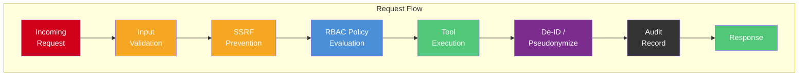

- **Authentication**: Token-based sessions with role scoping, SHA-256 hashing, and UTC expiry enforcement
- **Authorization**: Deny-by-default RBAC — explicit DENY rules take precedence over ALLOW
- **Input Validation**: FHIR ID format (`^[A-Za-z0-9\-._]+$`), DICOM UID format (`^[\d.]+$`), URL rejection for SSRF prevention
- **Privacy**: HIPAA Safe Harbor 18-identifier removal, HMAC-SHA256 pseudonymization, year-only date generalization
- **Integrity**: SHA-256 hash chains with canonical serialization, genesis hash verification
- **Audit**: Every tool call produces a signed audit record; hash-chained for tamper detection

See [spec/security.md](spec/security.md) and [spec/privacy.md](spec/privacy.md) for full details.

---

## Regulatory Compliance

| Standard | Specification Coverage | Regulatory File |
|----------|----------------------|-----------------|
| **21 CFR Part 11** | Hash-chained audit ledger, electronic signatures, audit replay | [regulatory/CFR_PART_11.md](regulatory/CFR_PART_11.md) |
| **HIPAA** | Safe Harbor de-identification, HMAC pseudonymization, minimum necessary | [regulatory/HIPAA.md](regulatory/HIPAA.md) |
| **FDA Guidance** | AI/ML medical device framework, predetermined change control | [regulatory/US_FDA.md](regulatory/US_FDA.md) |
| **ICH-GCP E6(R2)** | Replayable audit traces, electronic source data | [regulatory/CFR_PART_11.md](regulatory/CFR_PART_11.md) |
| **IEC 80601** | Safety-constrained execution via policy enforcement | [spec/security.md](spec/security.md) |
| **ISO 14971** | Risk management via deny-by-default policies | [spec/security.md](spec/security.md) |
| **ISO 13482** | Robot safety integration through scoped permissions | [spec/actor-model.md](spec/actor-model.md) |
| **IRB Requirements** | Site-specific policy templates | [regulatory/IRB_SITE_POLICY_TEMPLATE.md](regulatory/IRB_SITE_POLICY_TEMPLATE.md) |

---

## Advantages Over Existing Approaches

### vs. Prior Reference Implementation (kevinkawchak/mcp-pai-oncology-trials)

| Dimension | Reference Implementation | National Standard |
|-----------|------------------------|-------------------|
| **Scope** | Single-site proof of concept | Industry-wide U.S. standard for all sites |
| **Conformance** | Informal; implementers decide what to build | 5 formal conformance levels with MUST/SHOULD/MAY |
| **Schemas** | Implicit in Python code | 13 explicit JSON Schema files (draft 2020-12) |
| **Governance** | Repository-level decisions | Charter, decision process, extension namespaces |
| **Actors** | 4 roles in code (`robot_agent`, `trial_coordinator`, `data_monitor`, `auditor`) | 6 actors including `sponsor` and `CRO` for full trial ecosystem |
| **Regulatory** | Compliance noted in README | Dedicated regulatory overlays (FDA, HIPAA, 21 CFR Part 11, IRB) |
| **Versioning** | Changelog-driven | SemVer with compatibility policy and extension namespaces |
| **Community** | Contributors list | Full governance: charter, CODEOWNERS, issue templates, CoC |

### vs. Existing Oncology Trial Approaches

| Dimension | Traditional Approaches | National MCP Standard |
|-----------|----------------------|----------------------|
| **Integration** | Point-to-point custom APIs per site | Standardized 23-tool contract registry |
| **Security** | Varied per implementation | Uniform deny-by-default RBAC with SSRF prevention |
| **Audit** | Database logs, proprietary formats | Hash-chained immutable ledger with chain verification |
| **Privacy** | Site-specific de-identification | Mandated HIPAA Safe Harbor with HMAC pseudonymization |
| **Robotics** | No standard robot-to-clinical protocol | First national standard for Physical AI clinical integration |
| **Multi-site** | Manual data sharing agreements | Federated architecture with differential privacy built in |
| **Validation** | Manual testing | Machine-readable JSON schemas for automated validation |

### vs. Other MCP/AI Server Approaches for Oncology

| Dimension | General MCP Servers | National MCP-PAI Standard |
|-----------|-------------------|--------------------------|
| **Domain** | Generic tool serving | Purpose-built for oncology clinical trials |
| **Compliance** | No regulatory awareness | FDA, HIPAA, 21 CFR Part 11 mapped to every tool |
| **Physical AI** | Software agents only | Surgical robots, therapeutic systems, diagnostic platforms |
| **Provenance** | No data lineage | DAG-based lineage with SHA-256 fingerprinting |
| **Federated** | Single-instance | Multi-site federated with privacy-preserving aggregation |
| **Audit** | Application logs | 21 CFR Part 11 compliant hash-chained ledger |
| **Schemas** | Ad-hoc or none | 13 formal JSON Schema draft 2020-12 contracts |

---

## Getting Started

### For Implementers

1. Review [spec/core.md](spec/core.md) for protocol scope and design principles
2. Review the [adoption roadmap](docs/adoption-roadmap.md) for a phased implementation plan
3. Choose a [conformance profile](profiles/) appropriate for your deployment
4. Review the [glossary](docs/glossary.md) for standard terminology
5. Review the profile's mandatory tools, forbidden operations, and required schemas
6. Study the [reference implementations](reference/) (NON-NORMATIVE) for implementation guidance
7. Implement the required tool contracts from [spec/tool-contracts.md](spec/tool-contracts.md)
8. Validate server inputs/outputs against the [JSON schemas](schemas/) for your profile level
9. Apply security requirements from [spec/security.md](spec/security.md) and [spec/privacy.md](spec/privacy.md)
10. Apply applicable state overlays ([California](profiles/state-us-ca.md), [New York](profiles/state-us-ny.md)) and the [FDA overlay](profiles/country-us-fda.md)
11. Run the [unit tests](tests/) against the reference implementation: `pytest tests/ -v`
12. Run the [conformance test suite](conformance/) against your implementation: `pytest conformance/ -v`
13. Validate against the conformance test subset for your target profile

### For Regulators and Compliance Officers

1. Review [regulatory/US_FDA.md](regulatory/US_FDA.md) for FDA alignment
2. Review [regulatory/HIPAA.md](regulatory/HIPAA.md) for privacy compliance
3. Review [regulatory/CFR_PART_11.md](regulatory/CFR_PART_11.md) for electronic records compliance
4. Use [regulatory/IRB_SITE_POLICY_TEMPLATE.md](regulatory/IRB_SITE_POLICY_TEMPLATE.md) for site-level policy

### For Contributors

1. Read [CODE_OF_CONDUCT.md](CODE_OF_CONDUCT.md)
2. Review [governance/CHARTER.md](governance/CHARTER.md)
3. Follow the [governance/DECISION_PROCESS.md](governance/DECISION_PROCESS.md) for proposing changes
4. Use the appropriate [issue template](.github/ISSUE_TEMPLATE/) for proposals

---

## Governance

This specification is governed by an open process described in [governance/CHARTER.md](governance/CHARTER.md). Key principles:

- **Consensus-driven**: Major specification changes require community review
- **Extension-friendly**: Vendor extensions use `x-{vendor}` namespaces per [governance/EXTENSIONS.md](governance/EXTENSIONS.md)
- **Version-stable**: SemVer with explicit compatibility guarantees per [governance/VERSION_COMPATIBILITY.md](governance/VERSION_COMPATIBILITY.md)

---

> **Maturity**: This repository provides normative specifications (`/spec/`), machine-readable schemas (`/schemas/`), conformance profiles (`/profiles/`), Level 1 illustrative implementations (`/reference/`), production-shaped MCP server packages (`/servers/`) with persistence abstractions and Docker/Kubernetes deployment infrastructure (`/deploy/`), production-grade integration adapters for FHIR, DICOM, identity, clinical operations, privacy, and federation (`/integrations/`), robot safety and execution boundaries (`/safety/`), a black-box conformance harness (`/conformance/harness/`), a national interoperability testbed (`/interop-testbed/`), certification and evidence generation tools (`/tools/certification/`), and performance benchmarks (`/benchmarks/`). See the [adoption roadmap](docs/adoption-roadmap.md) for the path from specification to validated deployment.

---

## Repository Structure

> Directories marked **NORMATIVE** define requirements. Directories marked **NON-NORMATIVE** are informative examples.

```
national-mcp-pai-oncology-trials/
├── servers/                      # Production-shaped MCP server packages (v0.7.0)
│   ├── common/                   # Shared server infrastructure
│   │   ├── transport.py          # stdin/stdout MCP protocol (JSON-RPC 2.0)
│   │   ├── routing.py            # Tool-call request dispatching
│   │   ├── middleware.py         # Auth and audit middleware
│   │   ├── errors.py             # 9-code error taxonomy
│   │   ├── config.py             # Env vars, YAML/JSON config files
│   │   ├── logging.py            # Structured JSON logging
│   │   ├── health.py             # Health/readiness endpoints
│   │   └── validation.py         # Schema validation utilities
│   ├── storage/                  # Persistence layer
│   │   ├── base.py               # Abstract storage interface
│   │   ├── memory.py             # In-memory adapter (testing)
│   │   ├── sqlite_adapter.py     # SQLite adapter (single-site)
│   │   ├── postgres_adapter.py   # PostgreSQL adapter (production)
│   │   ├── migrations.py         # Schema migration utilities
│   │   └── factory.py            # Config-driven backend selection
│   ├── trialmcp_authz/           # Authorization server
│   ├── trialmcp_fhir/            # FHIR clinical data server
│   ├── trialmcp_dicom/           # DICOM imaging server
│   ├── trialmcp_ledger/          # Audit ledger server
│   └── trialmcp_provenance/      # Provenance server
├── conformance/                  # NORMATIVE conformance test suite (331 tests)
│   ├── conftest.py               # Shared fixtures, schema validation helpers
│   ├── fixtures/                 # Test fixture data (extracted from schemas)
│   ├── unit/                     # Unit-level fixture construction tests (v0.8.0)
│   ├── positive/                 # Correct behavior validation
│   ├── negative/                 # Invalid input rejection
│   ├── security/                 # Security control validation
│   ├── interoperability/         # Multi-server coordination
│   ├── integration/              # In-process server integration tests (v0.8.0)
│   ├── blackbox/                 # Black-box conformance tests (v0.8.0)
│   ├── adversarial/              # Adversarial security tests (v0.8.0)
│   └── harness/                  # Black-box conformance harness (v0.8.0)
│       ├── client.py             # MCP client (stdin/HTTP/Docker)
│       ├── config.py             # Harness configuration
│       ├── runner.py             # CLI runner + report generation
│       ├── data_seeder.py        # Synthetic test data generation
│       └── adapters/             # Pluggable transport adapters
├── interop-testbed/              # National interoperability testbed (v0.8.0)
│   ├── docker-compose.yml        # Multi-site cluster deployment
│   ├── personas/                 # 6 actor persona configurations
│   ├── scenarios/                # 8 interop test scenarios
│   └── mock_services/            # Mock EHR, PACS, Identity Provider
├── tools/                        # Developer tools and certification (v1.0.0)
│   ├── cli/                     # CLI toolchain (trialmcp init/scaffold/validate/certify)
│   ├── codegen/                 # Schema-driven code generation (Python, TypeScript, OpenAPI)
│   └── certification/           # Certification and evidence tools
│       ├── report_generator.py   # JSON/JUnit/HTML/Markdown reports
│       ├── evidence_pack.py      # SHA-256 evidence bundles
│       ├── site_certification.py # Profile-based site validation
│       └── schema_diff.py        # Schema compatibility analysis
├── benchmarks/                   # Performance benchmarks (v0.8.0)
│   ├── latency_benchmark.py      # Latency measurement
│   ├── throughput_benchmark.py   # Throughput measurement
│   ├── chain_benchmark.py        # Chain verification scaling
│   ├── concurrent_benchmark.py   # Concurrent access testing
│   └── report.py                 # Report generation + regression detection
├── integrations/                 # Production-grade integration adapters (v0.9.0)
│   ├── fhir/                    # FHIR R4 adapters (mock, HAPI, SMART, de-ID, terminology)
│   ├── dicom/                   # DICOM adapters (mock, Orthanc, dcm4chee, DICOMweb, RECIST)
│   ├── identity/                # Identity adapters (OIDC/JWT, mTLS, OPA, KMS)
│   ├── clinical/                # Clinical ops (eConsent, scheduling, provenance export)
│   ├── privacy/                 # Privacy modules (access control, de-ID, budgets, residency)
│   └── federation/              # Federated coordination (coordinator, aggregation, policy)
├── safety/                      # Robot safety and execution boundaries (v0.9.0)
│   ├── gate_service.py          # 5-gate pre-procedure safety matrix
│   ├── robot_registry.py        # Robot capability registry with USL scoring
│   ├── task_validator.py        # Task-order validator with safety constraints
│   ├── approval_checkpoint.py   # Human-in-the-loop approval gates
│   ├── estop.py                 # Emergency stop controller
│   ├── procedure_state.py       # 8-state procedure state machine
│   └── site_verifier.py         # Site capability verification
├── deploy/                       # Deployment infrastructure (v0.7.0)
│   ├── docker/                   # Dockerfiles for each server + all-in-one
│   ├── docker-compose.yml        # Single-site deployment (5 servers)
│   ├── docker-compose.multi-site.yml # Multi-site (Site A + B + shared ledger)
│   ├── kubernetes/               # Reference K8s manifests
│   ├── helm/trialmcp/            # Helm chart for configurable deployment
│   ├── config/                   # Example YAML config files per server
│   └── .env.example              # Environment configuration template
├── examples/                     # End-to-end demos (v0.7.0)
│   └── quickstart/               # 5-minute local demo
├── reference/                    # NON-NORMATIVE illustrative implementations
│   ├── python/                   # Python illustrative implementation
│   └── typescript/               # TypeScript illustrative implementation
├── profiles/                     # NORMATIVE conformance profiles and overlays
├── schemas/                      # NORMATIVE machine-readable JSON schemas (13)
├── spec/                         # NORMATIVE specification (9 modules)
├── governance/                   # Governance framework
├── regulatory/                   # NORMATIVE regulatory overlays
├── models/                       # Auto-generated typed models from schemas
├── scripts/                      # Build and generation scripts
├── tests/                        # Unit tests (337 tests)
├── sdk/                          # Client SDKs (v1.0.0)
│   ├── python/                  # Python SDK (trialmcp_client)
│   └── typescript/              # TypeScript SDK
├── docs/                         # Extended documentation
│   ├── mcp-process/             # 7 detailed MCP process diagrams
│   ├── guides/                  # Stakeholder implementation guides (5 guides)
│   ├── operations/              # Operational docs (runbook, incident response, etc.)
│   ├── deployment/              # Deployment guides (local, hospital, multi-site)
│   ├── adr/                     # Architecture Decision Records (7 ADRs)
│   ├── governance/              # Governance artifacts (decision log, roadmap, etc.)
│   ├── security/                # Security documentation (threat model, SBOM, etc.)
│   └── walkthroughs/            # Profile walkthroughs (5 end-to-end scenarios)
├── paper/                         # Research paper (v1.2.0)
│   ├── National_MCP_Servers_for_Physical_AI_Oncology_Clinical_Trial_Systems.pdf
│   ├── National_MCP_Servers_for_Physical_AI_Oncology_Clinical_Trial_Systems.tex
│   ├── arxiv.sty                 # Modified arxiv-style template
│   ├── references.bib            # BibTeX bibliography
│   ├── latex-source-code.zip     # Complete LaTeX source archive
│   ├── orcid_icon.pdf            # ORCID icon for author attribution
│   ├── orcid_icon.tex            # ORCID icon LaTeX source
│   └── prior/                    # Prior version paper files (v1.1.0)
├── peer-review/                  # External peer review responses and prompts
├── pyproject.toml                # Python project config (entry points, ruff, pytest)
├── changelog.md                  # Version history
├── releases.md                   # Release notes
└── prompts.md                    # Prompt archive
```

---

## References

1. Kawchak, K. (2026). *TrialMCP: MCP Servers for Physical AI Oncology Clinical Trial Systems*. DOI: [10.5281/zenodo.18869776](https://doi.org/10.5281/zenodo.18869776)

2. Kawchak, K. (2026). *Physical AI Oncology Trials: End-to-End Framework for Robotic Systems in Clinical Trials*. DOI: [10.5281/zenodo.18445179](https://doi.org/10.5281/zenodo.18445179)

3. Kawchak, K. (2026). *PAI Oncology Trial FL: Federated Learning for Physical AI Oncology Trials*. DOI: [10.5281/zenodo.18840880](https://doi.org/10.5281/zenodo.18840880)

### Related Repositories

- [kevinkawchak/mcp-pai-oncology-trials](https://github.com/kevinkawchak/mcp-pai-oncology-trials) — Reference implementation (single-site proof of concept)
- [kevinkawchak/physical-ai-oncology-trials](https://github.com/kevinkawchak/physical-ai-oncology-trials) — Physical AI framework with USL scoring and patient instructions
- [kevinkawchak/pai-oncology-trial-fl](https://github.com/kevinkawchak/pai-oncology-trial-fl) — Federated learning framework with privacy and regulatory modules

---

### Contributors

- [Kevin Kawchak](https://github.com/kevinkawchak)
- [Claude](https://claude.ai)
- [OpenAI](https://github.com/openai)
  
---

*This specification is released under the [MIT License](LICENSE). All modules are intended for standards development. Independent clinical validation, IRB approval, and regulatory clearance are required before any conforming implementation is used in a clinical setting.*
