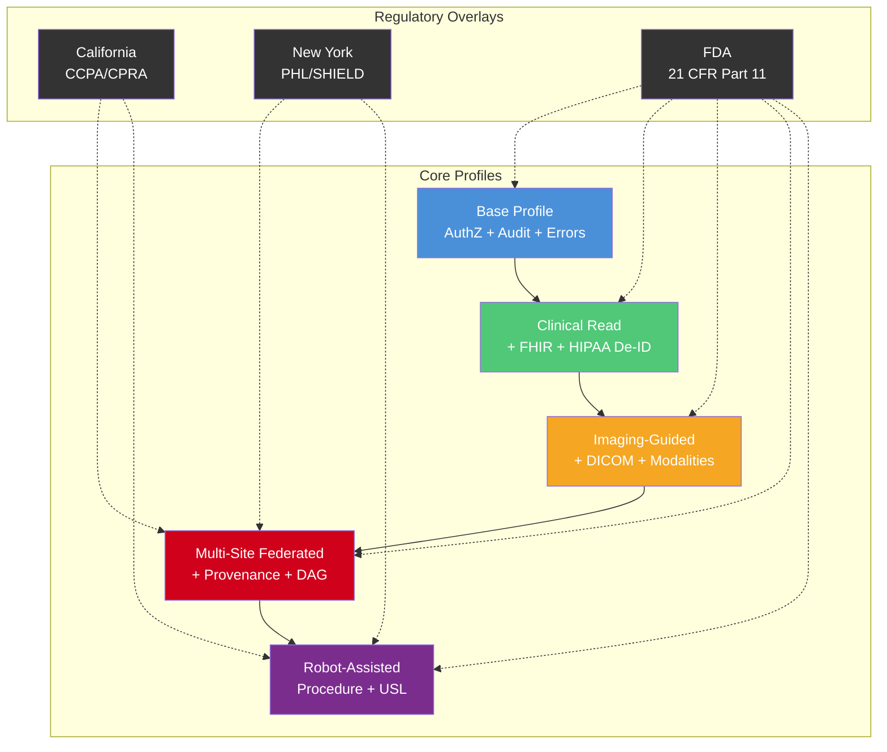
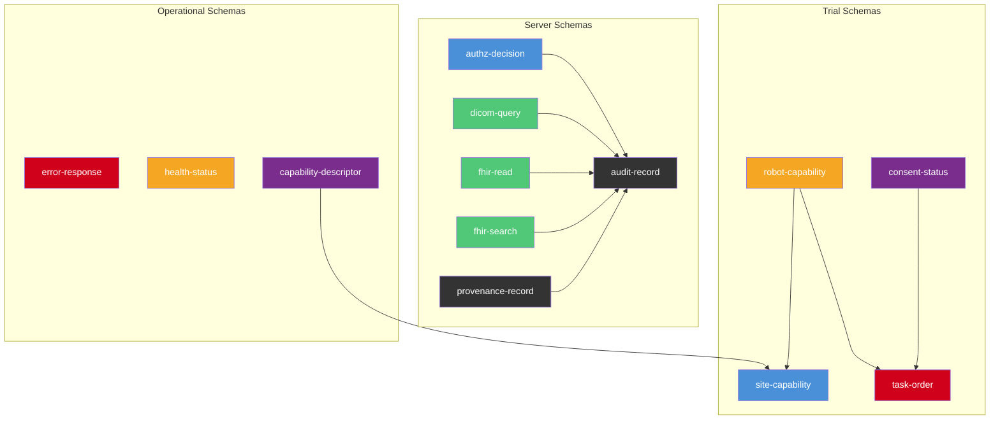
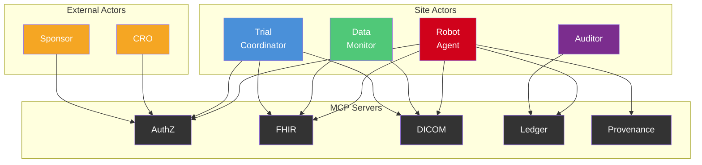

# National MCP Standard for Physical AI Oncology Clinical Trials

**Version 0.3.0** | **Normative Specification** | **United States Industry Standard**

[](LICENSE)
[](https://doi.org/10.5281/zenodo.18894758)
[](releases.md)
[](schemas/)
[](https://www.python.org/)
[](https://modelcontextprotocol.io/)
[](profiles/)
[](schemas/)
[](spec/tool-contracts.md)
[](https://github.com/kevinkawchak/mcp-pai-oncology-trials)
[](changelog.md)
[](releases.md)

The **National MCP-PAI Oncology Trials Standard** is a normative specification for deploying Model Context Protocol (MCP) servers across federated Physical AI oncology clinical trial systems in the United States. This standard defines protocol contracts, actor models, security baselines, regulatory overlays, machine-readable JSON schemas, and governance processes required for industry-wide interoperability of autonomous robotic systems in regulated clinical environments.

> **Scope**: This specification targets all U.S. clinical sites, sponsors, CROs, and technology vendors operating Physical AI systems — surgical robots, therapeutic positioning systems, diagnostic needle-placement platforms, and rehabilitative exoskeletons — within FDA-regulated oncology trials.

---

## Table of Contents

- [Motivation](#motivation)
- [National Architecture Overview](#national-architecture-overview)
- [Profiles and Conformance Level Definitions](#profiles-and-conformance-level-definitions)
- [Machine-Readable JSON Schemas](#machine-readable-json-schemas)
- [Conformance Levels](#conformance-levels)
- [Actor Model](#actor-model)
- [Tool Contract Registry](#tool-contract-registry)
- [Security and Privacy](#security-and-privacy)
- [Regulatory Compliance](#regulatory-compliance)
- [Advantages Over Existing Approaches](#advantages-over-existing-approaches)
- [Repository Structure](#repository-structure)
- [Getting Started](#getting-started)
- [Governance](#governance)
- [References](#references)

---

## Motivation

Physical AI systems are entering oncology clinical trials at an accelerating pace — from surgical robots performing tumor resections to companion robots assisting with patient monitoring. Today, each site, sponsor, and vendor implements bespoke integrations between robotic agents and clinical systems, resulting in fragmented security models, inconsistent audit trails, and duplicated regulatory compliance effort across thousands of trial sites.

This national standard eliminates that fragmentation by defining a single MCP-based protocol layer that every conforming implementation must satisfy, enabling:

- **Plug-and-play interoperability** across any conforming clinical site
- **Unified regulatory posture** (FDA, HIPAA, 21 CFR Part 11) built into the protocol
- **Federated data governance** that keeps patient data on-site while enabling multi-site collaboration
- **Vendor-neutral tool contracts** that decouple robot platforms from clinical infrastructure
- **Machine-readable schemas** for automated validation of all MCP server inputs and outputs

---

## National Architecture Overview

The national standard defines a three-tier architecture connecting Physical AI platforms to clinical trial infrastructure through standardized MCP servers deployed at each participating site.

### System Architecture Diagram

```
┌─────────────────────────────────────────────────────────────────────────┐
│                    NATIONAL MCP-PAI ONCOLOGY NETWORK                    │
├─────────────────────────────────────────────────────────────────────────┤
│                                                                         │
│  ┌─────────────┐  ┌─────────────┐  ┌─────────────┐  ┌─────────────┐   │
│  │  SITE A      │  │  SITE B      │  │  SITE C      │  │  SITE N      │  │
│  │  (Hospital)  │  │  (Cancer Ctr)│  │  (Research)  │  │  (Any Site)  │  │
│  │             │  │             │  │             │  │             │   │
│  │ ┌─────────┐ │  │ ┌─────────┐ │  │ ┌─────────┐ │  │ ┌─────────┐ │   │
│  │ │  Robot   │ │  │ │  Robot   │ │  │ │  Robot   │ │  │ │  Robot   │ │   │
│  │ │  Agent   │ │  │ │  Agent   │ │  │ │  Agent   │ │  │ │  Agent   │ │   │
│  │ └────┬────┘ │  │ └────┬────┘ │  │ └────┬────┘ │  │ └────┬────┘ │   │
│  │      │       │  │      │       │  │      │       │  │      │       │   │
│  │ ┌────▼────┐ │  │ ┌────▼────┐ │  │ ┌────▼────┐ │  │ ┌────▼────┐ │   │
│  │ │   MCP   │ │  │ │   MCP   │ │  │ │   MCP   │ │  │ │   MCP   │ │   │
│  │ │ Servers │ │  │ │ Servers │ │  │ │ Servers │ │  │ │ Servers │ │   │
│  │ │ (5 Svcs)│ │  │ │ (5 Svcs)│ │  │ │ (5 Svcs)│ │  │ │ (5 Svcs)│ │   │
│  │ └────┬────┘ │  │ └────┬────┘ │  │ └────┬────┘ │  │ └────┬────┘ │   │
│  │      │       │  │      │       │  │      │       │  │      │       │   │
│  │ ┌────▼────┐ │  │ ┌────▼────┐ │  │ ┌────▼────┐ │  │ ┌────▼────┐ │   │
│  │ │Clinical │ │  │ │Clinical │ │  │ │Clinical │ │  │ │Clinical │ │   │
│  │ │Systems  │ │  │ │Systems  │ │  │ │Systems  │ │  │ │Systems  │ │   │
│  │ │EHR/PACS │ │  │ │EHR/PACS │ │  │ │EHR/PACS │ │  │ │EHR/PACS │ │   │
│  │ └─────────┘ │  │ └─────────┘ │  │ └─────────┘ │  │ └─────────┘ │   │
│  └─────────────┘  └─────────────┘  └─────────────┘  └─────────────┘   │
│                                                                         │
│  ┌───────────────────────────────────────────────────────────────────┐  │
│  │               FEDERATED COORDINATION LAYER                        │  │
│  │  Aggregation (FedAvg/FedProx/SCAFFOLD) · Differential Privacy    │  │
│  │  Cross-Site Audit Verification · Regulatory Reporting             │  │
│  └───────────────────────────────────────────────────────────────────┘  │
└─────────────────────────────────────────────────────────────────────────┘
```

### Protocol Flow Diagram

```
ROBOT AGENT                MCP SERVER LAYER              CLINICAL SYSTEMS
─────────────              ────────────────              ────────────────

  ┌─────────┐    1. Auth    ┌──────────┐
  │  Robot   │─────────────▶│  AuthZ   │   Token Issued
  │  Agent   │◀─────────────│  Server  │
  │          │              └──────────┘
  │          │    2. Query   ┌──────────┐    FHIR R4     ┌──────────┐
  │          │─────────────▶│  FHIR    │───────────────▶│   EHR    │
  │          │◀─────────────│  Server  │◀───────────────│  System  │
  │          │  De-ID Data  └──────────┘                └──────────┘
  │          │              ┌──────────┐    DICOM        ┌──────────┐
  │          │─────────────▶│  DICOM   │───────────────▶│   PACS   │
  │          │◀─────────────│  Server  │◀───────────────│  System  │
  │          │  Image Ptr   └──────────┘                └──────────┘
  │          │
  │          │  3. Execute Procedure (Robot Performs Clinical Task)
  │          │
  │          │    4. Audit   ┌──────────┐
  │          │─────────────▶│  Ledger  │   Hash-Chained Record
  │          │◀─────────────│  Server  │
  │          │              └──────────┘
  │          │   5. Lineage  ┌──────────┐
  │          │─────────────▶│Provenance│   DAG Record
  │          │◀─────────────│  Server  │
  └─────────┘              └──────────┘
```

### Schema Validation Flow

```
┌─────────────────────────────────────────────────────────────┐
│                  SCHEMA VALIDATION LAYER                     │
│                                                              │
│  Incoming Request         JSON Schema              Output    │
│  ┌────────────┐    ┌──────────────────┐    ┌──────────────┐ │
│  │ MCP Tool   │───▶│  Validate Input  │───▶│  Execute     │ │
│  │ Invocation │    │  Against Schema  │    │  Tool Logic  │ │
│  └────────────┘    └──────────────────┘    └──────┬───────┘ │
│                                                    │         │
│                    ┌──────────────────┐    ┌───────▼───────┐ │
│                    │ Validate Output  │◀───│  Raw Result   │ │
│                    │  Against Schema  │    └───────────────┘ │
│                    └────────┬─────────┘                      │
│                             │                                │
│                    ┌────────▼─────────┐                      │
│                    │  Schema-Valid    │                      │
│                    │  MCP Response   │                      │
│                    └──────────────────┘                      │
│                                                              │
│  13 Schemas: capability-descriptor, robot-capability,        │
│  site-capability, task-order, audit-record, provenance,      │
│  consent-status, authz-decision, dicom-query, fhir-read,    │
│  fhir-search, error-response, health-status                 │
└─────────────────────────────────────────────────────────────┘
```

### National Deployment Topology

```
┌────────────────────────────────────────────────────┐
│           NATIONAL GOVERNANCE LAYER                 │
│  Standards Body · Conformance Registry              │
│  Extension Namespace · Version Compatibility        │
│  Schema Registry · Validation Services              │
└────────────────────┬───────────────────────────────┘
                     │
        ┌────────────┼────────────┐
        ▼            ▼            ▼
  ┌───────────┐ ┌───────────┐ ┌───────────┐
  │ REGION 1  │ │ REGION 2  │ │ REGION N  │
  │ (East)    │ │ (Central) │ │ (West)    │
  │           │ │           │ │           │
  │ 200+ Sites│ │ 300+ Sites│ │ 250+ Sites│
  │ 5 Servers │ │ 5 Servers │ │ 5 Servers │
  │ per Site  │ │ per Site  │ │ per Site  │
  └─────┬─────┘ └─────┬─────┘ └─────┬─────┘
        │              │              │
        └──────────────┼──────────────┘
                       ▼
            ┌────────────────────┐
            │  FEDERATED LAYER   │
            │  Model Aggregation │
            │  Audit Merge       │
            │  Privacy Budgets   │
            └────────────────────┘
```

---

## Profiles and Conformance Level Definitions

Version 0.3.0 introduces 8 conformance profiles under `/profiles/` that formalize the requirements for each deployment tier and regulatory jurisdiction. Each profile defines mandatory tools, optional tools, forbidden operations, required schemas, regulatory overlays, and a conformance test subset.

### Profile Architecture



### Profile Summary

| Profile | File | Mandatory Tools | Required Schemas | Test Count |
|---------|------|----------------|-----------------|------------|
| **Base Profile** | [`profiles/base-profile.md`](profiles/base-profile.md) | `authz_*` (5), `ledger_*` (5) | authz-decision, audit-record, error-response, health-status, capability-descriptor | 19 |
| **Clinical Read** | [`profiles/clinical-read.md`](profiles/clinical-read.md) | + `fhir_*` (4) | + fhir-read, fhir-search, consent-status | 29 |
| **Imaging-Guided Oncology** | [`profiles/imaging-guided-oncology.md`](profiles/imaging-guided-oncology.md) | + `dicom_*` (4) | + dicom-query, robot-capability-profile | 39 |
| **Multi-Site Federated** | [`profiles/multi-site-federated.md`](profiles/multi-site-federated.md) | + `provenance_*` (5) | + provenance-record, site-capability-profile | 48 |
| **Robot-Assisted Procedure** | [`profiles/robot-assisted-procedure.md`](profiles/robot-assisted-procedure.md) | All 23 tools | + robot-capability-profile, task-order | 58 |

### Regulatory Overlay Profiles

| Overlay | File | Jurisdiction | Key Requirements |
|---------|------|-------------|-----------------|
| **California CCPA** | [`profiles/state-us-ca.md`](profiles/state-us-ca.md) | US-CA | CCPA/CPRA consumer rights, sensitive PI protections, data minimization |
| **New York Health Info** | [`profiles/state-us-ny.md`](profiles/state-us-ny.md) | US-NY | PHL Article 27-F (HIV), SHIELD Act, MHL Article 33, DOH 10 NYCRR |
| **FDA 21 CFR Part 11** | [`profiles/country-us-fda.md`](profiles/country-us-fda.md) | US (Federal) | Electronic records, electronic signatures, audit trails, system validation |

### National Profile Deployment Map

```
┌─────────────────────────────────────────────────────────────────────┐
│                  NATIONAL PROFILE DEPLOYMENT                         │
├─────────────────────────────────────────────────────────────────────┤
│                                                                      │
│  ┌──────────────────┐  ┌──────────────────┐  ┌──────────────────┐   │
│  │  CALIFORNIA SITE  │  │  NEW YORK SITE   │  │  OTHER US SITES  │   │
│  │                   │  │                   │  │                   │  │
│  │  Profile: L5      │  │  Profile: L4      │  │  Profile: L1–L5  │  │
│  │  + CCPA Overlay   │  │  + NY Overlay     │  │  + FDA Overlay   │  │
│  │  + FDA Overlay    │  │  + FDA Overlay    │  │                   │  │
│  │                   │  │                   │  │                   │  │
│  │  Extra: CPRA      │  │  Extra: PHL 27-F  │  │  State overlays  │  │
│  │  sensitive PI,    │  │  HIV protections, │  │  applied per     │  │
│  │  data minimization│  │  SHIELD Act,      │  │  jurisdiction    │  │
│  │                   │  │  MHL Article 33   │  │                   │  │
│  └──────────────────┘  └──────────────────┘  └──────────────────┘   │
│                                                                      │
│  ┌───────────────────────────────────────────────────────────────┐   │
│  │              FDA 21 CFR PART 11 — ALL SITES                   │   │
│  │  Audit trails · Electronic signatures · System validation     │   │
│  │  Record integrity · Authority checks · Change control         │   │
│  └───────────────────────────────────────────────────────────────┘   │
└─────────────────────────────────────────────────────────────────────┘
```

---

## Machine-Readable JSON Schemas

Version 0.2.0 introduces 13 machine-readable JSON Schema files (JSON Schema draft 2020-12) that formalize the data contracts for all MCP server interactions across the national network. These schemas enable automated input/output validation, conformance testing, and code generation for every conforming implementation.



### Schema Summary

| Schema | Source | Purpose |
|--------|--------|---------|
| [`capability-descriptor`](schemas/capability-descriptor.schema.json) | Server capability advertisement | Server name, version, tools, conformance level |
| [`robot-capability-profile`](schemas/robot-capability-profile.schema.json) | `trial_robot_agent.py` + `trial_schedule.json` | Platform, robot type, USL score, safety prerequisites |
| [`site-capability-profile`](schemas/site-capability-profile.schema.json) | Site descriptor | Jurisdiction, servers, data residency, IRB approval |
| [`task-order`](schemas/task-order.schema.json) | `trial_schedule.json` structure | Procedure type, robot assignment, scheduling, safety checks |
| [`audit-record`](schemas/audit-record.schema.json) | `ledger_server.py` AuditRecord | Hash-chained audit record for 21 CFR Part 11 |
| [`provenance-record`](schemas/provenance-record.schema.json) | `provenance_server.py` ProvenanceRecord | DAG lineage with SHA-256 fingerprinting |
| [`consent-status`](schemas/consent-status.schema.json) | Consent state machine | Patient consent with 6 granular categories |
| [`authz-decision`](schemas/authz-decision.schema.json) | `authz_server.py` evaluate | RBAC decision with matching rules |
| [`dicom-query`](schemas/dicom-query.schema.json) | `dicom_server.py` dicom_query | DICOM query with role-based permissions |
| [`fhir-read`](schemas/fhir-read.schema.json) | `fhir_server.py` fhir_read | FHIR R4 read with HIPAA de-identification |
| [`fhir-search`](schemas/fhir-search.schema.json) | `fhir_server.py` fhir_search | FHIR R4 search with result capping |
| [`error-response`](schemas/error-response.schema.json) | `servers/common/__init__.py` | Standardized error with 9-code taxonomy |
| [`health-status`](schemas/health-status.schema.json) | `servers/common/__init__.py` | Server health with dependency and metrics |

---

## Conformance Levels

The standard defines five conformance levels. Each level builds on the previous, adding MUST/SHOULD/MAY requirements per [RFC 2119](https://www.rfc-editor.org/rfc/rfc2119).


| Level | Name | Required Servers | Key Capabilities |
|-------|------|-----------------|------------------|
| **1 — Core** | Core | AuthZ, Ledger | Authentication, authorization, audit chain |
| **2 — Clinical Read** | Clinical Read | + FHIR | FHIR R4 queries, de-identification, patient lookup |
| **3 — Imaging** | Imaging | + DICOM | DICOM query/retrieve, RECIST measurements |
| **4 — Federated Site** | Federated Site | + Provenance | Multi-site data lineage, federated aggregation |
| **5 — Robot Procedure** | Robot Procedure | All 5 | End-to-end autonomous robot clinical workflows |

See [spec/conformance.md](spec/conformance.md) for the full MUST/SHOULD/MAY matrix per level.

---

## Actor Model

Six actors interact with the national MCP infrastructure. Roles are enforced through deny-by-default RBAC policies.



| Actor | Description | Default Access |
|-------|-------------|----------------|
| **Robot Agent** | Autonomous physical AI system executing clinical procedures | Scoped FHIR read, DICOM query/retrieve, ledger append, provenance record |
| **Trial Coordinator** | Clinical site staff managing trial operations | Full FHIR and DICOM access, policy management |
| **Data Monitor** | CRO or sponsor representative reviewing trial data | Read-only FHIR and DICOM, no retrieve, no provenance write |
| **Auditor** | Compliance officer verifying regulatory adherence | Ledger query/verify/replay, chain status |
| **Sponsor** | Pharmaceutical or device company funding the trial | Policy configuration, aggregate reporting |
| **CRO** | Contract Research Organization managing multi-site operations | Cross-site coordination, aggregate data access |

See [spec/actor-model.md](spec/actor-model.md) for the full permission matrix.

---

## Tool Contract Registry

The standard defines **23 tool contracts** across five MCP servers. Every tool MUST satisfy input validation, output schema, error code, and audit requirements defined in [spec/tool-contracts.md](spec/tool-contracts.md).

### Server Summary

| Server | Tools | Purpose |
|--------|-------|---------|
| **trialmcp-authz** | `authz_evaluate`, `authz_issue_token`, `authz_validate_token`, `authz_list_policies`, `authz_revoke_token` | Deny-by-default RBAC, token lifecycle |
| **trialmcp-fhir** | `fhir_read`, `fhir_search`, `fhir_patient_lookup`, `fhir_study_status` | FHIR R4 clinical data with HIPAA de-identification |
| **trialmcp-dicom** | `dicom_query`, `dicom_retrieve_pointer`, `dicom_study_metadata`, `dicom_recist_measurements` | DICOM imaging with role-based permissions |
| **trialmcp-ledger** | `ledger_append`, `ledger_verify`, `ledger_query`, `ledger_replay`, `ledger_chain_status` | Hash-chained 21 CFR Part 11 audit trail |
| **trialmcp-provenance** | `provenance_register_source`, `provenance_record_access`, `provenance_get_lineage`, `provenance_get_actor_history`, `provenance_verify_integrity` | DAG-based data lineage and SHA-256 fingerprinting |

### Error Code Taxonomy

All servers MUST use standardized machine-readable error codes: `AUTHZ_DENIED`, `VALIDATION_FAILED`, `NOT_FOUND`, `INTERNAL_ERROR`, `TOKEN_EXPIRED`, `TOKEN_REVOKED`, `PERMISSION_DENIED`, `INVALID_INPUT`, `RATE_LIMITED`.

---

## Security and Privacy

### Security Model


- **Authentication**: Token-based sessions with role scoping, SHA-256 hashing, and UTC expiry enforcement
- **Authorization**: Deny-by-default RBAC — explicit DENY rules take precedence over ALLOW
- **Input Validation**: FHIR ID format (`^[A-Za-z0-9\-._]+$`), DICOM UID format (`^[\d.]+$`), URL rejection for SSRF prevention
- **Privacy**: HIPAA Safe Harbor 18-identifier removal, HMAC-SHA256 pseudonymization, year-only date generalization
- **Integrity**: SHA-256 hash chains with canonical serialization, genesis hash verification
- **Audit**: Every tool call produces a signed audit record; hash-chained for tamper detection

See [spec/security.md](spec/security.md) and [spec/privacy.md](spec/privacy.md) for full details.

---

## Regulatory Compliance

| Standard | Specification Coverage | Regulatory File |
|----------|----------------------|-----------------|
| **21 CFR Part 11** | Hash-chained audit ledger, electronic signatures, audit replay | [regulatory/CFR_PART_11.md](regulatory/CFR_PART_11.md) |
| **HIPAA** | Safe Harbor de-identification, HMAC pseudonymization, minimum necessary | [regulatory/HIPAA.md](regulatory/HIPAA.md) |
| **FDA Guidance** | AI/ML medical device framework, predetermined change control | [regulatory/US_FDA.md](regulatory/US_FDA.md) |
| **ICH-GCP E6(R2)** | Replayable audit traces, electronic source data | [regulatory/CFR_PART_11.md](regulatory/CFR_PART_11.md) |
| **IEC 80601** | Safety-constrained execution via policy enforcement | [spec/security.md](spec/security.md) |
| **ISO 14971** | Risk management via deny-by-default policies | [spec/security.md](spec/security.md) |
| **ISO 13482** | Robot safety integration through scoped permissions | [spec/actor-model.md](spec/actor-model.md) |
| **IRB Requirements** | Site-specific policy templates | [regulatory/IRB_SITE_POLICY_TEMPLATE.md](regulatory/IRB_SITE_POLICY_TEMPLATE.md) |

---

## Advantages Over Existing Approaches

### vs. Prior Reference Implementation (kevinkawchak/mcp-pai-oncology-trials)

| Dimension | Reference Implementation | National Standard |
|-----------|------------------------|-------------------|
| **Scope** | Single-site proof of concept | Industry-wide U.S. standard for all sites |
| **Conformance** | Informal; implementers decide what to build | 5 formal conformance levels with MUST/SHOULD/MAY |
| **Schemas** | Implicit in Python code | 13 explicit JSON Schema files (draft 2020-12) |
| **Governance** | Repository-level decisions | Charter, decision process, extension namespaces |
| **Actors** | 4 roles in code (`robot_agent`, `trial_coordinator`, `data_monitor`, `auditor`) | 6 actors including `sponsor` and `CRO` for full trial ecosystem |
| **Regulatory** | Compliance noted in README | Dedicated regulatory overlays (FDA, HIPAA, 21 CFR Part 11, IRB) |
| **Versioning** | Changelog-driven | SemVer with compatibility policy and extension namespaces |
| **Community** | Contributors list | Full governance: charter, CODEOWNERS, issue templates, CoC |

### vs. Existing Oncology Trial Approaches

| Dimension | Traditional Approaches | National MCP Standard |
|-----------|----------------------|----------------------|
| **Integration** | Point-to-point custom APIs per site | Standardized 23-tool contract registry |
| **Security** | Varied per implementation | Uniform deny-by-default RBAC with SSRF prevention |
| **Audit** | Database logs, proprietary formats | Hash-chained immutable ledger with chain verification |
| **Privacy** | Site-specific de-identification | Mandated HIPAA Safe Harbor with HMAC pseudonymization |
| **Robotics** | No standard robot-to-clinical protocol | First national standard for Physical AI clinical integration |
| **Multi-site** | Manual data sharing agreements | Federated architecture with differential privacy built in |
| **Validation** | Manual testing | Machine-readable JSON schemas for automated validation |

### vs. Other MCP/AI Server Approaches for Oncology

| Dimension | General MCP Servers | National MCP-PAI Standard |
|-----------|-------------------|--------------------------|
| **Domain** | Generic tool serving | Purpose-built for oncology clinical trials |
| **Compliance** | No regulatory awareness | FDA, HIPAA, 21 CFR Part 11 mapped to every tool |
| **Physical AI** | Software agents only | Surgical robots, therapeutic systems, diagnostic platforms |
| **Provenance** | No data lineage | DAG-based lineage with SHA-256 fingerprinting |
| **Federated** | Single-instance | Multi-site federated with privacy-preserving aggregation |
| **Audit** | Application logs | 21 CFR Part 11 compliant hash-chained ledger |
| **Schemas** | Ad-hoc or none | 13 formal JSON Schema draft 2020-12 contracts |

---

## Repository Structure

```
national-mcp-pai-oncology-trials/
├── profiles/                      # Conformance profiles and overlays (v0.3.0)
│   ├── base-profile.md            # Core conformance: authz + audit + error taxonomy
│   ├── clinical-read.md           # FHIR read/search + HIPAA de-identification
│   ├── imaging-guided-oncology.md # DICOM query/retrieve + role-based modality
│   ├── multi-site-federated.md    # Cross-site provenance, federated audit chain
│   ├── robot-assisted-procedure.md # Robot capability, task-order, safety matrix, USL
│   ├── state-us-ca.md             # California CCPA/CPRA overlay
│   ├── state-us-ny.md             # New York health information overlay
│   └── country-us-fda.md          # FDA 21 CFR Part 11 overlay
├── schemas/                       # Machine-readable JSON schemas (v0.2.0)
│   ├── capability-descriptor.schema.json    # Server capability advertisement
│   ├── robot-capability-profile.schema.json # Robot platform with USL scoring
│   ├── site-capability-profile.schema.json  # Site jurisdiction and data residency
│   ├── task-order.schema.json               # Clinical trial task scheduling
│   ├── audit-record.schema.json             # Hash-chained audit ledger record
│   ├── provenance-record.schema.json        # DAG lineage with SHA-256 fingerprinting
│   ├── consent-status.schema.json           # Patient consent state machine
│   ├── authz-decision.schema.json           # RBAC authorization decision
│   ├── dicom-query.schema.json              # DICOM query params and output
│   ├── fhir-read.schema.json               # FHIR R4 single resource read
│   ├── fhir-search.schema.json             # FHIR R4 collection search
│   ├── error-response.schema.json          # Standardized error format
│   └── health-status.schema.json           # Server health check
├── spec/                          # Normative specification
│   ├── core.md                    # Protocol scope and design principles
│   ├── actor-model.md             # 6-actor permission model
│   ├── tool-contracts.md          # 23 tool signatures and contracts
│   ├── security.md                # RBAC, token lifecycle, SSRF prevention
│   ├── privacy.md                 # HIPAA Safe Harbor, pseudonymization
│   ├── provenance.md              # DAG lineage, SHA-256 fingerprinting
│   ├── audit.md                   # Hash-chained ledger, 21 CFR Part 11
│   ├── conformance.md             # 5 conformance levels
│   └── versioning.md              # SemVer, compatibility, extensions
├── governance/                    # Governance framework
│   ├── CHARTER.md                 # Organization charter
│   ├── DECISION_PROCESS.md        # Decision-making procedures
│   ├── EXTENSIONS.md              # Extension namespace rules
│   ├── VERSION_COMPATIBILITY.md   # Version compatibility policy
│   └── CODEOWNERS                 # Code ownership assignments
├── regulatory/                    # Regulatory overlays
│   ├── US_FDA.md                  # FDA AI/ML guidance mapping
│   ├── HIPAA.md                   # HIPAA compliance mapping
│   ├── CFR_PART_11.md             # 21 CFR Part 11 mapping
│   └── IRB_SITE_POLICY_TEMPLATE.md # IRB site policy template
├── .github/                       # Community templates
│   ├── ISSUE_TEMPLATE/
│   │   ├── bug_report.md          # Bug report template
│   │   ├── feature_request.md     # Feature request template
│   │   └── spec_change.md         # Specification change template
│   └── PULL_REQUEST_TEMPLATE.md   # Pull request template
├── CODE_OF_CONDUCT.md             # Contributor Covenant
├── LICENSE                        # MIT License
├── README.md                      # This file
├── changelog.md                   # Version history
├── releases.md                    # Release notes
└── prompts.md                     # Prompt archive
```

---

## Getting Started

### For Implementers

1. Review [spec/core.md](spec/core.md) for protocol scope and design principles
2. Choose a [conformance profile](profiles/) appropriate for your deployment
3. Review the profile's mandatory tools, forbidden operations, and required schemas
4. Implement the required tool contracts from [spec/tool-contracts.md](spec/tool-contracts.md)
5. Validate server inputs/outputs against the [JSON schemas](schemas/) for your profile level
6. Apply security requirements from [spec/security.md](spec/security.md) and [spec/privacy.md](spec/privacy.md)
7. Apply applicable state overlays ([California](profiles/state-us-ca.md), [New York](profiles/state-us-ny.md)) and the [FDA overlay](profiles/country-us-fda.md)
8. Validate against the conformance test subset for your target profile

### For Regulators and Compliance Officers

1. Review [regulatory/US_FDA.md](regulatory/US_FDA.md) for FDA alignment
2. Review [regulatory/HIPAA.md](regulatory/HIPAA.md) for privacy compliance
3. Review [regulatory/CFR_PART_11.md](regulatory/CFR_PART_11.md) for electronic records compliance
4. Use [regulatory/IRB_SITE_POLICY_TEMPLATE.md](regulatory/IRB_SITE_POLICY_TEMPLATE.md) for site-level policy

### For Contributors

1. Read [CODE_OF_CONDUCT.md](CODE_OF_CONDUCT.md)
2. Review [governance/CHARTER.md](governance/CHARTER.md)
3. Follow the [governance/DECISION_PROCESS.md](governance/DECISION_PROCESS.md) for proposing changes
4. Use the appropriate [issue template](.github/ISSUE_TEMPLATE/) for proposals

---

## Governance

This specification is governed by an open process described in [governance/CHARTER.md](governance/CHARTER.md). Key principles:

- **Consensus-driven**: Major specification changes require community review
- **Extension-friendly**: Vendor extensions use `x-{vendor}` namespaces per [governance/EXTENSIONS.md](governance/EXTENSIONS.md)
- **Version-stable**: SemVer with explicit compatibility guarantees per [governance/VERSION_COMPATIBILITY.md](governance/VERSION_COMPATIBILITY.md)

---

## References

1. Kawchak, K. (2026). *TrialMCP: MCP Servers for Physical AI Oncology Clinical Trial Systems*. DOI: [10.5281/zenodo.18869776](https://doi.org/10.5281/zenodo.18869776)

2. Kawchak, K. (2026). *Physical AI Oncology Trials: End-to-End Framework for Robotic Systems in Clinical Trials*. DOI: [10.5281/zenodo.18445179](https://doi.org/10.5281/zenodo.18445179)

3. Kawchak, K. (2026). *PAI Oncology Trial FL: Federated Learning for Physical AI Oncology Trials*. DOI: [10.5281/zenodo.18840880](https://doi.org/10.5281/zenodo.18840880)

### Related Repositories

- [kevinkawchak/mcp-pai-oncology-trials](https://github.com/kevinkawchak/mcp-pai-oncology-trials) — Reference implementation (single-site proof of concept)
- [kevinkawchak/physical-ai-oncology-trials](https://github.com/kevinkawchak/physical-ai-oncology-trials) — Physical AI framework with USL scoring and patient instructions
- [kevinkawchak/pai-oncology-trial-fl](https://github.com/kevinkawchak/pai-oncology-trial-fl) — Federated learning framework with privacy and regulatory modules

---

*This specification is released under the [MIT License](LICENSE). All modules are intended for standards development. Independent clinical validation, IRB approval, and regulatory clearance are required before any conforming implementation is used in a clinical setting.*
