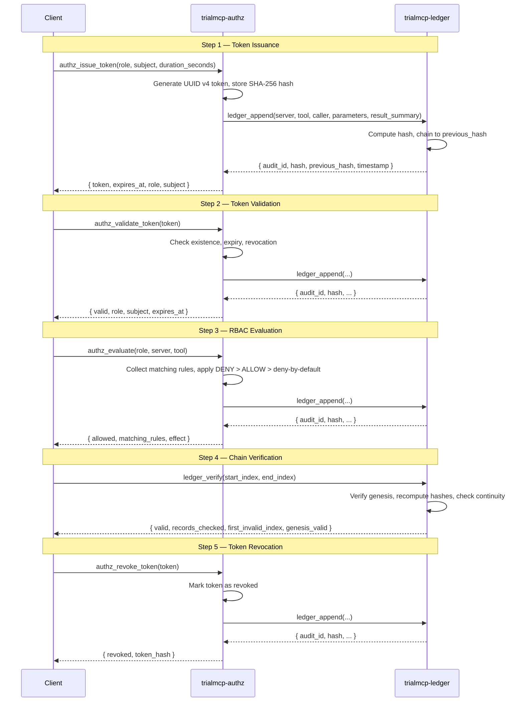

# Base Profile Walkthrough: Core AuthZ + Audit

**National MCP-PAI Oncology Trials Standard**
**Profile**: Base (Conformance Level 1)
**Servers**: `trialmcp-authz`, `trialmcp-ledger`

---

## Overview

This walkthrough demonstrates the foundational authorization and audit chain operations
required by every conforming deployment. Level 1 (Core) mandates that all implementations
provide deny-by-default RBAC authorization and hash-chained audit logging. Every higher
conformance level builds on these primitives.

The walkthrough covers:

1. Token issuance for an authenticated actor
2. Token validation
3. RBAC policy evaluation for each of the six actor roles
4. Audit record creation and hash-chain verification
5. Token revocation
6. Error handling scenarios

> **Spec references**: [spec/security.md](../../spec/security.md) Section 2-3,
> [spec/tool-contracts.md](../../spec/tool-contracts.md) Sections 3 and 6,
> [spec/audit.md](../../spec/audit.md) Sections 2-4,
> [spec/actor-model.md](../../spec/actor-model.md) Section 3.

---

## Sequence Diagram



---

## Step 1: Token Issuance

A trial coordinator authenticates and requests a scoped session token. Only
`trial_coordinator`, `sponsor`, and `cro` roles are permitted to issue tokens
(see [spec/actor-model.md](../../spec/actor-model.md) Section 3.1).

### Request

```json
{
  "tool": "authz_issue_token",
  "parameters": {
    "role": "trial_coordinator",
    "subject": "coord-jane-doe-site-07",
    "duration_seconds": 3600
  }
}
```

### Response

```json
{
  "token": "c9f2a1b4-7e3d-4a8c-b5f1-2d9e6c8a3b7f",
  "expires_at": "2026-03-08T15:30:00Z",
  "role": "trial_coordinator",
  "subject": "coord-jane-doe-site-07"
}
```

### Audit Side-Effect

The AuthZ server appends an audit record to the ledger. The token value itself
is never stored; only its SHA-256 hash is recorded (see
[spec/security.md](../../spec/security.md) Section 3.1).

```json
{
  "tool": "ledger_append",
  "parameters": {
    "server": "trialmcp-authz",
    "tool": "authz_issue_token",
    "caller": "coord-jane-doe-site-07",
    "parameters": {
      "role": "trial_coordinator",
      "token_hash": "a3b8c9...64-char-hex",
      "duration_seconds": 3600
    },
    "result_summary": "Token issued for trial_coordinator, expires 2026-03-08T15:30:00Z"
  }
}
```

### Ledger Response

```json
{
  "audit_id": "aud-00000001-abcd-efgh-ijkl-000000000001",
  "hash": "e4d7f2a1c9b83e5d6f0a1b2c3d4e5f6a7b8c9d0e1f2a3b4c5d6e7f8a9b0c1d2",
  "previous_hash": "0000000000000000000000000000000000000000000000000000000000000000",
  "timestamp": "2026-03-08T14:30:00Z"
}
```

> The `previous_hash` of `"0" * 64` indicates this is the genesis record
> (see [spec/audit.md](../../spec/audit.md) Section 3.1).

---

## Step 2: Token Validation

Before any downstream tool call, the caller's token is validated. Validation
checks existence, expiry, and revocation status.

### Request

```json
{
  "tool": "authz_validate_token",
  "parameters": {
    "token": "c9f2a1b4-7e3d-4a8c-b5f1-2d9e6c8a3b7f"
  }
}
```

### Response (Valid Token)

```json
{
  "valid": true,
  "role": "trial_coordinator",
  "subject": "coord-jane-doe-site-07",
  "expires_at": "2026-03-08T15:30:00Z"
}
```

### Audit Side-Effect

```json
{
  "tool": "ledger_append",
  "parameters": {
    "server": "trialmcp-authz",
    "tool": "authz_validate_token",
    "caller": "coord-jane-doe-site-07",
    "parameters": {
      "token_hash": "a3b8c9...64-char-hex"
    },
    "result_summary": "Token validated successfully for trial_coordinator"
  }
}
```

---

## Step 3: RBAC Policy Evaluation

The policy engine evaluates access requests using the algorithm defined in
[spec/security.md](../../spec/security.md) Section 2.2:

1. Collect all rules matching the request's role, server, and tool
2. If any matching rule has effect DENY, return DENIED
3. If any matching rule has effect ALLOW, return ALLOWED
4. If no rules match, return DENIED (deny-by-default)

### 3a. trial_coordinator Evaluating FHIR Access (ALLOW)

```json
{
  "tool": "authz_evaluate",
  "parameters": {
    "role": "trial_coordinator",
    "server": "trialmcp-fhir",
    "tool": "fhir_read"
  }
}
```

```json
{
  "allowed": true,
  "matching_rules": [
    { "role": "trial_coordinator", "server": "trialmcp-fhir", "tool": "fhir_read", "effect": "ALLOW" }
  ],
  "effect": "ALLOW"
}
```

### 3b. robot_agent Evaluating Token Issuance (DENY)

Robot agents are not permitted to issue tokens (see
[spec/actor-model.md](../../spec/actor-model.md) Section 3.1).

```json
{
  "tool": "authz_evaluate",
  "parameters": {
    "role": "robot_agent",
    "server": "trialmcp-authz",
    "tool": "authz_issue_token"
  }
}
```

```json
{
  "allowed": false,
  "matching_rules": [
    { "role": "robot_agent", "server": "trialmcp-authz", "tool": "authz_issue_token", "effect": "DENY" }
  ],
  "effect": "DENY"
}
```

### 3c. auditor Evaluating Ledger Access (ALLOW)

Auditors have full access to ledger verification and query tools.

```json
{
  "tool": "authz_evaluate",
  "parameters": {
    "role": "auditor",
    "server": "trialmcp-ledger",
    "tool": "ledger_verify"
  }
}
```

```json
{
  "allowed": true,
  "matching_rules": [
    { "role": "auditor", "server": "trialmcp-ledger", "tool": "ledger_verify", "effect": "ALLOW" }
  ],
  "effect": "ALLOW"
}
```

### 3d. auditor Evaluating Clinical Data Access (DENY — Deny-by-Default)

Auditors have no explicit ALLOW rule for FHIR tools, so deny-by-default applies.

```json
{
  "tool": "authz_evaluate",
  "parameters": {
    "role": "auditor",
    "server": "trialmcp-fhir",
    "tool": "fhir_read"
  }
}
```

```json
{
  "allowed": false,
  "matching_rules": [],
  "effect": "DENY"
}
```

### 3e. sponsor Evaluating Study Status (ALLOW)

Sponsors can access study-level aggregate data but not patient records.

```json
{
  "tool": "authz_evaluate",
  "parameters": {
    "role": "sponsor",
    "server": "trialmcp-fhir",
    "tool": "fhir_study_status"
  }
}
```

```json
{
  "allowed": true,
  "matching_rules": [
    { "role": "sponsor", "server": "trialmcp-fhir", "tool": "fhir_study_status", "effect": "ALLOW" }
  ],
  "effect": "ALLOW"
}
```

### 3f. data_monitor Evaluating Ledger Append (DENY)

Data monitors cannot write audit records; they are read-only observers.

```json
{
  "tool": "authz_evaluate",
  "parameters": {
    "role": "data_monitor",
    "server": "trialmcp-ledger",
    "tool": "ledger_append"
  }
}
```

```json
{
  "allowed": false,
  "matching_rules": [],
  "effect": "DENY"
}
```

---

## Step 4: Audit Record Creation and Chain Verification

### 4a. Appending an Audit Record

Every tool invocation produces an audit record. The ledger server computes a
SHA-256 hash over the canonical JSON serialization (fields in alphabetical key
order) and chains it to the previous record.

```json
{
  "tool": "ledger_append",
  "parameters": {
    "server": "trialmcp-authz",
    "tool": "authz_evaluate",
    "caller": "coord-jane-doe-site-07",
    "parameters": {
      "role": "trial_coordinator",
      "server": "trialmcp-fhir",
      "tool": "fhir_read"
    },
    "result_summary": "ALLOW — trial_coordinator authorized for fhir_read"
  }
}
```

```json
{
  "audit_id": "aud-00000002-abcd-efgh-ijkl-000000000002",
  "hash": "b1c2d3e4f5a6b7c8d9e0f1a2b3c4d5e6f7a8b9c0d1e2f3a4b5c6d7e8f9a0b1c2",
  "previous_hash": "e4d7f2a1c9b83e5d6f0a1b2c3d4e5f6a7b8c9d0e1f2a3b4c5d6e7f8a9b0c1d2",
  "timestamp": "2026-03-08T14:30:05Z"
}
```

### 4b. Verifying the Hash Chain

An auditor verifies the integrity of the entire audit chain. The verification
algorithm is defined in [spec/audit.md](../../spec/audit.md) Section 4.1.

```json
{
  "tool": "ledger_verify",
  "parameters": {
    "start_index": 0,
    "end_index": 50
  }
}
```

```json
{
  "valid": true,
  "records_checked": 51,
  "first_invalid_index": null,
  "genesis_valid": true
}
```

### 4c. Checking Chain Status

```json
{
  "tool": "ledger_chain_status",
  "parameters": {}
}
```

```json
{
  "total_records": 51,
  "chain_valid": true,
  "genesis_hash": "0000000000000000000000000000000000000000000000000000000000000000",
  "latest_hash": "f9e8d7c6b5a4f3e2d1c0b9a8f7e6d5c4b3a2f1e0d9c8b7a6f5e4d3c2b1a0f9e8",
  "latest_timestamp": "2026-03-08T14:35:00Z"
}
```

### 4d. Querying Audit Records

```json
{
  "tool": "ledger_query",
  "parameters": {
    "server": "trialmcp-authz",
    "tool": "authz_evaluate",
    "start_time": "2026-03-08T14:00:00Z",
    "end_time": "2026-03-08T15:00:00Z"
  }
}
```

```json
{
  "records": [
    {
      "audit_id": "aud-00000002-abcd-efgh-ijkl-000000000002",
      "timestamp": "2026-03-08T14:30:05Z",
      "server": "trialmcp-authz",
      "tool": "authz_evaluate",
      "caller": "coord-jane-doe-site-07",
      "parameters": { "role": "trial_coordinator", "server": "trialmcp-fhir", "tool": "fhir_read" },
      "result_summary": "ALLOW — trial_coordinator authorized for fhir_read",
      "hash": "b1c2d3...64-char-hex",
      "previous_hash": "e4d7f2...64-char-hex"
    }
  ],
  "total": 1
}
```

---

## Step 5: Token Revocation

Token revocation is immediate and irreversible. Only `trial_coordinator`,
`sponsor`, and `cro` roles may revoke tokens.

### Request

```json
{
  "tool": "authz_revoke_token",
  "parameters": {
    "token": "c9f2a1b4-7e3d-4a8c-b5f1-2d9e6c8a3b7f"
  }
}
```

### Response

```json
{
  "revoked": true,
  "token_hash": "a3b8c9d0e1f2a3b4c5d6e7f8a9b0c1d2e3f4a5b6c7d8e9f0a1b2c3d4e5f6a7b8"
}
```

### Post-Revocation Validation Attempt

Validating the revoked token now returns an error.

```json
{
  "tool": "authz_validate_token",
  "parameters": {
    "token": "c9f2a1b4-7e3d-4a8c-b5f1-2d9e6c8a3b7f"
  }
}
```

```json
{
  "error": {
    "code": "TOKEN_REVOKED",
    "message": "Token has been revoked and is no longer valid",
    "details": {
      "token_hash": "a3b8c9...64-char-hex",
      "revoked_at": "2026-03-08T14:40:00Z"
    }
  }
}
```

---

## Step 6: Error Handling Scenarios

### 6a. Expired Token

```json
{
  "tool": "authz_validate_token",
  "parameters": {
    "token": "expired-token-uuid-value"
  }
}
```

```json
{
  "error": {
    "code": "TOKEN_EXPIRED",
    "message": "Token has expired",
    "details": {
      "expired_at": "2026-03-08T13:00:00Z"
    }
  }
}
```

### 6b. SSRF Prevention — URL in Input

All string inputs are checked for embedded URLs ([spec/security.md](../../spec/security.md)
Section 4.3). Any value containing `http://` or `https://` is rejected.

```json
{
  "tool": "authz_issue_token",
  "parameters": {
    "role": "trial_coordinator",
    "subject": "https://evil.example.com/steal-token"
  }
}
```

```json
{
  "error": {
    "code": "VALIDATION_FAILED",
    "message": "Input contains embedded URL — possible SSRF attempt",
    "details": {
      "field": "subject",
      "pattern": "https://"
    }
  }
}
```

### 6c. Invalid Role

```json
{
  "tool": "authz_issue_token",
  "parameters": {
    "role": "superadmin",
    "subject": "attacker-01"
  }
}
```

```json
{
  "error": {
    "code": "INVALID_INPUT",
    "message": "Unknown role 'superadmin'. Valid roles: robot_agent, trial_coordinator, data_monitor, auditor, sponsor, cro",
    "details": {
      "field": "role",
      "value": "superadmin"
    }
  }
}
```

### 6d. Unauthorized Token Issuance

A `robot_agent` attempts to issue a token, which is denied by policy.

```json
{
  "tool": "authz_issue_token",
  "parameters": {
    "role": "robot_agent",
    "subject": "robot-arm-001"
  }
}
```

```json
{
  "error": {
    "code": "AUTHZ_DENIED",
    "message": "Role 'robot_agent' is not authorized to invoke authz_issue_token",
    "details": {
      "evaluated_role": "robot_agent",
      "requested_tool": "authz_issue_token",
      "effect": "DENY"
    }
  }
}
```

### 6e. Chain Integrity Failure

If the ledger detects tampering during verification, it halts and reports the
first invalid index (see [spec/security.md](../../spec/security.md) Section 7.2).

```json
{
  "tool": "ledger_verify",
  "parameters": {
    "start_index": 0,
    "end_index": 100
  }
}
```

```json
{
  "valid": false,
  "records_checked": 45,
  "first_invalid_index": 44,
  "genesis_valid": true
}
```

> **Critical response**: When `valid` is `false`, the ledger server MUST
> immediately halt accepting new records, generate alerts for all registered
> auditors, and prevent chain repair without auditor review
> ([spec/security.md](../../spec/security.md) Section 7.2).

### 6f. Replay Trace for Compliance Review

An auditor generates a replay trace for an ICH-GCP E6(R2) audit review.

```json
{
  "tool": "ledger_replay",
  "parameters": {
    "start_time": "2026-03-08T08:00:00Z",
    "end_time": "2026-03-08T17:00:00Z",
    "caller": "robot-arm-001"
  }
}
```

```json
{
  "trace": [
    {
      "audit_id": "aud-00000010-...",
      "timestamp": "2026-03-08T09:15:00Z",
      "server": "trialmcp-authz",
      "tool": "authz_validate_token",
      "caller": "robot-arm-001",
      "result_summary": "Token validated successfully for robot_agent"
    },
    {
      "audit_id": "aud-00000011-...",
      "timestamp": "2026-03-08T09:15:02Z",
      "server": "trialmcp-fhir",
      "tool": "fhir_read",
      "caller": "robot-arm-001",
      "result_summary": "Read Observation/obs-tumor-001 (de-identified)"
    }
  ],
  "total": 2,
  "duration": "PT9H"
}
```

---

## Role Permission Summary

The table below summarizes Level 1 permissions across all six roles. A complete
matrix is in [spec/actor-model.md](../../spec/actor-model.md) Section 3.

| Tool | robot_agent | trial_coordinator | data_monitor | auditor | sponsor | cro |
|------|:-----------:|:-----------------:|:------------:|:-------:|:-------:|:---:|
| `authz_evaluate` | ALLOW | ALLOW | ALLOW | ALLOW | ALLOW | ALLOW |
| `authz_issue_token` | DENY | ALLOW | DENY | DENY | ALLOW | ALLOW |
| `authz_validate_token` | ALLOW | ALLOW | ALLOW | ALLOW | ALLOW | ALLOW |
| `authz_list_policies` | DENY | ALLOW | DENY | ALLOW | ALLOW | ALLOW |
| `authz_revoke_token` | DENY | ALLOW | DENY | DENY | ALLOW | ALLOW |
| `ledger_append` | ALLOW | ALLOW | DENY | DENY | DENY | DENY |
| `ledger_verify` | ALLOW | ALLOW | ALLOW | ALLOW | ALLOW | ALLOW |
| `ledger_query` | DENY | ALLOW | ALLOW | ALLOW | ALLOW | ALLOW |
| `ledger_replay` | DENY | ALLOW | DENY | ALLOW | ALLOW | ALLOW |
| `ledger_chain_status` | ALLOW | ALLOW | ALLOW | ALLOW | ALLOW | ALLOW |

---

## Key Design Decisions

1. **Deny-by-default**: No implicit permissions exist. Every access must match
   an explicit ALLOW rule, and explicit DENY always wins.
2. **Token hash storage**: Plaintext tokens are never persisted. Only SHA-256
   hashes are stored, preventing token theft from the database.
3. **Genesis anchor**: The `"0" * 64` genesis hash provides a deterministic
   chain anchor for verification.
4. **Canonical serialization**: Alphabetical key ordering in JSON ensures
   deterministic hash computation across implementations.
5. **Immediate revocation**: Revoked tokens fail validation instantly — there
   is no grace period.

---

## Checklist for Implementers

- [ ] Policy engine denies all requests with no matching ALLOW rule
- [ ] DENY rules take precedence over ALLOW rules
- [ ] Tokens are generated with cryptographically secure randomness (UUID v4)
- [ ] Token SHA-256 hashes (not plaintext) are stored
- [ ] Every tool call produces a `ledger_append` audit record
- [ ] Audit records use canonical JSON (alphabetical keys) for hash computation
- [ ] Genesis record uses `"0" * 64` as `previous_hash`
- [ ] Chain verification checks genesis, recomputes hashes, and validates continuity
- [ ] SSRF prevention rejects all inputs containing `http://` or `https://`
- [ ] Error responses include `code`, `message`, and optional `details`
