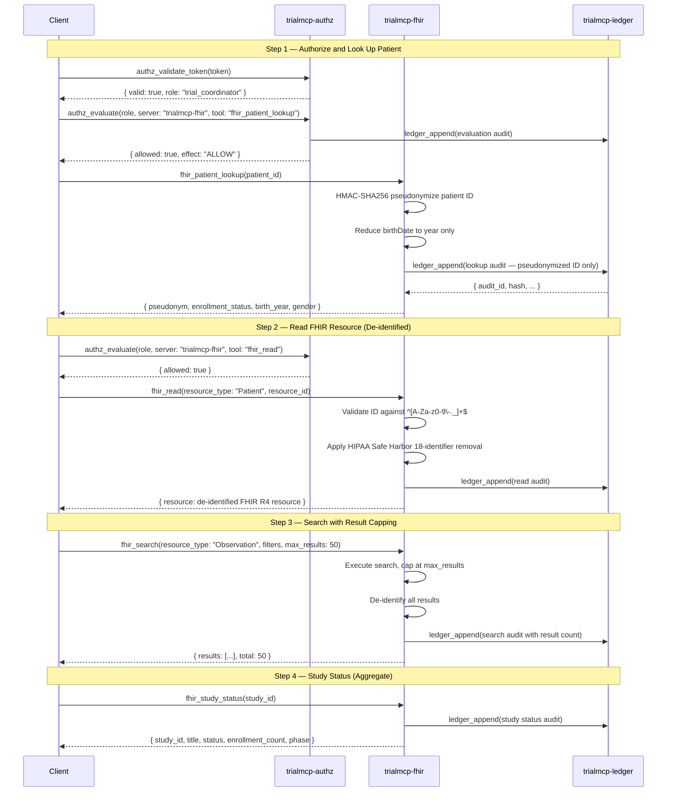

# Clinical Read Walkthrough: FHIR Access with De-identification

**National MCP-PAI Oncology Trials Standard**
**Profile**: Clinical Read (Conformance Level 2)
**Servers**: `trialmcp-authz`, `trialmcp-fhir`, `trialmcp-ledger`

---

## Overview

This walkthrough demonstrates FHIR R4 clinical data access with mandatory HIPAA
Safe Harbor de-identification. Conformance Level 2 builds on Level 1 (Core AuthZ +
Audit) by adding the clinical data server. Every FHIR operation requires prior
authorization, produces de-identified output, and generates an audit trail entry.

The walkthrough covers:

1. Authorized patient lookup with pseudonymization
2. FHIR resource read with HIPAA Safe Harbor de-identification
3. FHIR search with result capping
4. Consent check integration
5. Study status retrieval
6. Error handling scenarios

> **Spec references**: [spec/tool-contracts.md](../../spec/tool-contracts.md) Section 4,
> [spec/privacy.md](../../spec/privacy.md) Sections 2-3,
> [spec/actor-model.md](../../spec/actor-model.md) Section 3.2,
> [spec/security.md](../../spec/security.md) Section 4.

---

## Sequence Diagram



---

## Step 1: Patient Lookup with Authorization

### 1a. Validate the Caller's Token

Before any clinical data access, the caller's session token must be validated.

```json
{
  "tool": "authz_validate_token",
  "parameters": {
    "token": "c9f2a1b4-7e3d-4a8c-b5f1-2d9e6c8a3b7f"
  }
}
```

```json
{
  "valid": true,
  "role": "trial_coordinator",
  "subject": "coord-jane-doe-site-07",
  "expires_at": "2026-03-08T15:30:00Z"
}
```

### 1b. Evaluate Authorization for Patient Lookup

```json
{
  "tool": "authz_evaluate",
  "parameters": {
    "role": "trial_coordinator",
    "server": "trialmcp-fhir",
    "tool": "fhir_patient_lookup"
  }
}
```

```json
{
  "allowed": true,
  "matching_rules": [
    { "role": "trial_coordinator", "server": "trialmcp-fhir", "tool": "fhir_patient_lookup", "effect": "ALLOW" }
  ],
  "effect": "ALLOW"
}
```

### 1c. Execute Patient Lookup

The FHIR server applies HMAC-SHA256 pseudonymization to the patient ID and
reduces the birth date to year-only, per [spec/privacy.md](../../spec/privacy.md)
Section 3.1.

```json
{
  "tool": "fhir_patient_lookup",
  "parameters": {
    "patient_id": "patient-smith-12345"
  }
}
```

```json
{
  "pseudonym": "ps-a7b3c9d2e1f4",
  "enrollment_status": "active",
  "birth_year": 1958,
  "gender": "female"
}
```

> **Privacy guarantee**: The real patient ID `patient-smith-12345` is never
> returned. The pseudonym is generated via `HMAC-SHA256(salt, patient_id)`
> and is consistent within the site but differs across sites due to
> site-specific salts.

### 1d. Audit Record (Pseudonymized)

The audit record stores only the pseudonymized patient ID — never the real
identifier ([spec/tool-contracts.md](../../spec/tool-contracts.md) Section 4.3).

```json
{
  "audit_id": "aud-00000012-...",
  "timestamp": "2026-03-08T14:31:00Z",
  "server": "trialmcp-fhir",
  "tool": "fhir_patient_lookup",
  "caller": "coord-jane-doe-site-07",
  "parameters": { "patient_id_pseudonym": "ps-a7b3c9d2e1f4" },
  "result_summary": "Patient lookup returned: active enrollment, birth_year 1958",
  "hash": "c3d4e5f6...64-char-hex",
  "previous_hash": "b1c2d3e4...64-char-hex"
}
```

---

## Step 2: FHIR Resource Read with De-identification

### 2a. Read a Patient Resource

The FHIR server validates the resource ID against the pattern `^[A-Za-z0-9\-._]+$`
([spec/security.md](../../spec/security.md) Section 4.1), then applies HIPAA Safe
Harbor de-identification before returning the resource.

```json
{
  "tool": "fhir_read",
  "parameters": {
    "resource_type": "Patient",
    "resource_id": "patient-smith-12345"
  }
}
```

#### De-identified Response

```json
{
  "resource": {
    "resourceType": "Patient",
    "id": "ps-a7b3c9d2e1f4",
    "gender": "female",
    "birthDate": "1958",
    "identifier": [
      {
        "system": "urn:oid:trialmcp-pseudonym",
        "value": "ps-a7b3c9d2e1f4"
      }
    ]
  }
}
```

#### What Was Removed (HIPAA Safe Harbor)

The following fields were stripped per [spec/privacy.md](../../spec/privacy.md)
Section 2.3:

| Original Field | Action | Result |
|----------------|--------|--------|
| `name` (Jane Smith) | Removed entirely | Not present |
| `telecom` (phone, email) | Removed entirely | Not present |
| `address` (123 Oak St, Springfield) | Removed entirely | Not present |
| `birthDate` (1958-07-22) | Reduced to year | `"1958"` |
| `id` (patient-smith-12345) | Pseudonymized | `"ps-a7b3c9d2e1f4"` |
| `identifier` values | Pseudonymized | HMAC-SHA256 pseudonym |
| `gender` (female) | Preserved | `"female"` |

### 2b. Read an Observation Resource

Clinical content is preserved; only patient references are pseudonymized.

```json
{
  "tool": "fhir_read",
  "parameters": {
    "resource_type": "Observation",
    "resource_id": "obs-tumor-marker-001"
  }
}
```

```json
{
  "resource": {
    "resourceType": "Observation",
    "id": "obs-tumor-marker-001",
    "status": "final",
    "code": {
      "coding": [
        {
          "system": "http://loinc.org",
          "code": "85319-2",
          "display": "HER2 [Presence] in Breast cancer specimen by Immune stain"
        }
      ]
    },
    "subject": {
      "reference": "Patient/ps-a7b3c9d2e1f4"
    },
    "valueCodeableConcept": {
      "coding": [
        {
          "system": "http://loinc.org",
          "code": "LA6576-8",
          "display": "Positive"
        }
      ]
    },
    "effectiveDateTime": "2026"
  }
}
```

> **Referential integrity**: The `subject.reference` uses the same pseudonym
> `ps-a7b3c9d2e1f4` as the Patient resource, enabling cross-resource joins
> without exposing real identifiers ([spec/privacy.md](../../spec/privacy.md)
> Section 3.2).

---

## Step 3: FHIR Search with Result Capping

Search results are capped at 100 by default to prevent bulk data extraction
([spec/privacy.md](../../spec/privacy.md) Section 4.1).

### 3a. Search Observations by Code

```json
{
  "tool": "fhir_search",
  "parameters": {
    "resource_type": "Observation",
    "filters": {
      "code": "85319-2",
      "status": "final"
    },
    "max_results": 25
  }
}
```

```json
{
  "results": [
    {
      "resourceType": "Observation",
      "id": "obs-tumor-marker-001",
      "status": "final",
      "code": {
        "coding": [{ "system": "http://loinc.org", "code": "85319-2", "display": "HER2 [Presence]" }]
      },
      "subject": { "reference": "Patient/ps-a7b3c9d2e1f4" },
      "valueCodeableConcept": {
        "coding": [{ "system": "http://loinc.org", "code": "LA6576-8", "display": "Positive" }]
      },
      "effectiveDateTime": "2026"
    },
    {
      "resourceType": "Observation",
      "id": "obs-tumor-marker-002",
      "status": "final",
      "code": {
        "coding": [{ "system": "http://loinc.org", "code": "85319-2", "display": "HER2 [Presence]" }]
      },
      "subject": { "reference": "Patient/ps-b8c4d0e3f2a5" },
      "valueCodeableConcept": {
        "coding": [{ "system": "http://loinc.org", "code": "LA6577-6", "display": "Negative" }]
      },
      "effectiveDateTime": "2026"
    }
  ],
  "total": 2
}
```

### 3b. Audit Record for Search

```json
{
  "audit_id": "aud-00000015-...",
  "timestamp": "2026-03-08T14:33:00Z",
  "server": "trialmcp-fhir",
  "tool": "fhir_search",
  "caller": "coord-jane-doe-site-07",
  "parameters": {
    "resource_type": "Observation",
    "filters": { "code": "85319-2", "status": "final" },
    "max_results": 25
  },
  "result_summary": "Search returned 2 de-identified Observation resources",
  "hash": "d4e5f6a7...64-char-hex",
  "previous_hash": "c3d4e5f6...64-char-hex"
}
```

### 3c. Result Cap Enforcement

If a search would return more than 100 results, the server truncates and reports
the capped total.

```json
{
  "tool": "fhir_search",
  "parameters": {
    "resource_type": "Observation",
    "filters": { "status": "final" },
    "max_results": 200
  }
}
```

```json
{
  "results": ["... (100 de-identified resources) ..."],
  "total": 100
}
```

> **Note**: Even though `max_results: 200` was requested, the server enforces
> the hard cap of 100 per [spec/tool-contracts.md](../../spec/tool-contracts.md)
> Section 4.2.

---

## Step 4: Consent Check Integration

Before accessing patient data in a trial context, systems should verify that
the patient has provided informed consent for the specific trial activities.

### 4a. Consent Verification

```json
{
  "tool": "fhir_read",
  "parameters": {
    "resource_type": "Consent",
    "resource_id": "consent-trial-onc-2026-pt-12345"
  }
}
```

```json
{
  "resource": {
    "resourceType": "Consent",
    "id": "consent-trial-onc-2026-pt-12345",
    "status": "active",
    "scope": {
      "coding": [
        {
          "system": "http://terminology.hl7.org/CodeSystem/consentscope",
          "code": "research",
          "display": "Research"
        }
      ]
    },
    "category": [
      {
        "coding": [
          {
            "system": "http://loinc.org",
            "code": "59284-0",
            "display": "Consent Document"
          }
        ]
      }
    ],
    "patient": {
      "reference": "Patient/ps-a7b3c9d2e1f4"
    },
    "dateTime": "2026",
    "provision": {
      "type": "permit",
      "period": {
        "start": "2026-01-15",
        "end": "2027-01-15"
      },
      "purpose": [
        {
          "system": "http://terminology.hl7.org/CodeSystem/v3-ActReason",
          "code": "HRESCH",
          "display": "Healthcare Research"
        }
      ]
    }
  }
}
```

### 4b. Consent Not Found

If no consent record exists, subsequent data access for that patient should be
restricted.

```json
{
  "tool": "fhir_read",
  "parameters": {
    "resource_type": "Consent",
    "resource_id": "consent-trial-onc-2026-pt-99999"
  }
}
```

```json
{
  "error": {
    "code": "NOT_FOUND",
    "message": "Consent resource 'consent-trial-onc-2026-pt-99999' not found",
    "details": {
      "resource_type": "Consent",
      "resource_id": "consent-trial-onc-2026-pt-99999"
    }
  }
}
```

---

## Step 5: Study Status Retrieval

Study status is available to a broader set of roles — including `sponsor` and
`cro` — because it returns aggregate enrollment data, not patient-level information.

### 5a. Request

```json
{
  "tool": "fhir_study_status",
  "parameters": {
    "study_id": "study-onc-phase3-2026-001"
  }
}
```

### 5b. Response

```json
{
  "study_id": "study-onc-phase3-2026-001",
  "title": "Phase III Randomized Trial of Robot-Assisted Biopsy in HER2+ Breast Cancer",
  "status": "active",
  "enrollment_count": 247,
  "phase": "phase-3"
}
```

### 5c. Sponsor Access

A sponsor can access study status but not individual patient records.

```json
{
  "tool": "authz_evaluate",
  "parameters": {
    "role": "sponsor",
    "server": "trialmcp-fhir",
    "tool": "fhir_study_status"
  }
}
```

```json
{
  "allowed": true,
  "matching_rules": [
    { "role": "sponsor", "server": "trialmcp-fhir", "tool": "fhir_study_status", "effect": "ALLOW" }
  ],
  "effect": "ALLOW"
}
```

```json
{
  "tool": "authz_evaluate",
  "parameters": {
    "role": "sponsor",
    "server": "trialmcp-fhir",
    "tool": "fhir_patient_lookup"
  }
}
```

```json
{
  "allowed": false,
  "matching_rules": [],
  "effect": "DENY"
}
```

---

## Step 6: Error Handling Scenarios

### 6a. SSRF Attempt via Resource ID

Resource IDs are validated against `^[A-Za-z0-9\-._]+$` and checked for
embedded URLs ([spec/security.md](../../spec/security.md) Section 4.1, 4.3).

```json
{
  "tool": "fhir_read",
  "parameters": {
    "resource_type": "Patient",
    "resource_id": "https://evil.example.com/exfiltrate"
  }
}
```

```json
{
  "error": {
    "code": "VALIDATION_FAILED",
    "message": "Resource ID contains embedded URL — SSRF prevention triggered",
    "details": {
      "field": "resource_id",
      "pattern_violation": "ID must match ^[A-Za-z0-9\\-._]+$",
      "ssrf_detected": true
    }
  }
}
```

### 6b. Unauthorized Role Accessing Patient Data

An auditor attempts to read FHIR resources, which is denied by policy.

```json
{
  "tool": "authz_evaluate",
  "parameters": {
    "role": "auditor",
    "server": "trialmcp-fhir",
    "tool": "fhir_read"
  }
}
```

```json
{
  "allowed": false,
  "matching_rules": [],
  "effect": "DENY"
}
```

If the auditor bypasses the evaluation and calls the FHIR tool directly:

```json
{
  "tool": "fhir_read",
  "parameters": {
    "resource_type": "Patient",
    "resource_id": "patient-smith-12345"
  }
}
```

```json
{
  "error": {
    "code": "AUTHZ_DENIED",
    "message": "Caller role 'auditor' is not authorized for fhir_read",
    "details": {
      "caller_role": "auditor",
      "required_roles": ["robot_agent", "trial_coordinator", "data_monitor"]
    }
  }
}
```

### 6c. Resource Not Found

```json
{
  "tool": "fhir_read",
  "parameters": {
    "resource_type": "Observation",
    "resource_id": "obs-nonexistent-99999"
  }
}
```

```json
{
  "error": {
    "code": "NOT_FOUND",
    "message": "Observation resource 'obs-nonexistent-99999' not found",
    "details": {
      "resource_type": "Observation",
      "resource_id": "obs-nonexistent-99999"
    }
  }
}
```

### 6d. robot_agent Denied Patient Lookup

Robot agents can read clinical resources via `fhir_read` and `fhir_search` but
cannot perform direct patient lookups.

```json
{
  "tool": "authz_evaluate",
  "parameters": {
    "role": "robot_agent",
    "server": "trialmcp-fhir",
    "tool": "fhir_patient_lookup"
  }
}
```

```json
{
  "allowed": false,
  "matching_rules": [
    { "role": "robot_agent", "server": "trialmcp-fhir", "tool": "fhir_patient_lookup", "effect": "DENY" }
  ],
  "effect": "DENY"
}
```

---

## FHIR Access Permission Summary

| Tool | robot_agent | trial_coordinator | data_monitor | auditor | sponsor | cro |
|------|:-----------:|:-----------------:|:------------:|:-------:|:-------:|:---:|
| `fhir_read` | ALLOW | ALLOW | ALLOW | DENY | DENY | DENY |
| `fhir_search` | ALLOW | ALLOW | ALLOW | DENY | DENY | DENY |
| `fhir_patient_lookup` | DENY | ALLOW | ALLOW | DENY | DENY | DENY |
| `fhir_study_status` | ALLOW | ALLOW | ALLOW | DENY | ALLOW | ALLOW |

---

## De-identification Pipeline Summary

The FHIR server applies the following de-identification pipeline to all
patient-related resources before returning them:

```
Raw FHIR Resource
    |
    v
[1] Validate resource ID (regex + SSRF check)
    |
    v
[2] Strip HIPAA Safe Harbor identifiers:
    - Remove: name, telecom, address, SSN, MRN (as raw), URLs, IPs
    - Generalize: birthDate to year only, geography to state
    - Pseudonymize: id, identifier values via HMAC-SHA256(salt, value)
    |
    v
[3] Maintain referential integrity:
    - subject.reference uses same pseudonym as Patient.id
    |
    v
[4] Return de-identified resource
    |
    v
[5] Append audit record (pseudonymized patient ID only)
```

---

## Key Design Decisions

1. **HMAC-SHA256 pseudonymization**: Consistent within a site (same input always
   produces same pseudonym) but different across sites (different salts),
   preventing cross-site patient linking.
2. **Result capping at 100**: Hard limit prevents bulk extraction of clinical data.
3. **Year-only dates**: Birth dates and clinical dates are reduced to year-only
   to satisfy Safe Harbor while retaining research utility.
4. **Audit never stores real IDs**: Audit records contain only pseudonymized
   patient identifiers — the real ID never leaves the FHIR server boundary.
5. **Referential integrity preserved**: Pseudonymized references allow clinical
   analysis across resource types without exposing real identifiers.

---

## Checklist for Implementers

- [ ] FHIR IDs validated against `^[A-Za-z0-9\-._]+$` before processing
- [ ] All string inputs checked for embedded URLs (SSRF prevention)
- [ ] HIPAA Safe Harbor 18-identifier removal applied to all patient resources
- [ ] HMAC-SHA256 pseudonymization uses site-specific salt
- [ ] Same patient ID always produces same pseudonym within a site
- [ ] `birthDate` reduced to year-only in all returned resources
- [ ] `subject.reference` pseudonyms match `Patient.id` pseudonyms
- [ ] Search results capped at 100 regardless of `max_results` parameter
- [ ] Audit records store pseudonymized patient IDs, never real IDs
- [ ] `fhir_patient_lookup` denied for `robot_agent`, `auditor`, `sponsor`, `cro`
- [ ] `fhir_study_status` accessible to `sponsor` and `cro` (aggregate only)
