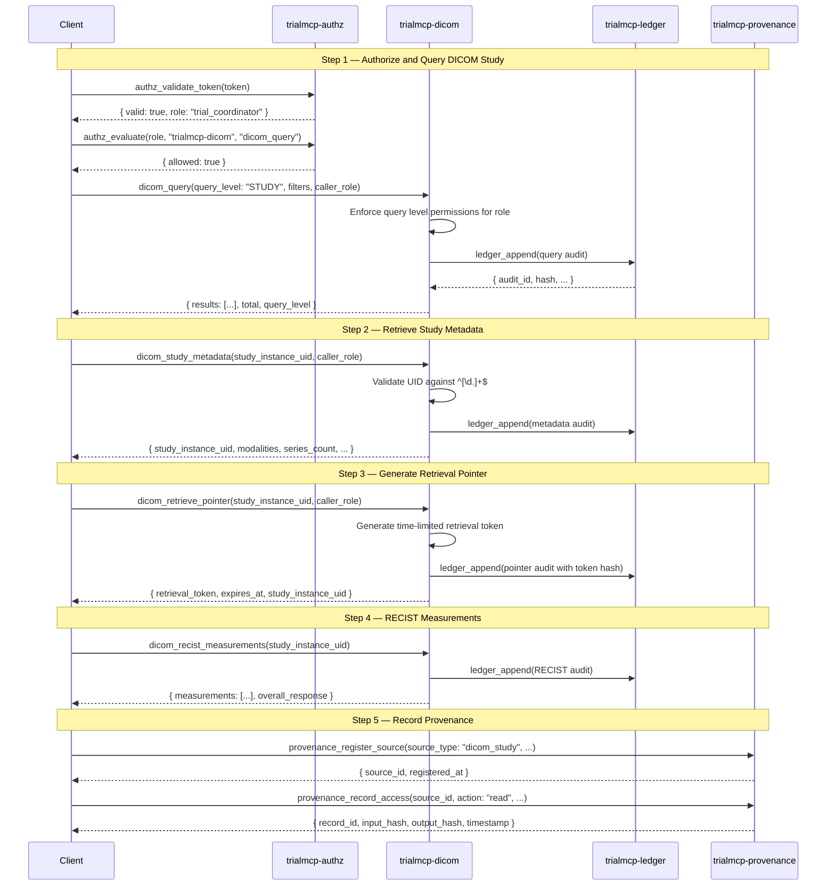

# Imaging-Guided Walkthrough: DICOM Query with Modality Restrictions

**National MCP-PAI Oncology Trials Standard**
**Profile**: Imaging (Conformance Level 3)
**Servers**: `trialmcp-authz`, `trialmcp-fhir`, `trialmcp-dicom`, `trialmcp-ledger`, `trialmcp-provenance`

---

## Overview

This walkthrough demonstrates DICOM imaging access with role-based modality
restrictions, metadata retrieval (no pixel data), and RECIST 1.1 measurement
validation. Conformance Level 3 adds the DICOM server to the Level 2 clinical
data stack. Every imaging query is authorized, audited, and tracked through
provenance.

The walkthrough covers:

1. DICOM study query with role-based query level restrictions
2. Study metadata retrieval (no pixel data returned)
3. Retrieval pointer generation (time-limited token for image access)
4. RECIST 1.1 tumor measurement validation
5. Provenance recording for imaging access
6. Error handling scenarios

> **Spec references**: [spec/tool-contracts.md](../../spec/tool-contracts.md) Section 5,
> [spec/privacy.md](../../spec/privacy.md) Section 2.4,
> [spec/actor-model.md](../../spec/actor-model.md) Section 3.3,
> [spec/security.md](../../spec/security.md) Section 4.2.

---

## Sequence Diagram



---

## Step 1: DICOM Study Query with Role-Based Restrictions

Different roles have different query level permissions. The DICOM server enforces
these restrictions per [spec/tool-contracts.md](../../spec/tool-contracts.md)
Section 5.1:

| Role | Allowed Query Levels |
|------|---------------------|
| `trial_coordinator` | PATIENT, STUDY, SERIES |
| `robot_agent` | STUDY, SERIES |
| `data_monitor` | PATIENT, STUDY |
| `auditor` | STUDY only |

### 1a. trial_coordinator Queries at STUDY Level (ALLOW)

```json
{
  "tool": "dicom_query",
  "parameters": {
    "query_level": "STUDY",
    "filters": {
      "StudyDate": "20260301-20260308",
      "Modality": "CT"
    },
    "caller_role": "trial_coordinator"
  }
}
```

```json
{
  "results": [
    {
      "StudyInstanceUID": "1.2.840.113619.2.55.3.2831164020.768.1583223456.789",
      "StudyDate": "20260305",
      "StudyDescription": "CT Chest Abdomen Pelvis with Contrast",
      "Modality": "CT",
      "NumberOfSeries": 4,
      "NumberOfInstances": 312
    },
    {
      "StudyInstanceUID": "1.2.840.113619.2.55.3.2831164020.768.1583223456.901",
      "StudyDate": "20260307",
      "StudyDescription": "CT Chest Follow-up",
      "Modality": "CT",
      "NumberOfSeries": 3,
      "NumberOfInstances": 245
    }
  ],
  "total": 2,
  "query_level": "STUDY"
}
```

### 1b. robot_agent Queries at PATIENT Level (DENY)

Robot agents are restricted to STUDY and SERIES query levels.

```json
{
  "tool": "dicom_query",
  "parameters": {
    "query_level": "PATIENT",
    "filters": {},
    "caller_role": "robot_agent"
  }
}
```

```json
{
  "error": {
    "code": "AUTHZ_DENIED",
    "message": "Role 'robot_agent' is not authorized for PATIENT-level DICOM queries",
    "details": {
      "caller_role": "robot_agent",
      "requested_level": "PATIENT",
      "allowed_levels": ["STUDY", "SERIES"]
    }
  }
}
```

### 1c. PATIENT-Level Query with Privacy Hashing

When a `trial_coordinator` or `data_monitor` queries at PATIENT level, patient
names are hashed using SHA-256 truncated to 12 characters
([spec/privacy.md](../../spec/privacy.md) Section 2.4).

```json
{
  "tool": "dicom_query",
  "parameters": {
    "query_level": "PATIENT",
    "filters": {},
    "caller_role": "trial_coordinator"
  }
}
```

```json
{
  "results": [
    {
      "PatientName": "a7b3c9d2e1f4",
      "PatientID": "ps-hm-d4e5f6a7b8c9",
      "NumberOfStudies": 3
    },
    {
      "PatientName": "b8c4d0e3f2a5",
      "PatientID": "ps-hm-e5f6a7b8c9d0",
      "NumberOfStudies": 2
    }
  ],
  "total": 2,
  "query_level": "PATIENT"
}
```

> **Privacy**: Patient names are SHA-256 hashed and truncated to 12 characters.
> Patient IDs are pseudonymized via HMAC-SHA256. Real patient identifiers are
> never returned.

---

## Step 2: Study Metadata Retrieval

Metadata retrieval returns study-level information without any pixel data.
The DICOM UID is validated against `^[\d.]+$` for SSRF prevention.

### 2a. Request

```json
{
  "tool": "dicom_study_metadata",
  "parameters": {
    "study_instance_uid": "1.2.840.113619.2.55.3.2831164020.768.1583223456.789",
    "caller_role": "trial_coordinator"
  }
}
```

### 2b. Response

```json
{
  "study_instance_uid": "1.2.840.113619.2.55.3.2831164020.768.1583223456.789",
  "modalities": ["CT"],
  "series_count": 4,
  "study_date": "20260305",
  "description": "CT Chest Abdomen Pelvis with Contrast"
}
```

### 2c. data_monitor Access (ALLOW)

Data monitors can view metadata for quality review but cannot retrieve pixel data.

```json
{
  "tool": "dicom_study_metadata",
  "parameters": {
    "study_instance_uid": "1.2.840.113619.2.55.3.2831164020.768.1583223456.789",
    "caller_role": "data_monitor"
  }
}
```

```json
{
  "study_instance_uid": "1.2.840.113619.2.55.3.2831164020.768.1583223456.789",
  "modalities": ["CT"],
  "series_count": 4,
  "study_date": "20260305",
  "description": "CT Chest Abdomen Pelvis with Contrast"
}
```

---

## Step 3: Retrieval Pointer Generation

The DICOM server generates a time-limited retrieval token instead of returning
pixel data directly. Only `robot_agent` and `trial_coordinator` can generate
retrieval pointers ([spec/actor-model.md](../../spec/actor-model.md) Section 3.3).

### 3a. trial_coordinator Generates Pointer

```json
{
  "tool": "dicom_retrieve_pointer",
  "parameters": {
    "study_instance_uid": "1.2.840.113619.2.55.3.2831164020.768.1583223456.789",
    "caller_role": "trial_coordinator"
  }
}
```

```json
{
  "retrieval_token": "rtk-f4e3d2c1b0a9-8765-4321-fedc-ba9876543210",
  "expires_at": "2026-03-08T15:30:00Z",
  "study_instance_uid": "1.2.840.113619.2.55.3.2831164020.768.1583223456.789"
}
```

> **Security**: The retrieval token expires after 3600 seconds (default). Only
> the SHA-256 hash of the token is stored in the audit ledger — never the
> plaintext token ([spec/tool-contracts.md](../../spec/tool-contracts.md) Section 5.2).

### 3b. data_monitor Denied Retrieval (DENY)

```json
{
  "tool": "dicom_retrieve_pointer",
  "parameters": {
    "study_instance_uid": "1.2.840.113619.2.55.3.2831164020.768.1583223456.789",
    "caller_role": "data_monitor"
  }
}
```

```json
{
  "error": {
    "code": "AUTHZ_DENIED",
    "message": "Role 'data_monitor' is not authorized for dicom_retrieve_pointer",
    "details": {
      "caller_role": "data_monitor",
      "authorized_roles": ["robot_agent", "trial_coordinator"]
    }
  }
}
```

---

## Step 4: RECIST 1.1 Measurement Validation

RECIST (Response Evaluation Criteria in Solid Tumors) 1.1 measurements track
tumor response over time. This tool returns structured measurement data with
lesion-level diameters and an overall response classification.

### 4a. Request

```json
{
  "tool": "dicom_recist_measurements",
  "parameters": {
    "study_instance_uid": "1.2.840.113619.2.55.3.2831164020.768.1583223456.789"
  }
}
```

### 4b. Response

```json
{
  "study_instance_uid": "1.2.840.113619.2.55.3.2831164020.768.1583223456.789",
  "measurements": [
    {
      "lesion_id": "target-lesion-001",
      "diameter_mm": 22.4,
      "response": "stable_disease"
    },
    {
      "lesion_id": "target-lesion-002",
      "diameter_mm": 15.1,
      "response": "partial_response"
    },
    {
      "lesion_id": "non-target-001",
      "diameter_mm": null,
      "response": "non_cr_non_pd"
    }
  ],
  "overall_response": "stable_disease"
}
```

> **RECIST 1.1 Response Categories**:
> - `complete_response` (CR): Disappearance of all target lesions
> - `partial_response` (PR): >= 30% decrease in sum of diameters
> - `stable_disease` (SD): Neither PR nor PD criteria met
> - `progressive_disease` (PD): >= 20% increase in sum of diameters

### 4c. CRO Access to RECIST Data (ALLOW)

CROs can access RECIST measurements for cross-site data review.

```json
{
  "tool": "authz_evaluate",
  "parameters": {
    "role": "cro",
    "server": "trialmcp-dicom",
    "tool": "dicom_recist_measurements"
  }
}
```

```json
{
  "allowed": true,
  "matching_rules": [
    { "role": "cro", "server": "trialmcp-dicom", "tool": "dicom_recist_measurements", "effect": "ALLOW" }
  ],
  "effect": "ALLOW"
}
```

---

## Step 5: Provenance Recording for Imaging Access

Every imaging access event is recorded in the provenance graph to establish
data lineage.

### 5a. Register the DICOM Study as a Data Source

```json
{
  "tool": "provenance_register_source",
  "parameters": {
    "source_type": "dicom_study",
    "origin_server": "trialmcp-dicom",
    "description": "CT Chest Abdomen Pelvis — Study 1.2.840...789",
    "metadata": {
      "study_instance_uid": "1.2.840.113619.2.55.3.2831164020.768.1583223456.789",
      "modality": "CT",
      "study_date": "20260305"
    }
  }
}
```

```json
{
  "source_id": "src-dicom-a1b2c3d4-e5f6-7890-abcd-ef1234567890",
  "registered_at": "2026-03-08T14:35:00Z"
}
```

### 5b. Record the Access Event

```json
{
  "tool": "provenance_record_access",
  "parameters": {
    "source_id": "src-dicom-a1b2c3d4-e5f6-7890-abcd-ef1234567890",
    "action": "read",
    "actor_id": "coord-jane-doe-site-07",
    "actor_role": "trial_coordinator",
    "tool_call": "dicom_study_metadata",
    "input_data": "{\"study_instance_uid\": \"1.2.840.113619.2.55.3.2831164020.768.1583223456.789\"}",
    "output_data": "{\"modalities\": [\"CT\"], \"series_count\": 4}"
  }
}
```

```json
{
  "record_id": "prov-rec-b2c3d4e5-f6a7-8901-bcde-f23456789012",
  "input_hash": "7a8b9c0d1e2f3a4b5c6d7e8f9a0b1c2d3e4f5a6b7c8d9e0f1a2b3c4d5e6f7a8b",
  "output_hash": "8b9c0d1e2f3a4b5c6d7e8f9a0b1c2d3e4f5a6b7c8d9e0f1a2b3c4d5e6f7a8b9c",
  "timestamp": "2026-03-08T14:35:05Z"
}
```

### 5c. Query Forward Lineage

After a robot agent uses this imaging data for a procedure, the forward lineage
shows what downstream outputs were derived from it.

```json
{
  "tool": "provenance_get_lineage",
  "parameters": {
    "source_id": "src-dicom-a1b2c3d4-e5f6-7890-abcd-ef1234567890",
    "direction": "forward"
  }
}
```

```json
{
  "source_id": "src-dicom-a1b2c3d4-e5f6-7890-abcd-ef1234567890",
  "lineage": [
    {
      "record_id": "prov-rec-b2c3d4e5-...",
      "action": "read",
      "actor_id": "coord-jane-doe-site-07",
      "actor_role": "trial_coordinator",
      "tool_call": "dicom_study_metadata",
      "timestamp": "2026-03-08T14:35:05Z"
    },
    {
      "record_id": "prov-rec-c3d4e5f6-...",
      "action": "read",
      "actor_id": "robot-arm-001",
      "actor_role": "robot_agent",
      "tool_call": "dicom_retrieve_pointer",
      "timestamp": "2026-03-08T15:00:00Z"
    }
  ],
  "total": 2
}
```

---

## Step 6: Error Handling Scenarios

### 6a. Invalid DICOM UID (SSRF Prevention)

DICOM UIDs must match `^[\d.]+$`. Any UID containing non-numeric, non-dot
characters is rejected ([spec/security.md](../../spec/security.md) Section 4.2).

```json
{
  "tool": "dicom_study_metadata",
  "parameters": {
    "study_instance_uid": "https://evil.example.com/1.2.3.4",
    "caller_role": "trial_coordinator"
  }
}
```

```json
{
  "error": {
    "code": "VALIDATION_FAILED",
    "message": "Study Instance UID contains invalid characters — must match ^[\\d.]+$",
    "details": {
      "field": "study_instance_uid",
      "value_preview": "https://evil...",
      "ssrf_detected": true
    }
  }
}
```

### 6b. Study Not Found

```json
{
  "tool": "dicom_study_metadata",
  "parameters": {
    "study_instance_uid": "1.2.3.4.5.6.7.8.9.0",
    "caller_role": "trial_coordinator"
  }
}
```

```json
{
  "error": {
    "code": "NOT_FOUND",
    "message": "No DICOM study found with UID '1.2.3.4.5.6.7.8.9.0'",
    "details": {
      "study_instance_uid": "1.2.3.4.5.6.7.8.9.0"
    }
  }
}
```

### 6c. auditor Denied All DICOM Access

Auditors have no permissions on any DICOM tools.

```json
{
  "tool": "authz_evaluate",
  "parameters": {
    "role": "auditor",
    "server": "trialmcp-dicom",
    "tool": "dicom_query"
  }
}
```

```json
{
  "allowed": false,
  "matching_rules": [],
  "effect": "DENY"
}
```

### 6d. Provenance Integrity Verification Failure

```json
{
  "tool": "provenance_verify_integrity",
  "parameters": {
    "source_id": "src-dicom-a1b2c3d4-e5f6-7890-abcd-ef1234567890",
    "data": "{\"modalities\": [\"CT\", \"MR\"], \"series_count\": 5}"
  }
}
```

```json
{
  "source_id": "src-dicom-a1b2c3d4-e5f6-7890-abcd-ef1234567890",
  "verified": false,
  "expected_hash": "8b9c0d1e2f3a4b5c6d7e8f9a0b1c2d3e4f5a6b7c8d9e0f1a2b3c4d5e6f7a8b9c",
  "actual_hash": "f1e2d3c4b5a6f7e8d9c0b1a2f3e4d5c6b7a8f9e0d1c2b3a4f5e6d7c8b9a0f1e2"
}
```

> **Implication**: The data has been modified since the provenance record was
> created. This could indicate tampering or an unauthorized update. The
> discrepancy should be investigated and reported.

---

## DICOM Access Permission Summary

| Tool | robot_agent | trial_coordinator | data_monitor | auditor | sponsor | cro |
|------|:-----------:|:-----------------:|:------------:|:-------:|:-------:|:---:|
| `dicom_query` | ALLOW | ALLOW | ALLOW | DENY | DENY | DENY |
| `dicom_retrieve_pointer` | ALLOW | ALLOW | DENY | DENY | DENY | DENY |
| `dicom_study_metadata` | ALLOW | ALLOW | ALLOW | DENY | DENY | DENY |
| `dicom_recist_measurements` | ALLOW | ALLOW | ALLOW | DENY | DENY | ALLOW |

### Query Level Restrictions

| Role | PATIENT | STUDY | SERIES | IMAGE |
|------|:-------:|:-----:|:------:|:-----:|
| `trial_coordinator` | ALLOW | ALLOW | ALLOW | - |
| `robot_agent` | DENY | ALLOW | ALLOW | - |
| `data_monitor` | ALLOW | ALLOW | DENY | - |
| `auditor` | DENY | ALLOW | DENY | - |

---

## Key Design Decisions

1. **No pixel data via MCP**: The DICOM server returns metadata and retrieval
   tokens, never raw pixel data. Image access is mediated through time-limited
   retrieval pointers.
2. **Role-based query levels**: Restricting query levels prevents unauthorized
   patient enumeration. Robot agents cannot query at PATIENT level.
3. **RECIST 1.1 integration**: Structured tumor measurement data supports
   automated response evaluation without manual radiology review.
4. **UID validation**: Strict `^[\d.]+$` validation prevents SSRF through
   crafted DICOM UIDs.
5. **Provenance fingerprinting**: SHA-256 hashes of input and output data
   enable tamper detection for imaging metadata.

---

## Checklist for Implementers

- [ ] DICOM UIDs validated against `^[\d.]+$` before processing
- [ ] Query level restrictions enforced per role
- [ ] Patient names hashed (SHA-256, 12-char truncation) at PATIENT query level
- [ ] Patient IDs pseudonymized via HMAC-SHA256
- [ ] Retrieval tokens expire after 3600 seconds by default
- [ ] Only token SHA-256 hash stored in audit ledger
- [ ] RECIST measurements return structured response categories
- [ ] Provenance records created for all imaging access events
- [ ] Data fingerprints (SHA-256) computed for input and output
- [ ] `data_monitor` denied `dicom_retrieve_pointer` access
- [ ] `auditor` denied all DICOM tool access
