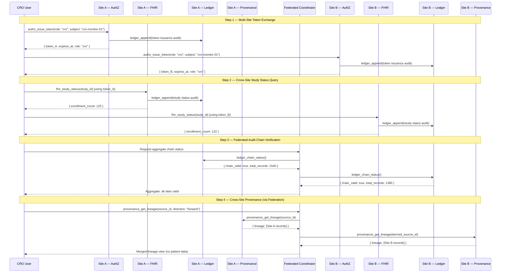

# Multi-Site Federated Walkthrough: Cross-Site Provenance and Audit

**National MCP-PAI Oncology Trials Standard**
**Profile**: Federated Site (Conformance Level 4)
**Servers**: `trialmcp-authz`, `trialmcp-fhir`, `trialmcp-dicom`, `trialmcp-ledger`, `trialmcp-provenance`

---

## Overview

This walkthrough demonstrates cross-site operations in a national multi-site
oncology trial. Conformance Level 4 adds federated capabilities: independent
per-site ledgers coordinated through a federated layer, cross-site provenance
tracking, and multi-site token exchange. Patient data never leaves the
originating site.

The walkthrough covers:

1. Multi-site token exchange and site-scoped authorization
2. Cross-site data query with provenance tracking
3. Federated audit chain coordination
4. DAG provenance across sites
5. Federated learning aggregation provenance
6. Error handling scenarios

> **Spec references**: [spec/actor-model.md](../../spec/actor-model.md) Section 5,
> [spec/audit.md](../../spec/audit.md) Section 7,
> [spec/provenance.md](../../spec/provenance.md) Section 5,
> [spec/privacy.md](../../spec/privacy.md) Section 6,
> [spec/security.md](../../spec/security.md) Section 5.

---

## Sequence Diagram



---

## Step 1: Multi-Site Token Exchange

In a multi-site trial, each site maintains its own authorization server. A CRO
user must obtain separate tokens from each participating site. A token issued at
Site A does not grant access at Site B ([spec/actor-model.md](../../spec/actor-model.md)
Section 4.4).

### 1a. Obtain Token from Site A

```json
{
  "tool": "authz_issue_token",
  "server": "site-a.trialmcp-authz",
  "parameters": {
    "role": "cro",
    "subject": "cro-monitor-01-acme-research",
    "duration_seconds": 7200
  }
}
```

```json
{
  "token": "siteA-d4e5f6a7-b8c9-0d1e-2f3a-4b5c6d7e8f9a",
  "expires_at": "2026-03-08T16:30:00Z",
  "role": "cro",
  "subject": "cro-monitor-01-acme-research"
}
```

### 1b. Obtain Token from Site B

```json
{
  "tool": "authz_issue_token",
  "server": "site-b.trialmcp-authz",
  "parameters": {
    "role": "cro",
    "subject": "cro-monitor-01-acme-research",
    "duration_seconds": 7200
  }
}
```

```json
{
  "token": "siteB-e5f6a7b8-c9d0-1e2f-3a4b-5c6d7e8f9a0b",
  "expires_at": "2026-03-08T16:30:00Z",
  "role": "cro",
  "subject": "cro-monitor-01-acme-research"
}
```

### 1c. Cross-Site Token Rejection

Attempting to use Site A's token at Site B is rejected.

```json
{
  "tool": "authz_validate_token",
  "server": "site-b.trialmcp-authz",
  "parameters": {
    "token": "siteA-d4e5f6a7-b8c9-0d1e-2f3a-4b5c6d7e8f9a"
  }
}
```

```json
{
  "error": {
    "code": "INVALID_INPUT",
    "message": "Token not recognized — tokens are site-scoped and cannot be used across sites",
    "details": {
      "site": "site-b",
      "suggestion": "Obtain a token from site-b's authorization server"
    }
  }
}
```

---

## Step 2: Cross-Site Data Query with Provenance

### 2a. Study Status from Site A

CRO roles can access `fhir_study_status` to view aggregate enrollment data.

```json
{
  "tool": "fhir_study_status",
  "server": "site-a.trialmcp-fhir",
  "parameters": {
    "study_id": "study-onc-phase3-2026-001"
  }
}
```

```json
{
  "study_id": "study-onc-phase3-2026-001",
  "title": "Phase III Randomized Trial of Robot-Assisted Biopsy in HER2+ Breast Cancer",
  "status": "active",
  "enrollment_count": 125,
  "phase": "phase-3"
}
```

### 2b. Study Status from Site B

```json
{
  "tool": "fhir_study_status",
  "server": "site-b.trialmcp-fhir",
  "parameters": {
    "study_id": "study-onc-phase3-2026-001"
  }
}
```

```json
{
  "study_id": "study-onc-phase3-2026-001",
  "title": "Phase III Randomized Trial of Robot-Assisted Biopsy in HER2+ Breast Cancer",
  "status": "active",
  "enrollment_count": 122,
  "phase": "phase-3"
}
```

### 2c. Aggregate View (Federated Coordinator)

The federated coordinator merges results without exposing patient-level data.

```json
{
  "aggregate_study_status": {
    "study_id": "study-onc-phase3-2026-001",
    "title": "Phase III Randomized Trial of Robot-Assisted Biopsy in HER2+ Breast Cancer",
    "status": "active",
    "phase": "phase-3",
    "sites": [
      { "site_id": "site-a", "enrollment_count": 125, "status": "active" },
      { "site_id": "site-b", "enrollment_count": 122, "status": "active" }
    ],
    "total_enrollment": 247
  }
}
```

### 2d. CRO Denied Patient-Level Access

CRO roles cannot access patient-level data at any site.

```json
{
  "tool": "authz_evaluate",
  "server": "site-a.trialmcp-authz",
  "parameters": {
    "role": "cro",
    "server": "trialmcp-fhir",
    "tool": "fhir_patient_lookup"
  }
}
```

```json
{
  "allowed": false,
  "matching_rules": [],
  "effect": "DENY"
}
```

---

## Step 3: Federated Audit Chain Coordination

Each site maintains its own independent audit ledger. The federated layer
collects chain status from all sites without transferring individual records
([spec/audit.md](../../spec/audit.md) Section 7.2).

### 3a. Site A Chain Status

```json
{
  "tool": "ledger_chain_status",
  "server": "site-a.trialmcp-ledger",
  "parameters": {}
}
```

```json
{
  "total_records": 1540,
  "chain_valid": true,
  "genesis_hash": "0000000000000000000000000000000000000000000000000000000000000000",
  "latest_hash": "a1b2c3d4e5f6a7b8c9d0e1f2a3b4c5d6e7f8a9b0c1d2e3f4a5b6c7d8e9f0a1b2",
  "latest_timestamp": "2026-03-08T14:30:00Z"
}
```

### 3b. Site B Chain Status

```json
{
  "tool": "ledger_chain_status",
  "server": "site-b.trialmcp-ledger",
  "parameters": {}
}
```

```json
{
  "total_records": 1380,
  "chain_valid": true,
  "genesis_hash": "0000000000000000000000000000000000000000000000000000000000000000",
  "latest_hash": "b2c3d4e5f6a7b8c9d0e1f2a3b4c5d6e7f8a9b0c1d2e3f4a5b6c7d8e9f0a1b2c3",
  "latest_timestamp": "2026-03-08T14:28:00Z"
}
```

### 3c. Aggregate Chain Health Report

The federated coordinator produces an aggregate report identifying any sites
with chain integrity issues.

```json
{
  "federated_chain_status": {
    "total_sites": 2,
    "all_valid": true,
    "sites": [
      {
        "site_id": "site-a",
        "chain_valid": true,
        "total_records": 1540,
        "latest_timestamp": "2026-03-08T14:30:00Z"
      },
      {
        "site_id": "site-b",
        "chain_valid": true,
        "total_records": 1380,
        "latest_timestamp": "2026-03-08T14:28:00Z"
      }
    ],
    "aggregate_records": 2920
  }
}
```

### 3d. Site with Chain Integrity Failure

If a site's chain is compromised, the federated report flags it.

```json
{
  "federated_chain_status": {
    "total_sites": 2,
    "all_valid": false,
    "sites": [
      {
        "site_id": "site-a",
        "chain_valid": true,
        "total_records": 1540,
        "latest_timestamp": "2026-03-08T14:30:00Z"
      },
      {
        "site_id": "site-b",
        "chain_valid": false,
        "total_records": 1380,
        "first_invalid_index": 1201,
        "alert": "CRITICAL — Chain integrity compromised at record 1201. Ledger halted."
      }
    ],
    "aggregate_records": 2920,
    "action_required": "Site B ledger requires auditor investigation before resuming operations"
  }
}
```

> **Critical response**: Per [spec/security.md](../../spec/security.md) Section 7.2,
> when a chain fails verification the site MUST halt the ledger, alert auditors,
> and prevent chain repair without auditor review.

---

## Step 4: DAG Provenance Across Sites

Cross-site lineage queries are answered through the federated coordination layer.
Each site returns its local lineage without patient data, and the coordinator
merges results ([spec/provenance.md](../../spec/provenance.md) Section 5.3).

### 4a. Register Data Sources at Each Site

**Site A** registers model parameters after local training:

```json
{
  "tool": "provenance_register_source",
  "server": "site-a.trialmcp-provenance",
  "parameters": {
    "source_type": "model_parameters",
    "origin_server": "trialmcp-fhir",
    "description": "HER2+ classification model — Site A local training epoch 50",
    "metadata": {
      "model_version": "v1.0.0",
      "training_samples": 125,
      "algorithm": "FedAvg"
    }
  }
}
```

```json
{
  "source_id": "src-model-siteA-a1b2c3d4",
  "registered_at": "2026-03-08T14:00:00Z"
}
```

**Site B** registers its model parameters:

```json
{
  "tool": "provenance_register_source",
  "server": "site-b.trialmcp-provenance",
  "parameters": {
    "source_type": "model_parameters",
    "origin_server": "trialmcp-fhir",
    "description": "HER2+ classification model — Site B local training epoch 50",
    "metadata": {
      "model_version": "v1.0.0",
      "training_samples": 122,
      "algorithm": "FedAvg"
    }
  }
}
```

```json
{
  "source_id": "src-model-siteB-b2c3d4e5",
  "registered_at": "2026-03-08T14:01:00Z"
}
```

### 4b. Record Aggregation Event

When federated learning aggregation occurs, the aggregation event is recorded
as a provenance record with action `aggregate`.

```json
{
  "tool": "provenance_record_access",
  "server": "site-a.trialmcp-provenance",
  "parameters": {
    "source_id": "src-model-siteA-a1b2c3d4",
    "action": "aggregate",
    "actor_id": "federated-aggregator-01",
    "actor_role": "cro",
    "tool_call": "federated_aggregate",
    "input_data": "{\"contributing_sites\": [\"site-a\", \"site-b\"], \"algorithm\": \"FedAvg\", \"round\": 5}",
    "output_data": "{\"aggregated_model_version\": \"v1.0.0-fed-r5\", \"total_samples\": 247}"
  }
}
```

```json
{
  "record_id": "prov-rec-fed-agg-c3d4e5f6",
  "input_hash": "d4e5f6a7b8c9d0e1f2a3b4c5d6e7f8a9b0c1d2e3f4a5b6c7d8e9f0a1b2c3d4e5",
  "output_hash": "e5f6a7b8c9d0e1f2a3b4c5d6e7f8a9b0c1d2e3f4a5b6c7d8e9f0a1b2c3d4e5f6",
  "timestamp": "2026-03-08T14:10:00Z"
}
```

### 4c. Register the Aggregated Model

The aggregated model is registered as a new data source referencing contributing
sites by site identifier, not by patient data
([spec/provenance.md](../../spec/provenance.md) Section 5.2).

```json
{
  "tool": "provenance_register_source",
  "server": "site-a.trialmcp-provenance",
  "parameters": {
    "source_type": "model_parameters",
    "origin_server": "federated-aggregator",
    "description": "HER2+ classification model — Federated aggregate round 5",
    "metadata": {
      "model_version": "v1.0.0-fed-r5",
      "contributing_sites": ["site-a", "site-b"],
      "total_samples": 247,
      "algorithm": "FedAvg",
      "round": 5
    }
  }
}
```

```json
{
  "source_id": "src-model-federated-d4e5f6a7",
  "registered_at": "2026-03-08T14:10:30Z"
}
```

### 4d. Cross-Site Lineage Query

A CRO user queries the provenance of the aggregated model to trace its origins
back to each contributing site.

```json
{
  "tool": "provenance_get_lineage",
  "parameters": {
    "source_id": "src-model-federated-d4e5f6a7",
    "direction": "backward"
  }
}
```

The federated coordinator merges lineage from both sites:

```json
{
  "source_id": "src-model-federated-d4e5f6a7",
  "lineage": [
    {
      "record_id": "prov-rec-fed-agg-c3d4e5f6",
      "action": "aggregate",
      "actor_id": "federated-aggregator-01",
      "actor_role": "cro",
      "tool_call": "federated_aggregate",
      "timestamp": "2026-03-08T14:10:00Z",
      "contributing_sources": [
        { "site": "site-a", "source_id": "src-model-siteA-a1b2c3d4" },
        { "site": "site-b", "source_id": "src-model-siteB-b2c3d4e5" }
      ]
    }
  ],
  "total": 1
}
```

### 4e. Actor History Across Sites

Query all operations performed by the CRO user across sites.

```json
{
  "tool": "provenance_get_actor_history",
  "server": "site-a.trialmcp-provenance",
  "parameters": {
    "actor_id": "cro-monitor-01-acme-research",
    "start_time": "2026-03-08T00:00:00Z",
    "end_time": "2026-03-08T23:59:59Z"
  }
}
```

```json
{
  "actor_id": "cro-monitor-01-acme-research",
  "records": [
    {
      "record_id": "prov-rec-001-...",
      "source_id": "src-model-siteA-a1b2c3d4",
      "action": "read",
      "tool_call": "fhir_study_status",
      "timestamp": "2026-03-08T14:05:00Z"
    }
  ],
  "total": 1
}
```

---

## Step 5: Federated Learning Aggregation Provenance

### 5a. Data Locality Guarantee

Patient data remains at the originating site. Only aggregated model parameters
cross site boundaries ([spec/privacy.md](../../spec/privacy.md) Section 6.1).

```
Site A: 125 patients → Local model weights → [FedAvg] ─┐
                                                        ├──→ Aggregated model
Site B: 122 patients → Local model weights → [FedAvg] ─┘

Patient data NEVER leaves the site.
Model weights are the ONLY cross-site transfer.
```

### 5b. Differential Privacy Tracking

Sites should apply differential privacy to model updates before transmission.

```json
{
  "differential_privacy": {
    "mechanism": "gaussian_noise",
    "epsilon": 1.0,
    "delta": 1e-5,
    "noise_multiplier": 1.1,
    "clipping_norm": 1.0,
    "privacy_budget_consumed": {
      "site-a": { "epsilon_used": 0.42, "epsilon_remaining": 0.58 },
      "site-b": { "epsilon_used": 0.39, "epsilon_remaining": 0.61 }
    }
  }
}
```

### 5c. Provenance Integrity Verification

Verify that the aggregated model parameters match the recorded fingerprint.

```json
{
  "tool": "provenance_verify_integrity",
  "parameters": {
    "source_id": "src-model-federated-d4e5f6a7",
    "data": "{\"aggregated_model_version\": \"v1.0.0-fed-r5\", \"total_samples\": 247}"
  }
}
```

```json
{
  "source_id": "src-model-federated-d4e5f6a7",
  "verified": true,
  "expected_hash": "e5f6a7b8c9d0e1f2a3b4c5d6e7f8a9b0c1d2e3f4a5b6c7d8e9f0a1b2c3d4e5f6",
  "actual_hash": "e5f6a7b8c9d0e1f2a3b4c5d6e7f8a9b0c1d2e3f4a5b6c7d8e9f0a1b2c3d4e5f6"
}
```

---

## Step 6: Error Handling Scenarios

### 6a. Cross-Site Token Reuse

```json
{
  "tool": "fhir_study_status",
  "server": "site-b.trialmcp-fhir",
  "parameters": {
    "study_id": "study-onc-phase3-2026-001"
  },
  "_auth_token": "siteA-d4e5f6a7-b8c9-0d1e-2f3a-4b5c6d7e8f9a"
}
```

```json
{
  "error": {
    "code": "AUTHZ_DENIED",
    "message": "Token was issued by site-a and is not valid at site-b",
    "details": {
      "token_site": "site-a",
      "requested_site": "site-b"
    }
  }
}
```

### 6b. Federated Coordinator Site Unreachable

When a participating site is unreachable during a federated query, the
coordinator reports partial results.

```json
{
  "federated_chain_status": {
    "total_sites": 3,
    "all_valid": null,
    "sites": [
      { "site_id": "site-a", "chain_valid": true, "total_records": 1540 },
      { "site_id": "site-b", "chain_valid": true, "total_records": 1380 },
      { "site_id": "site-c", "status": "unreachable", "error": "Connection timed out after 30s" }
    ],
    "warning": "Partial results — 1 of 3 sites unreachable"
  }
}
```

### 6c. Provenance Source Not Found Across Sites

```json
{
  "tool": "provenance_get_lineage",
  "parameters": {
    "source_id": "src-nonexistent-99999",
    "direction": "backward"
  }
}
```

```json
{
  "error": {
    "code": "NOT_FOUND",
    "message": "Data source 'src-nonexistent-99999' not found in any participating site",
    "details": {
      "sites_queried": ["site-a", "site-b"],
      "source_id": "src-nonexistent-99999"
    }
  }
}
```

### 6d. Auditor Cross-Site Verification

An auditor must obtain separate tokens and verify each site's chain independently.

```json
{
  "tool": "ledger_verify",
  "server": "site-a.trialmcp-ledger",
  "parameters": {
    "start_index": 0,
    "end_index": 1539
  }
}
```

```json
{
  "valid": true,
  "records_checked": 1540,
  "first_invalid_index": null,
  "genesis_valid": true
}
```

```json
{
  "tool": "ledger_verify",
  "server": "site-b.trialmcp-ledger",
  "parameters": {
    "start_index": 0,
    "end_index": 1379
  }
}
```

```json
{
  "valid": true,
  "records_checked": 1380,
  "first_invalid_index": null,
  "genesis_valid": true
}
```

---

## Cross-Site Provenance DAG

The following illustrates the provenance DAG for a federated learning round:

```
 Site A                          Federated Layer                      Site B
┌──────────────────┐                                          ┌──────────────────┐
│ FHIR Patient     │                                          │ FHIR Patient     │
│ Data (125 pts)   │                                          │ Data (122 pts)   │
│ [src-fhir-A-001] │                                          │ [src-fhir-B-001] │
└────────┬─────────┘                                          └────────┬─────────┘
         │ read                                                        │ read
         v                                                             v
┌──────────────────┐                                          ┌──────────────────┐
│ Local Model      │                                          │ Local Model      │
│ Weights (Site A) │                                          │ Weights (Site B) │
│ [src-model-A]    │                                          │ [src-model-B]    │
└────────┬─────────┘                                          └────────┬─────────┘
         │ aggregate                                                   │ aggregate
         └─────────────────────┐               ┌───────────────────────┘
                               v               v
                       ┌──────────────────────────────┐
                       │ Aggregated Model (FedAvg R5) │
                       │ [src-model-federated]        │
                       │ v1.0.0-fed-r5                │
                       └──────────────────────────────┘
```

---

## Key Design Decisions

1. **Site-scoped tokens**: Tokens are valid only at the issuing site. Cross-site
   access requires independent authentication at each site, preventing
   single-token privilege escalation.
2. **Independent ledgers**: Each site maintains its own hash chain. The federated
   layer collects chain status summaries without centralizing audit records.
3. **Data locality**: Patient data never leaves the originating site. Only
   aggregated model parameters, de-identified aggregate statistics, and audit
   chain summaries may cross site boundaries.
4. **Cross-site pseudonym isolation**: Different HMAC salts at each site ensure
   the same patient produces different pseudonyms, preventing cross-site linking.
5. **Provenance via federation**: Cross-site lineage queries are resolved by
   the federated coordinator, which merges local provenance graphs without
   exposing patient data.

---

## Checklist for Implementers

- [ ] Each site maintains an independent AuthZ server and issues site-scoped tokens
- [ ] Tokens from Site A are rejected at Site B
- [ ] Each site maintains an independent hash-chained audit ledger
- [ ] Federated coordinator can collect chain status from all sites
- [ ] Patient data never crosses site boundaries
- [ ] Different HMAC salts produce different pseudonyms across sites
- [ ] Model parameters are the only data that crosses site boundaries
- [ ] Provenance records track aggregation events with site references (not patient data)
- [ ] Cross-site lineage queries are answered through the federated coordinator
- [ ] Differential privacy is applied to model updates before cross-site transfer
- [ ] Partial results are reported when sites are unreachable
- [ ] Auditors obtain separate tokens and verify each site independently
