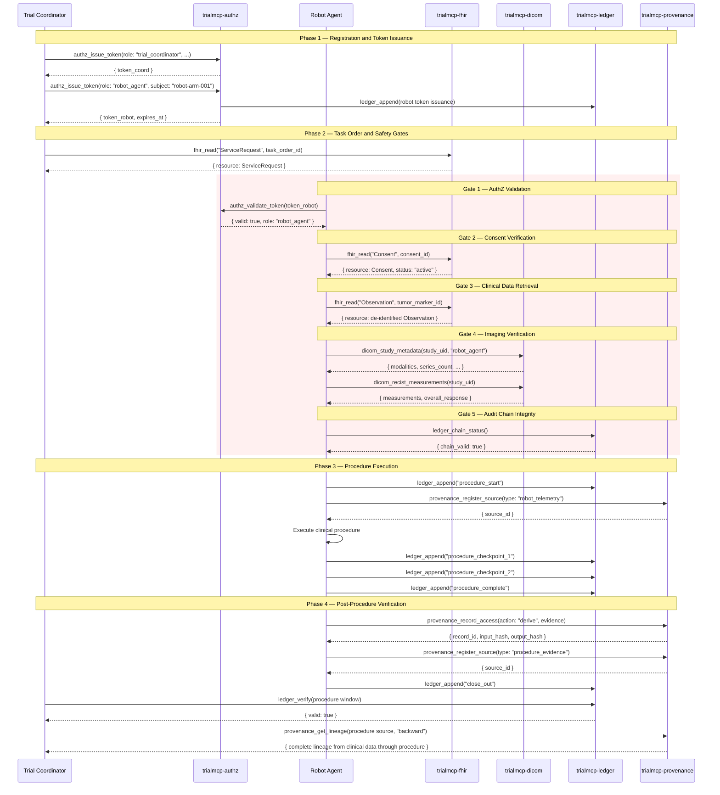

# Robot Procedure Walkthrough: Complete Robot-Assisted Clinical Workflow

**National MCP-PAI Oncology Trials Standard**
**Profile**: Robot Procedure (Conformance Level 5)
**Servers**: `trialmcp-authz`, `trialmcp-fhir`, `trialmcp-dicom`, `trialmcp-ledger`, `trialmcp-provenance`

---

## Overview

This walkthrough demonstrates the complete lifecycle of a robot-assisted
oncology procedure — from capability registration through post-procedure
verification and close-out. Conformance Level 5 requires all five MCP servers
and implements the full robot agent workflow, including pre-procedure safety
gates, real-time audit during execution, and provenance-tracked evidence.

The walkthrough covers:

1. Robot capability registration and token issuance
2. Task order submission and validation
3. Pre-procedure safety gate evaluation (5 gates)
4. Procedure execution with real-time audit
5. Post-procedure verification and close-out
6. Error handling scenarios

> **Spec references**: [spec/core.md](../../spec/core.md) Section 3.1 (Level 5),
> [spec/tool-contracts.md](../../spec/tool-contracts.md) all sections,
> [spec/actor-model.md](../../spec/actor-model.md) Section 2.1 and 5.3,
> [spec/provenance.md](../../spec/provenance.md) Section 6,
> [spec/security.md](../../spec/security.md) Section 3.4.

---

## Sequence Diagram



---

## Phase 1: Robot Capability Registration and Token Issuance

### Step 1.1: Trial Coordinator Authenticates

The trial coordinator obtains their session token to manage the robot procedure.

```json
{
  "tool": "authz_issue_token",
  "parameters": {
    "role": "trial_coordinator",
    "subject": "coord-jane-doe-site-07",
    "duration_seconds": 7200
  }
}
```

```json
{
  "token": "coord-c9f2a1b4-7e3d-4a8c-b5f1-2d9e6c8a3b7f",
  "expires_at": "2026-03-08T16:30:00Z",
  "role": "trial_coordinator",
  "subject": "coord-jane-doe-site-07"
}
```

### Step 1.2: Register Robot Agent and Issue Token

Each robot agent must be registered before receiving tokens. Registration
includes platform type, serial number, and authorized procedures
([spec/actor-model.md](../../spec/actor-model.md) Section 5.3).

The trial coordinator issues a scoped token for the robot agent:

```json
{
  "tool": "authz_issue_token",
  "parameters": {
    "role": "robot_agent",
    "subject": "robot-arm-001-needle-biopsy-v3",
    "duration_seconds": 3600
  }
}
```

```json
{
  "token": "robot-d4e5f6a7-b8c9-0d1e-2f3a-4b5c6d7e8f9a",
  "expires_at": "2026-03-08T15:30:00Z",
  "role": "robot_agent",
  "subject": "robot-arm-001-needle-biopsy-v3"
}
```

### Step 1.3: Verify Robot Permissions

Confirm the robot agent's constrained permission set.

```json
{
  "tool": "authz_evaluate",
  "parameters": {
    "role": "robot_agent",
    "server": "trialmcp-fhir",
    "tool": "fhir_read"
  }
}
```

```json
{
  "allowed": true,
  "matching_rules": [
    { "role": "robot_agent", "server": "trialmcp-fhir", "tool": "fhir_read", "effect": "ALLOW" }
  ],
  "effect": "ALLOW"
}
```

Verify the robot cannot issue tokens or look up patients:

```json
{
  "tool": "authz_evaluate",
  "parameters": {
    "role": "robot_agent",
    "server": "trialmcp-authz",
    "tool": "authz_issue_token"
  }
}
```

```json
{
  "allowed": false,
  "matching_rules": [
    { "role": "robot_agent", "server": "trialmcp-authz", "tool": "authz_issue_token", "effect": "DENY" }
  ],
  "effect": "DENY"
}
```

---

## Phase 2: Task Order and Pre-Procedure Safety Gates

### Step 2.1: Retrieve the Task Order (ServiceRequest)

The trial coordinator retrieves the procedure task order from FHIR.

```json
{
  "tool": "fhir_read",
  "parameters": {
    "resource_type": "ServiceRequest",
    "resource_id": "sr-biopsy-2026-03-08-001"
  }
}
```

```json
{
  "resource": {
    "resourceType": "ServiceRequest",
    "id": "sr-biopsy-2026-03-08-001",
    "status": "active",
    "intent": "order",
    "code": {
      "coding": [
        {
          "system": "http://snomed.info/sct",
          "code": "86273004",
          "display": "Biopsy of breast"
        }
      ]
    },
    "subject": {
      "reference": "Patient/ps-a7b3c9d2e1f4"
    },
    "requester": {
      "reference": "Practitioner/dr-oncologist-042"
    },
    "performerType": {
      "coding": [
        {
          "system": "urn:trialmcp:robot-type",
          "code": "needle-biopsy-arm",
          "display": "Robot-Assisted Needle Biopsy System"
        }
      ]
    },
    "reasonReference": [
      { "reference": "Condition/cond-her2-positive-breast-001" }
    ]
  }
}
```

### Step 2.2: Pre-Procedure Safety Gate Evaluation

The robot agent must pass all five safety gates before procedure execution
begins. Each gate is independently evaluated, and failure of any gate halts
the procedure.

#### Gate 1: AuthZ Token Validation

Verify the robot's session token is valid and not expired.

```json
{
  "tool": "authz_validate_token",
  "parameters": {
    "token": "robot-d4e5f6a7-b8c9-0d1e-2f3a-4b5c6d7e8f9a"
  }
}
```

```json
{
  "valid": true,
  "role": "robot_agent",
  "subject": "robot-arm-001-needle-biopsy-v3",
  "expires_at": "2026-03-08T15:30:00Z"
}
```

**Gate 1 result**: PASS

#### Gate 2: Patient Consent Verification

Confirm active research consent exists for the patient.

```json
{
  "tool": "fhir_read",
  "parameters": {
    "resource_type": "Consent",
    "resource_id": "consent-trial-onc-2026-pt-12345"
  }
}
```

```json
{
  "resource": {
    "resourceType": "Consent",
    "id": "consent-trial-onc-2026-pt-12345",
    "status": "active",
    "scope": {
      "coding": [{ "system": "http://terminology.hl7.org/CodeSystem/consentscope", "code": "research" }]
    },
    "patient": { "reference": "Patient/ps-a7b3c9d2e1f4" },
    "provision": {
      "type": "permit",
      "period": { "start": "2026-01-15", "end": "2027-01-15" },
      "purpose": [
        { "system": "http://terminology.hl7.org/CodeSystem/v3-ActReason", "code": "HRESCH" }
      ]
    }
  }
}
```

**Gate 2 result**: PASS — Active consent valid through 2027-01-15

#### Gate 3: Clinical Data Retrieval and Verification

Retrieve relevant clinical observations for procedure planning.

```json
{
  "tool": "fhir_read",
  "parameters": {
    "resource_type": "Observation",
    "resource_id": "obs-tumor-marker-her2-001"
  }
}
```

```json
{
  "resource": {
    "resourceType": "Observation",
    "id": "obs-tumor-marker-her2-001",
    "status": "final",
    "code": {
      "coding": [{ "system": "http://loinc.org", "code": "85319-2", "display": "HER2 [Presence]" }]
    },
    "subject": { "reference": "Patient/ps-a7b3c9d2e1f4" },
    "valueCodeableConcept": {
      "coding": [{ "system": "http://loinc.org", "code": "LA6576-8", "display": "Positive" }]
    },
    "effectiveDateTime": "2026"
  }
}
```

**Gate 3 result**: PASS — HER2+ confirmed, clinical data consistent with task order

#### Gate 4: Imaging Verification and RECIST Assessment

Retrieve imaging metadata and tumor measurements.

```json
{
  "tool": "dicom_study_metadata",
  "parameters": {
    "study_instance_uid": "1.2.840.113619.2.55.3.2831164020.768.1583223456.789",
    "caller_role": "robot_agent"
  }
}
```

```json
{
  "study_instance_uid": "1.2.840.113619.2.55.3.2831164020.768.1583223456.789",
  "modalities": ["CT"],
  "series_count": 4,
  "study_date": "20260305",
  "description": "CT Chest Abdomen Pelvis with Contrast"
}
```

```json
{
  "tool": "dicom_recist_measurements",
  "parameters": {
    "study_instance_uid": "1.2.840.113619.2.55.3.2831164020.768.1583223456.789"
  }
}
```

```json
{
  "study_instance_uid": "1.2.840.113619.2.55.3.2831164020.768.1583223456.789",
  "measurements": [
    { "lesion_id": "target-lesion-001", "diameter_mm": 22.4, "response": "stable_disease" }
  ],
  "overall_response": "stable_disease"
}
```

**Gate 4 result**: PASS — Imaging current (3 days old), target lesion identified at 22.4mm

#### Gate 5: Audit Chain Integrity Check

Verify the audit chain is intact before starting the procedure.

```json
{
  "tool": "ledger_chain_status",
  "parameters": {}
}
```

```json
{
  "total_records": 1542,
  "chain_valid": true,
  "genesis_hash": "0000000000000000000000000000000000000000000000000000000000000000",
  "latest_hash": "a1b2c3d4e5f6a7b8c9d0e1f2a3b4c5d6e7f8a9b0c1d2e3f4a5b6c7d8e9f0a1b2",
  "latest_timestamp": "2026-03-08T14:29:55Z"
}
```

**Gate 5 result**: PASS — Audit chain intact, 1542 records verified

### Step 2.3: Safety Gate Summary

```json
{
  "safety_gate_evaluation": {
    "procedure_id": "sr-biopsy-2026-03-08-001",
    "robot_agent": "robot-arm-001-needle-biopsy-v3",
    "timestamp": "2026-03-08T14:30:00Z",
    "gates": [
      { "gate": 1, "name": "AuthZ Token Validation", "result": "PASS" },
      { "gate": 2, "name": "Patient Consent Verification", "result": "PASS" },
      { "gate": 3, "name": "Clinical Data Retrieval", "result": "PASS" },
      { "gate": 4, "name": "Imaging Verification", "result": "PASS" },
      { "gate": 5, "name": "Audit Chain Integrity", "result": "PASS" }
    ],
    "overall_result": "PASS — Procedure authorized to proceed",
    "all_gates_passed": true
  }
}
```

> **Audit record**: The safety gate evaluation is recorded as a single
> `ledger_append` call to capture the composite result.

```json
{
  "tool": "ledger_append",
  "parameters": {
    "server": "trialmcp-authz",
    "tool": "safety_gate_evaluation",
    "caller": "robot-arm-001-needle-biopsy-v3",
    "parameters": {
      "procedure_id": "sr-biopsy-2026-03-08-001",
      "gates_evaluated": 5,
      "all_passed": true
    },
    "result_summary": "All 5 safety gates passed — procedure authorized"
  }
}
```

---

## Phase 3: Procedure Execution with Real-Time Audit

### Step 3.1: Record Procedure Start

```json
{
  "tool": "ledger_append",
  "parameters": {
    "server": "trialmcp-dicom",
    "tool": "robot_procedure",
    "caller": "robot-arm-001-needle-biopsy-v3",
    "parameters": {
      "procedure_id": "sr-biopsy-2026-03-08-001",
      "patient_pseudonym": "ps-a7b3c9d2e1f4",
      "phase": "start"
    },
    "result_summary": "Robot-assisted needle biopsy procedure started"
  }
}
```

```json
{
  "audit_id": "aud-proc-start-001",
  "hash": "f1e2d3c4b5a6f7e8d9c0b1a2f3e4d5c6b7a8f9e0d1c2b3a4f5e6d7c8b9a0f1e2",
  "previous_hash": "a1b2c3d4e5f6a7b8c9d0e1f2a3b4c5d6e7f8a9b0c1d2e3f4a5b6c7d8e9f0a1b2",
  "timestamp": "2026-03-08T14:30:30Z"
}
```

### Step 3.2: Register Provenance for Procedure Input

Register the clinical data and imaging used to plan the procedure
([spec/provenance.md](../../spec/provenance.md) Section 6.1).

```json
{
  "tool": "provenance_register_source",
  "parameters": {
    "source_type": "robot_telemetry",
    "origin_server": "trialmcp-dicom",
    "description": "Robot-assisted needle biopsy telemetry — sr-biopsy-2026-03-08-001",
    "metadata": {
      "procedure_id": "sr-biopsy-2026-03-08-001",
      "robot_agent": "robot-arm-001-needle-biopsy-v3",
      "input_sources": [
        "obs-tumor-marker-her2-001",
        "1.2.840.113619.2.55.3.2831164020.768.1583223456.789"
      ]
    }
  }
}
```

```json
{
  "source_id": "src-telemetry-proc-001",
  "registered_at": "2026-03-08T14:30:35Z"
}
```

### Step 3.3: Real-Time Checkpoints During Procedure

The robot logs critical milestones during execution:

**Checkpoint 1 — Target Acquisition**

```json
{
  "tool": "ledger_append",
  "parameters": {
    "server": "trialmcp-dicom",
    "tool": "robot_procedure",
    "caller": "robot-arm-001-needle-biopsy-v3",
    "parameters": {
      "procedure_id": "sr-biopsy-2026-03-08-001",
      "phase": "checkpoint",
      "checkpoint": 1,
      "description": "Target lesion acquired — 22.4mm mass at coordinates (x:142, y:87, z:203)"
    },
    "result_summary": "Checkpoint 1: Target acquisition confirmed"
  }
}
```

```json
{
  "audit_id": "aud-proc-cp1-001",
  "hash": "a2b3c4d5e6f7a8b9c0d1e2f3a4b5c6d7e8f9a0b1c2d3e4f5a6b7c8d9e0f1a2b3",
  "previous_hash": "f1e2d3c4b5a6f7e8d9c0b1a2f3e4d5c6b7a8f9e0d1c2b3a4f5e6d7c8b9a0f1e2",
  "timestamp": "2026-03-08T14:32:00Z"
}
```

**Checkpoint 2 — Needle Insertion**

```json
{
  "tool": "ledger_append",
  "parameters": {
    "server": "trialmcp-dicom",
    "tool": "robot_procedure",
    "caller": "robot-arm-001-needle-biopsy-v3",
    "parameters": {
      "procedure_id": "sr-biopsy-2026-03-08-001",
      "phase": "checkpoint",
      "checkpoint": 2,
      "description": "Needle insertion complete — depth 45mm, trajectory within 2deg of planned path"
    },
    "result_summary": "Checkpoint 2: Needle insertion confirmed within tolerance"
  }
}
```

```json
{
  "audit_id": "aud-proc-cp2-001",
  "hash": "b3c4d5e6f7a8b9c0d1e2f3a4b5c6d7e8f9a0b1c2d3e4f5a6b7c8d9e0f1a2b3c4",
  "previous_hash": "a2b3c4d5e6f7a8b9c0d1e2f3a4b5c6d7e8f9a0b1c2d3e4f5a6b7c8d9e0f1a2b3",
  "timestamp": "2026-03-08T14:34:15Z"
}
```

**Checkpoint 3 — Sample Collection**

```json
{
  "tool": "ledger_append",
  "parameters": {
    "server": "trialmcp-dicom",
    "tool": "robot_procedure",
    "caller": "robot-arm-001-needle-biopsy-v3",
    "parameters": {
      "procedure_id": "sr-biopsy-2026-03-08-001",
      "phase": "checkpoint",
      "checkpoint": 3,
      "description": "Biopsy sample collected — 3 tissue cores obtained"
    },
    "result_summary": "Checkpoint 3: Sample collection complete — 3 cores"
  }
}
```

### Step 3.4: Record Procedure Completion

```json
{
  "tool": "ledger_append",
  "parameters": {
    "server": "trialmcp-dicom",
    "tool": "robot_procedure",
    "caller": "robot-arm-001-needle-biopsy-v3",
    "parameters": {
      "procedure_id": "sr-biopsy-2026-03-08-001",
      "phase": "complete",
      "duration_seconds": 420,
      "samples_collected": 3,
      "complications": "none"
    },
    "result_summary": "Procedure completed successfully — 7 minutes, 3 cores, no complications"
  }
}
```

```json
{
  "audit_id": "aud-proc-complete-001",
  "hash": "d5e6f7a8b9c0d1e2f3a4b5c6d7e8f9a0b1c2d3e4f5a6b7c8d9e0f1a2b3c4d5e6",
  "previous_hash": "c4d5e6f7a8b9c0d1e2f3a4b5c6d7e8f9a0b1c2d3e4f5a6b7c8d9e0f1a2b3c4d5",
  "timestamp": "2026-03-08T14:37:30Z"
}
```

---

## Phase 4: Post-Procedure Verification and Close-Out

### Step 4.1: Record Procedure Provenance

Record the procedure execution as a provenance event linking clinical input
to procedure output ([spec/provenance.md](../../spec/provenance.md) Section 6.1).

```json
{
  "tool": "provenance_record_access",
  "parameters": {
    "source_id": "src-telemetry-proc-001",
    "action": "derive",
    "actor_id": "robot-arm-001-needle-biopsy-v3",
    "actor_role": "robot_agent",
    "tool_call": "robot_procedure",
    "input_data": "{\"procedure_id\": \"sr-biopsy-2026-03-08-001\", \"clinical_obs\": \"obs-tumor-marker-her2-001\", \"imaging\": \"1.2.840...789\"}",
    "output_data": "{\"samples_collected\": 3, \"duration_seconds\": 420, \"complications\": \"none\"}"
  }
}
```

```json
{
  "record_id": "prov-rec-proc-001",
  "input_hash": "e6f7a8b9c0d1e2f3a4b5c6d7e8f9a0b1c2d3e4f5a6b7c8d9e0f1a2b3c4d5e6f7",
  "output_hash": "f7a8b9c0d1e2f3a4b5c6d7e8f9a0b1c2d3e4f5a6b7c8d9e0f1a2b3c4d5e6f7a8",
  "timestamp": "2026-03-08T14:38:00Z"
}
```

### Step 4.2: Register Procedure Evidence

The procedure evidence (telemetry, images, sample records) is registered as
a new data source in the provenance graph.

```json
{
  "tool": "provenance_register_source",
  "parameters": {
    "source_type": "procedure_evidence",
    "origin_server": "trialmcp-dicom",
    "description": "Biopsy procedure evidence — sr-biopsy-2026-03-08-001",
    "metadata": {
      "procedure_id": "sr-biopsy-2026-03-08-001",
      "evidence_type": "telemetry_and_imaging",
      "samples": 3,
      "robot_agent": "robot-arm-001-needle-biopsy-v3"
    }
  }
}
```

```json
{
  "source_id": "src-evidence-proc-001",
  "registered_at": "2026-03-08T14:38:30Z"
}
```

### Step 4.3: Close-Out Audit Record

```json
{
  "tool": "ledger_append",
  "parameters": {
    "server": "trialmcp-provenance",
    "tool": "procedure_close_out",
    "caller": "robot-arm-001-needle-biopsy-v3",
    "parameters": {
      "procedure_id": "sr-biopsy-2026-03-08-001",
      "phase": "close_out",
      "provenance_source_id": "src-telemetry-proc-001",
      "evidence_source_id": "src-evidence-proc-001",
      "safety_gates_passed": 5,
      "checkpoints_logged": 3,
      "total_audit_records": 6
    },
    "result_summary": "Procedure close-out complete — all evidence registered, provenance chain established"
  }
}
```

### Step 4.4: Coordinator Verifies Procedure Audit Trail

The trial coordinator verifies the complete audit trail for the procedure window.

```json
{
  "tool": "ledger_verify",
  "parameters": {
    "start_index": 1542,
    "end_index": 1550
  }
}
```

```json
{
  "valid": true,
  "records_checked": 9,
  "first_invalid_index": null,
  "genesis_valid": true
}
```

### Step 4.5: Verify Provenance Lineage

The coordinator traces the complete lineage from clinical data through procedure
execution to evidence recording.

```json
{
  "tool": "provenance_get_lineage",
  "parameters": {
    "source_id": "src-evidence-proc-001",
    "direction": "backward"
  }
}
```

```json
{
  "source_id": "src-evidence-proc-001",
  "lineage": [
    {
      "record_id": "prov-rec-proc-001",
      "action": "derive",
      "actor_id": "robot-arm-001-needle-biopsy-v3",
      "actor_role": "robot_agent",
      "tool_call": "robot_procedure",
      "timestamp": "2026-03-08T14:38:00Z",
      "input_source": "src-telemetry-proc-001"
    },
    {
      "record_id": "prov-rec-imaging-read-001",
      "action": "read",
      "actor_id": "robot-arm-001-needle-biopsy-v3",
      "actor_role": "robot_agent",
      "tool_call": "dicom_study_metadata",
      "timestamp": "2026-03-08T14:29:30Z"
    },
    {
      "record_id": "prov-rec-clinical-read-001",
      "action": "read",
      "actor_id": "robot-arm-001-needle-biopsy-v3",
      "actor_role": "robot_agent",
      "tool_call": "fhir_read",
      "timestamp": "2026-03-08T14:29:00Z"
    }
  ],
  "total": 3
}
```

### Step 4.6: Token Revocation After Procedure

After the procedure completes, the trial coordinator revokes the robot's token.

```json
{
  "tool": "authz_revoke_token",
  "parameters": {
    "token": "robot-d4e5f6a7-b8c9-0d1e-2f3a-4b5c6d7e8f9a"
  }
}
```

```json
{
  "revoked": true,
  "token_hash": "b8c9d0e1f2a3b4c5d6e7f8a9b0c1d2e3f4a5b6c7d8e9f0a1b2c3d4e5f6a7b8c9"
}
```

---

## Error Handling Scenarios

### Error 1: Safety Gate Failure — Expired Token

If the robot's token expires before the procedure starts, Gate 1 fails and
the procedure is halted.

```json
{
  "tool": "authz_validate_token",
  "parameters": {
    "token": "robot-d4e5f6a7-b8c9-0d1e-2f3a-4b5c6d7e8f9a"
  }
}
```

```json
{
  "error": {
    "code": "TOKEN_EXPIRED",
    "message": "Robot agent token has expired",
    "details": {
      "expired_at": "2026-03-08T14:00:00Z"
    }
  }
}
```

```json
{
  "safety_gate_evaluation": {
    "gates": [
      { "gate": 1, "name": "AuthZ Token Validation", "result": "FAIL", "reason": "TOKEN_EXPIRED" }
    ],
    "overall_result": "FAIL — Procedure NOT authorized. Token must be reissued.",
    "all_gates_passed": false
  }
}
```

### Error 2: Safety Gate Failure — No Consent

If no active consent exists, Gate 2 fails.

```json
{
  "tool": "fhir_read",
  "parameters": {
    "resource_type": "Consent",
    "resource_id": "consent-trial-onc-2026-pt-12345"
  }
}
```

```json
{
  "resource": {
    "resourceType": "Consent",
    "id": "consent-trial-onc-2026-pt-12345",
    "status": "rejected"
  }
}
```

```json
{
  "safety_gate_evaluation": {
    "gates": [
      { "gate": 1, "result": "PASS" },
      { "gate": 2, "name": "Patient Consent Verification", "result": "FAIL", "reason": "Consent status is 'rejected'" }
    ],
    "overall_result": "FAIL — Procedure NOT authorized. Patient consent required.",
    "all_gates_passed": false
  }
}
```

### Error 3: Safety Gate Failure — Audit Chain Compromised

If the audit chain is invalid, Gate 5 fails and the procedure must not proceed.

```json
{
  "tool": "ledger_chain_status",
  "parameters": {}
}
```

```json
{
  "total_records": 1542,
  "chain_valid": false,
  "genesis_hash": "0000000000000000000000000000000000000000000000000000000000000000",
  "latest_hash": "invalid-hash",
  "latest_timestamp": "2026-03-08T14:29:55Z"
}
```

```json
{
  "safety_gate_evaluation": {
    "gates": [
      { "gate": 1, "result": "PASS" },
      { "gate": 2, "result": "PASS" },
      { "gate": 3, "result": "PASS" },
      { "gate": 4, "result": "PASS" },
      { "gate": 5, "name": "Audit Chain Integrity", "result": "FAIL", "reason": "Chain integrity compromised" }
    ],
    "overall_result": "FAIL — Procedure NOT authorized. Audit chain must be investigated.",
    "all_gates_passed": false
  }
}
```

### Error 4: Token Rotation During Long Procedure

For long-running procedures, the token may need rotation. The implementation
should support atomic rotation: issue new token, revoke old token
([spec/security.md](../../spec/security.md) Section 3.4).

```json
{
  "token_rotation": {
    "old_token_hash": "b8c9d0e1...64-char-hex",
    "new_token": "robot-e5f6a7b8-c9d0-1e2f-3a4b-5c6d7e8f9a0b",
    "new_expires_at": "2026-03-08T16:30:00Z",
    "rotation_timestamp": "2026-03-08T15:25:00Z",
    "audit_records": [
      "aud-revoke-old-token",
      "aud-issue-new-token"
    ]
  }
}
```

### Error 5: robot_agent Attempts Unauthorized Operation

During a procedure, if the robot attempts an unauthorized operation, it is
denied immediately.

```json
{
  "tool": "fhir_patient_lookup",
  "parameters": {
    "patient_id": "patient-smith-12345"
  }
}
```

```json
{
  "error": {
    "code": "AUTHZ_DENIED",
    "message": "Role 'robot_agent' is not authorized for fhir_patient_lookup",
    "details": {
      "caller_role": "robot_agent",
      "authorized_roles": ["trial_coordinator", "data_monitor"]
    }
  }
}
```

---

## Complete Procedure Provenance Chain

The provenance DAG for a complete robot procedure:

```
┌──────────────────────────┐     ┌──────────────────────────┐
│ FHIR Observation         │     │ DICOM Study Metadata     │
│ (HER2+ tumor marker)     │     │ (CT Chest, 4 series)     │
│ [obs-tumor-marker-001]   │     │ [1.2.840...789]          │
└───────────┬──────────────┘     └───────────┬──────────────┘
            │ read                            │ read
            └──────────┐          ┌───────────┘
                       v          v
              ┌──────────────────────────┐
              │ Robot Procedure          │
              │ (Needle Biopsy)          │
              │ [src-telemetry-proc-001] │
              │ 5 gates passed           │
              │ 3 checkpoints logged     │
              └───────────┬──────────────┘
                          │ derive
                          v
              ┌──────────────────────────┐
              │ Procedure Evidence       │
              │ (Telemetry + Imaging)    │
              │ [src-evidence-proc-001]  │
              │ 3 tissue cores           │
              └──────────────────────────┘
```

---

## Robot Agent Permission Summary

| Server | Tool | Access |
|--------|------|:------:|
| `trialmcp-authz` | `authz_evaluate` | ALLOW |
| `trialmcp-authz` | `authz_issue_token` | DENY |
| `trialmcp-authz` | `authz_validate_token` | ALLOW |
| `trialmcp-authz` | `authz_list_policies` | DENY |
| `trialmcp-authz` | `authz_revoke_token` | DENY |
| `trialmcp-fhir` | `fhir_read` | ALLOW |
| `trialmcp-fhir` | `fhir_search` | ALLOW |
| `trialmcp-fhir` | `fhir_patient_lookup` | DENY |
| `trialmcp-fhir` | `fhir_study_status` | ALLOW |
| `trialmcp-dicom` | `dicom_query` | ALLOW (STUDY/SERIES only) |
| `trialmcp-dicom` | `dicom_retrieve_pointer` | ALLOW |
| `trialmcp-dicom` | `dicom_study_metadata` | ALLOW |
| `trialmcp-dicom` | `dicom_recist_measurements` | ALLOW |
| `trialmcp-ledger` | `ledger_append` | ALLOW |
| `trialmcp-ledger` | `ledger_verify` | ALLOW |
| `trialmcp-ledger` | `ledger_query` | DENY |
| `trialmcp-ledger` | `ledger_replay` | DENY |
| `trialmcp-ledger` | `ledger_chain_status` | ALLOW |
| `trialmcp-provenance` | `provenance_register_source` | ALLOW |
| `trialmcp-provenance` | `provenance_record_access` | ALLOW |
| `trialmcp-provenance` | `provenance_get_lineage` | ALLOW |
| `trialmcp-provenance` | `provenance_get_actor_history` | DENY |
| `trialmcp-provenance` | `provenance_verify_integrity` | ALLOW |

---

## Key Design Decisions

1. **Five safety gates**: Every robot procedure must pass all five gates before
   execution. Any single gate failure halts the procedure — no overrides.
2. **Real-time audit checkpoints**: Critical procedure milestones are logged
   to the hash-chained ledger in real time, creating a reconstructible timeline.
3. **Provenance chain**: The complete lineage from clinical data input through
   procedure execution to evidence output is tracked in the DAG, satisfying
   [spec/provenance.md](../../spec/provenance.md) Section 6.2.
4. **Constrained robot permissions**: Robots can read clinical data and imaging
   but cannot issue tokens, look up patients directly, or query audit logs.
5. **Post-procedure token revocation**: Robot tokens are revoked after procedure
   completion to enforce least privilege.
6. **Token rotation**: Long-running procedures support atomic token rotation to
   prevent expiry during execution.

---

## Checklist for Implementers

- [ ] Robot agents registered with platform type, serial number, and authorized procedures
- [ ] Robot tokens issued by trial coordinator (robot cannot self-issue)
- [ ] All 5 safety gates evaluated before procedure start
- [ ] Any gate failure halts the procedure entirely
- [ ] Procedure start, checkpoints, and completion logged to ledger in real time
- [ ] Provenance records created for input registration, procedure execution, and evidence
- [ ] Complete backward lineage traceable from evidence to clinical inputs
- [ ] Robot token revoked after procedure completion
- [ ] Token rotation supported for long-running procedures
- [ ] Robot denied patient lookup, token issuance, ledger query, and actor history
- [ ] DICOM query restricted to STUDY and SERIES levels for robot agents
- [ ] All audit records maintain hash chain continuity throughout procedure
